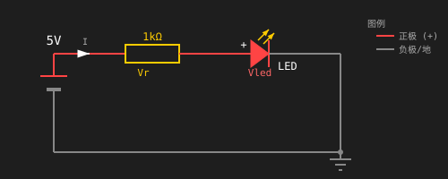
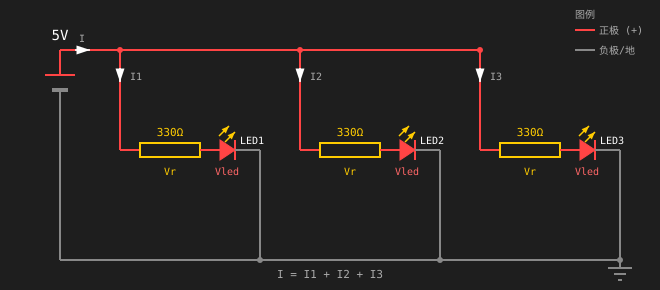
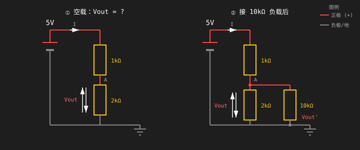
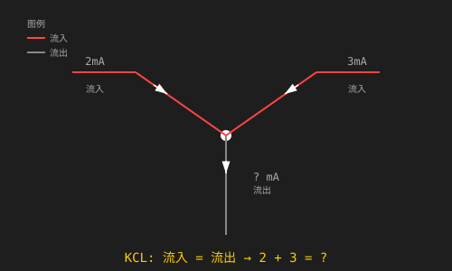
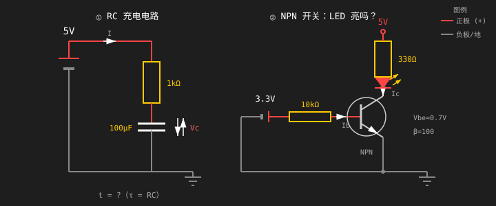
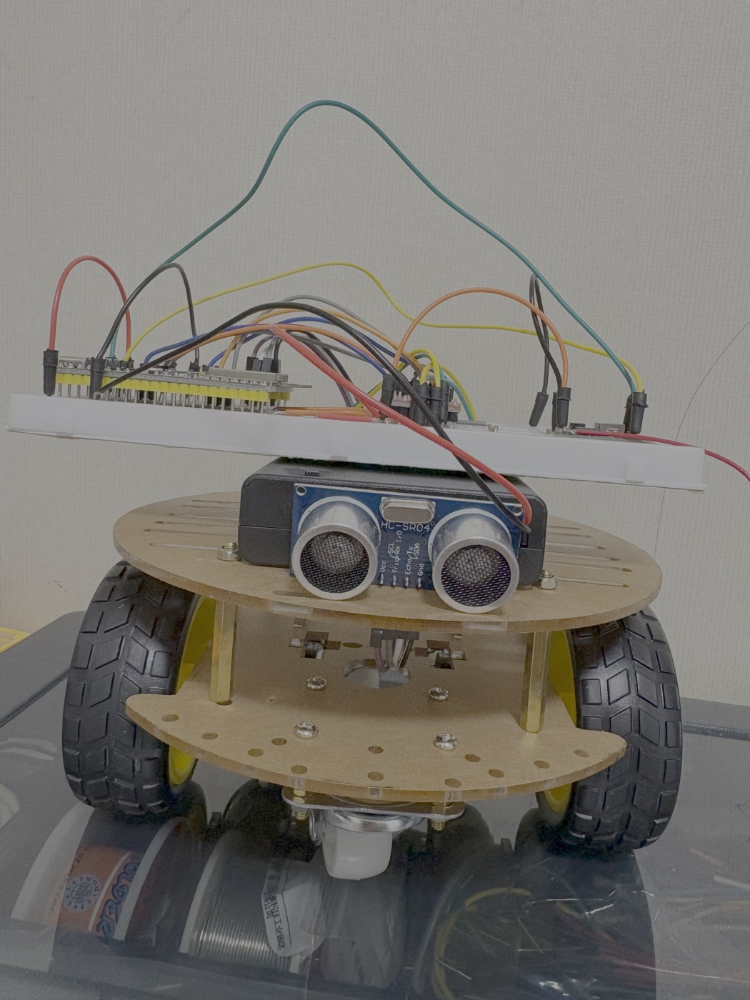
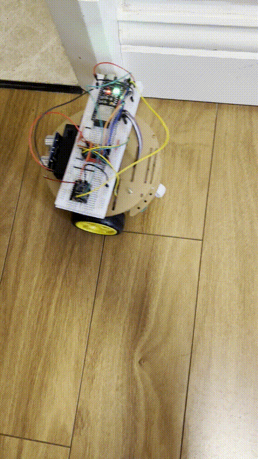
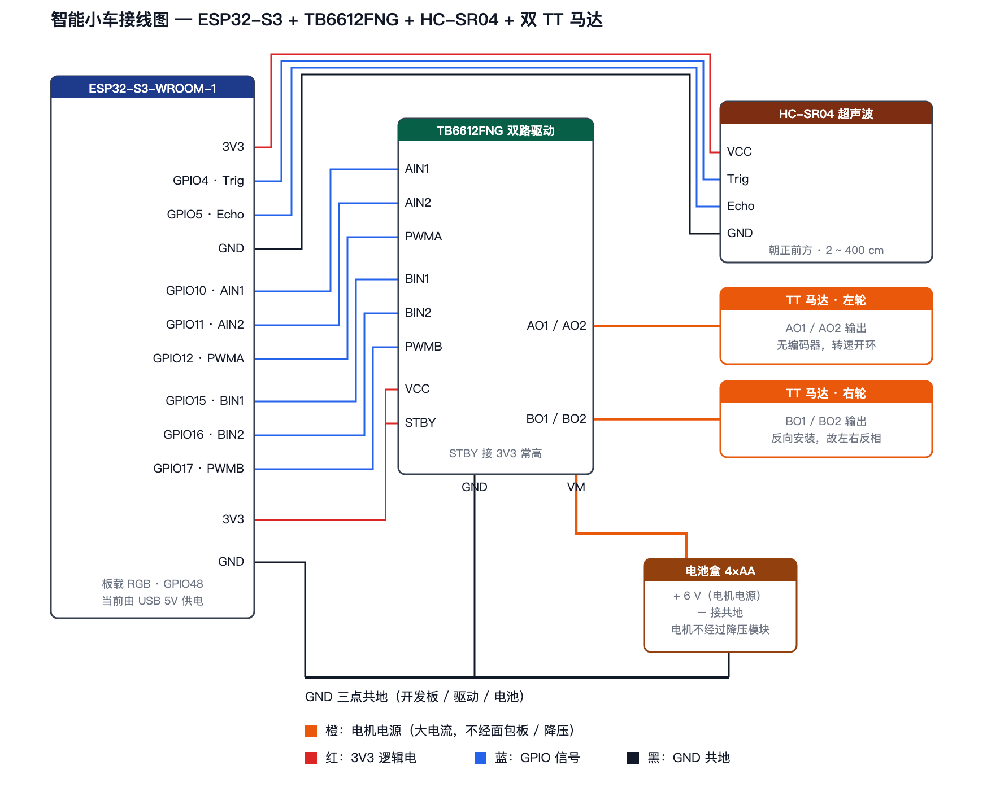
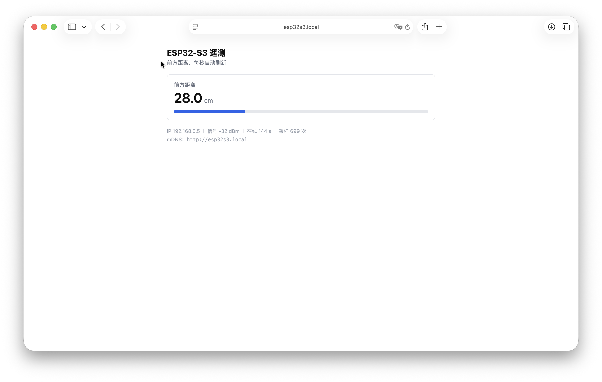
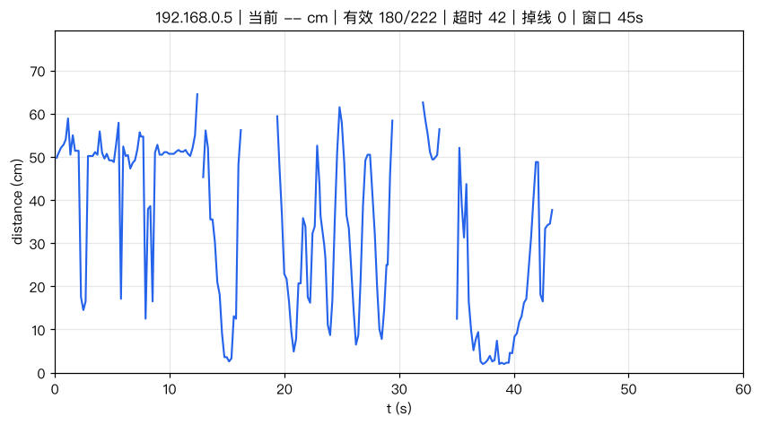

# Robotics Engineer Learning Tutorial

A hands-on, month-by-month robotics engineering curriculum. Starting from zero electronics experience, progressing to ROS2, control theory, and job-ready robotics skills in 6 months.

## What's Inside

| Folder | Description |
|--------|-------------|
| [`教程/`](./教程/) | Original 1–6 month article-style learning plans |
| [`进度/`](./进度/) | Day-by-day practical extension of Month 1 (30 days) + terminology glossary |
| [`docs/`](./docs/) | ESP32-S3 board source material (schematic + pinout) + component photos ([`元器件.jpg`](./docs/元器件.jpg)) + `小车模块分工表.md` (role of each Day 17–21 module in the finished robot) |
| [`智能小车/`](./智能小车/) | Smart-car PCB and carrier-board design notes + photos of the built board ([`智能小车-正面.png`](./智能小车/智能小车-正面.png) ｜ [`智能小车-背面.png`](./智能小车/智能小车-背面.png)) |
| [`day-01/`](./day-01/) … [`day-33/`](./day-33/) | Daily work (screenshots, circuit files, code, notes) |

> 📌 **Code convention (from Day 10)**: later experiments are written as a single `loop()` running in parallel with the onboard pixel (one `RgbCycle::update()` call plus a `millis()` test per task) — no more separate "LED-only" sketches.

This repo doubles as a public learning journal. Every experiment, circuit, and robot project is documented with photos, schematics, code, and a dedicated "What Went Wrong & How I Fixed It" section.

---

## 6-Month Roadmap

| Month | Focus |
|-------|-------|
| 1 | Electronics fundamentals, breadboarding, soldering, ESP32-S3, sensors, DC motors |
| 2 | Microcontrollers, motor drivers, servo/stepper control, IMU, ultrasonic ranging |
| 3 | Mechanical design, CAD, 3D printing, laser cutting, chassis fabrication |
| 4 | ROS2 simulation, Gazebo, Nav2, enterprise dev practices |
| 5 | Control theory, PID tuning, Kalman filters, math foundations |
| 6 | LeRobot, RL for robotics, specialization tracks, portfolio & job hunt |

---

## Month 1 at a Glance

- **Week 1** — Circuit theory & simulation (Falstad, Tinkercad, All About Circuits)
- **Week 2** — ESP32-S3 GPIO, PWM, ADC, serial communication
- **Week 3** — Soldering, HC-SR04 ultrasonic, MPU-6050 IMU, DC motors + TB6612 driver, SG90 servo
- **Week 4** — Python scripts, Git/GitHub workflow, Wi-Fi remote control car capstone

Budget: **$0–$90** depending on tier (simulator-only → full ESP32 starter kit).

---

## Day 1 — Ohm's Law & Voltage Divider

### Goal
Understand voltage, current, and resistance. Build and simulate your first circuits. Verify Ohm's Law with real measurements.

### Screenshots
- **Falstad simulation — single resistor (1 kΩ @ 5 V):** [`day-01/1kΩ.png`](day-01/1k%CE%A9.png)
- **Falstad simulation — single resistor (220 Ω @ 5 V):** [`day-01/220Ω.png`](day-01/220%CE%A9.png)
- **Falstad simulation — single resistor (10 kΩ @ 5 V):** [`day-01/10kΩ.png`](day-01/10k%CE%A9.png)
- **Tinkercad sign-up succeeded:** [`day-01/tinkercad.png`](day-01/tinkercad.png)

### Falstad circuit file

- **Reusable circuit template:** [`day-01/series-resistor-circuit.txt`](day-01/series-resistor-circuit.txt)
  - A Falstad-exported 1 kΩ series circuit
  - To import: open https://www.falstad.com/circuit/ → File → Import → paste the file contents

### Measured Data

| Resistance | Current (I) | Power (P) | Verification |
|------------|-------------|-----------|--------------|
| 1 kΩ | 5 mA | 25 mW | I = 5V/1kΩ = 5mA, P = V×I = 25mW ✅ |
| 220 Ω | 22.727 mA | 113.636 mW | I = 5V/220Ω ≈ 22.7mA, P = 25/220 ≈ 113.6mW ✅ |
| 10 kΩ | 500 µA | 2.5 mW | I = 5V/10kΩ = 0.5mA, P = 25/10000 = 2.5mW ✅ |

> All measured values match Ohm's Law I = V/R and power formula P = V²/R exactly.

### Formulas

**1. Ohm's Law**
```
V = I × R
```
- `V` = voltage in volts (V)
- `I` = current in amperes (A)
- `R` = resistance in ohms (Ω)

> From my Falstad simulation: 5 V across 10 kΩ → I = 5 V / 10000 Ω = **0.5 mA (500 µA)**

**2. Voltage Divider**
```
Vout = Vin × R2 / (R1 + R2)
```
- `R1` = top resistor (closest to Vin)
- `R2` = bottom resistor (closest to GND)

> Example: Vin = 5 V, R1 = 1 kΩ, R2 = 2 kΩ → Vout = 5 × 2 / 3 = **3.33 V**

**3. Power Dissipation**
```
P = V × I = I² × R = V² / R
```
- `P` = power in watts (W)
- Most through-hole resistors are rated 1/4 W (0.25 W)

> From my Falstad simulation: 5 V across 10 kΩ → P = 25 / 10000 = **2.5 mW** (well within 1/4 W rating)

**4. Series / Parallel Resistance**
```
Series:     R_eq = R1 + R2 + ...
Parallel:   1 / R_eq = 1/R1 + 1/R2  →  R_eq = (R1 × R2) / (R1 + R2)
```

**5. Kirchhoff's Current Law (KCL)**
```
Σ I_in = Σ I_out   at any node
```

**6. RC Time Constant**
```
τ = R × C
```
- After ~5τ, a capacitor is >99% charged/discharged
- `R` in ohms, `C` in farads → `τ` in seconds

### Quick Reference

| Symbol | Meaning | Unit |
|--------|---------|------|
| `V` | Voltage | Volt (V) |
| `I` | Current | Ampere (A) |
| `R` | Resistance | Ohm (Ω) |
| `P` | Power | Watt (W) |
| `C` | Capacitance | Farad (F) |
| `τ` | Time constant | Second (s) |

### Files in This Repo

```
robotics-engineer-learning-tutorial/
├── README.md                    ← you are here (Chinese)
├── README.en.md                 ← English version
├── 教程/                        ← original 1–6 month learning plans
├── 进度/                        ← Month 1 day-by-day guide + glossary
├── docs/                        ← ESP32-S3 board reference (schematic + pinout) + component photos (元器件.jpg) + 小车模块分工表.md
├── 元器件库存清单.md            ← parts on hand + shopping list
├── day-01/ … day-07/            ← Week 1: circuit theory & simulation
├── day-08/                      ← Day 8: ESP32-S3 board & toolchain setup
├── day-09/                      ← Day 9: first program, Blink (onboard WS2812B + external LED)
├── day-10/                      ← Day 10: PWM breathing LED (duty-cycle brightness + two parallel tasks)
├── day-11/                      ← Day 11: Digital input & button (INPUT_PULLUP + debounce)
├── day-12/                      ← Day 12: ADC & sensor reading (potentiometer + LDR + Serial Plotter)
├── day-13/                      ← Day 13: Serial communication & debugging (UART + Serial.printf + JSON output)
├── day-14/                      ← Day 14: Week 2 Project - Digital voltmeter (divider + averaging + calibration)
├── day-15/                      ← Day 15: Soldering safety & basic practice (tinning + 5-step method + cold joints + continuity)
├── day-16/                      ← Day 16: Through-hole soldering (perfboard layout + shared-hole series chain + elevated 3 mm lead bend + segment-sum self-check)
└── day-17/                      ← Day 17: HC-SR04 ultrasonic ranging (Trig/Echo timing + pulseIn + speed-of-sound conversion)
└── day-18/                      ← Day 18: MPU-6050 IMU over I2C (bus addressing + accel/gyro + tilt from gravity)
└── day-19/                      ← Day 19: DC motors with the TB6612FNG driver (H-bridge truth table + fwd/rev/brake/coast + PWM speed control)
└── day-20/                      ← Day 20: SG90 servo control (50 Hz pulse protocol + angle positioning + dedicated 5 V supply)
├── day-21/                      ← Day 21: Robot car chassis (differential steering + motion functions + ultrasonic obstacle-avoidance state machine)
├── day-22/                      ← Day 22: Python refresher (serial JSON telemetry → CSV / config validation / batch rename)
├── day-23/                      ← Day 23: Git version control (two-dot inspection + diff3 conflict markers + reflog recovery / merge vs rebase)
├── day-24/                      ← Day 24: README writing and project presentation (ffmpeg GIF clipping + hand-written SVG wiring diagram + README section order)
├── day-25/                      ← Day 25: first Wi-Fi on the ESP32-S3 (2.4 GHz join + connect timeout / auto-reconnect + hand-rolled HTTP + TLS + web server)
├── day-26/                      ← Day 26: Python live telemetry plotting (HTTP poll of /data + 60 s rolling window + NaN line breaks + CSV)
├── day-27/                      ← Day 27: Wi-Fi remote-control car (/cmd write route + phone control panel + connection watchdog)
├── day-28/                      ← Day 28: remote control + auto avoidance in one firmware (mode switch + heartbeat semantics extended + demo video)
├── day-29/                      ← Day 29: portfolio tidy-up and GitHub profile (README audit + profile README + full compile check)
├── day-30/                      ← Day 30: monthly review and month-2 prep (main thread + inventory + shopping list)
├── day-31/                      ← Day 31: interrupts — a reaction-timer game (polling vs interrupt, three-state machine)
├── day-32/                      ← Day 32: TCRT5000 — one module, three AO readings (black HIGH / white LOW + height sweep, mount at 3cm)
├── day-33/                      ← Day 33: five AO channels fused into one "where is the line" number (weighted centroid pos + locating test sheet + seven-station calibration curve)
├── day-34/ … day-60/            📌 to come (Day 34-38 line following / Day 39-45 attitude fusion / Day 46-51 encoder closed loop / Day 52-58 self-balancing / Day 59-60 review)
└── 智能小车/                    ← smart-car PCB and carrier-board design notes + photos of the built board
```

---

## Day 2 — Series & Parallel Circuits

### Goal
Compute equivalent resistance and understand voltage division.

### Screenshots

- **Falstad — series (1 kΩ + 2 kΩ @ 5 V):** [`day-02/1kΩ-串联-2kΩ.png`](day-02/1kΩ-串联-2kΩ.png)
- **Falstad — parallel (1 kΩ // 1 kΩ @ 5 V):** [`day-02/1kΩ-并联-1kΩ.png`](day-02/1kΩ-并联-1kΩ.png)
- **Tinkercad — series (voltmeter in parallel reads 3.33V, ammeter in series reads 1.67mA):** [`day-02/电路-串联-tinkercad.png`](day-02/电路-串联-tinkercad.png)
- **Tinkercad — parallel (voltage 5V, current 10mA, equivalent resistance 500Ω):** [`day-02/电路-并联-tinkercad.png`](day-02/电路-并联-tinkercad.png)

### Falstad Circuit Files

- **Series template:** [`day-02/电路-1kΩ-串联-2kΩ.txt`](day-02/电路-1kΩ-串联-2kΩ.txt) — 1 kΩ + 2 kΩ in series across 5V
- **Parallel template:** [`day-02/电路-1kΩ-并联-1kΩ.txt`](day-02/电路-1kΩ-并联-1kΩ.txt) — two 1 kΩ in parallel across 5V
  - Import method same as Day 1

### Measured Data

**1. Series (1 kΩ + 2 kΩ)**

| Parameter | Measured | Calculated | Verified |
|------|--------|--------|------|
| Total resistance | 3 kΩ | 1k + 2k = 3k Ω | ✅ |
| Total current | 1.667 mA | 5V / 3kΩ ≈ 1.667mA | ✅ |
| Midpoint voltage (Vout) | 3.333 V | 5 × 2k / (1k+2k) = 3.33V | ✅ |
| 1kΩ power | — | I² × R = (1.667m)² × 1k ≈ 2.78mW | — |
| 2kΩ power | — | I² × R = (1.667m)² × 2k ≈ 5.56mW | — |

> Voltage divider check: Vout = Vin × R2 / (R1 + R2) = 5 × 2000 / 3000 = **3.333 V**

**2. Parallel (1 kΩ // 1 kΩ)**

| Parameter | Measured | Calculated | Verified |
|------|--------|--------|------|
| Equivalent resistance | 500 Ω | (1k × 1k) / (1k + 1k) = 500Ω | ✅ |
| Total current | 10 mA | 5V / 500Ω = 10mA | ✅ |
| Per-branch current | 5 mA | 5V / 1kΩ = 5mA | ✅ |

> Parallel check: 1/Req = 1/R1 + 1/R2 → Req = 500 Ω, total current 10mA = 5V/500Ω ✅

### Formulas

**Voltage divider**
```
Vout = Vin × R2 / (R1 + R2)
```
- For series circuits; R2 is the lower resistor (closer to GND)

**Series equivalent resistance**
```
R_eq = R1 + R2 + ...
```

**Parallel equivalent resistance**
```
1 / R_eq = 1/R1 + 1/R2
or
R_eq = (R1 × R2) / (R1 + R2)
```

---

## Day 3 — Kirchhoff's Laws (KCL/KVL) & Power

### Goal
Understand KCL (Kirchhoff's Current Law) and KVL (Kirchhoff's Voltage Law), compute per-component power dissipation, and grasp what a resistor's power rating means.

### Screenshots

- **Tinkercad — KVL (series divider 1 kΩ + 2 kΩ @ 5 V):** [`day-03/电路A-KVL.png`](day-03/电路A-KVL.png)
- **Tinkercad — KCL (parallel split 1 kΩ // 1 kΩ @ 5 V):** [`day-03/电路B-KCL.png`](day-03/电路B-KCL.png)

### Measured Data

**1. KVL check — series (1 kΩ + 2 kΩ)**

| Parameter | Measured | Calculated | Verified |
|------|--------|--------|------|
| Total resistance | 3 kΩ | 1k + 2k = 3k Ω | ✅ |
| Total current | 1.667 mA | 5V / 3kΩ ≈ 1.667mA | ✅ |
| 1kΩ voltage (V1) | 1.667 V | I × R = 1.667m × 1k ≈ 1.667V | ✅ |
| 2kΩ voltage (V2) | 3.333 V | I × R = 1.667m × 2k ≈ 3.333V | ✅ |
| V1 + V2 | 5.000 V | 1.667 + 3.333 = 5V | ✅ |
| 1kΩ power | 2.78 mW | I² × R = (1.667m)² × 1k ≈ 2.78mW | — |
| 2kΩ power | 5.56 mW | I² × R = (1.667m)² × 2k ≈ 5.56mW | — |

> KVL check: going once around the loop, the voltage drops sum to 1.667V + 3.333V = 5V = source voltage ✅

**2. KCL check — parallel (1 kΩ // 1 kΩ)**

| Parameter | Measured | Calculated | Verified |
|------|--------|--------|------|
| Equivalent resistance | 500 Ω | (1k × 1k) / (1k + 1k) = 500Ω | ✅ |
| Total current | 10 mA | 5V / 500Ω = 10mA | ✅ |
| Branch 1 current | 5 mA | 5V / 1kΩ = 5mA | ✅ |
| Branch 2 current | 5 mA | 5V / 1kΩ = 5mA | ✅ |
| I_total = I1 + I2 | 10 mA | 5mA + 5mA = 10mA | ✅ |
| Power per branch | 25 mW | V² / R = 25 / 1k = 25mW | — |

> KCL check: total current into the node = sum of branch currents out = 10mA ✅

**3. Power comparison (understanding power ratings)**

| Resistance | Power at 5V | 1/4W rating | Safe? |
|--------|----------------|-------------|----------|
| 1 kΩ | 25 mW | 250 mW | ✅ safe (only 10%) |
| 100 Ω | 250 mW | 250 mW | ⚠️ at the limit (100%) |

> A 100Ω resistor dissipating 250mW at 5V exactly equals its 1/4W rating. In practice you want margin — pick a resistor rated for at least 2× the actual dissipation.

### Formulas

**KVL (Kirchhoff's Voltage Law)**
```
∑V = 0 (around a closed loop, voltage rises = voltage drops)
V_source = V1 + V2 + ...
```

**KCL (Kirchhoff's Current Law)**
```
∑I = 0 (at any node, current in = current out)
I_total = I1 + I2 + ...
```

**Power**
```
P = V × I = I² × R = V² / R
```

---

## Day 4 — RC Circuits & Capacitor Charging

### Goal
Understand the RC time constant, observe the exponential charge/discharge curve of a capacitor, and master τ = R × C.

### Tool Choice
- **Falstad**: its built-in oscilloscope shows the capacitor voltage exponential in real time

### Screenshots

- **Falstad — RC charging circuit (1 kΩ + 10 μF @ 5 V, scope shows the exponential curve):** [`day-04/电容电压变化.png`](day-04/电容电压变化.png)

### Falstad Circuit File

- **RC charging template:** [`day-04/电路-电容电压变化.txt`](day-04/电路-电容电压变化.txt)
  - R = 1 kΩ, C = 10 μF, supply = 5 V
  - Import: open https://www.falstad.com/circuit/ → File → Import → paste the file contents
  - Scope already configured: channel 0 = capacitor voltage, channel 3 = supply

### Measured Data (simulation)

| Parameter | Value | Unit |
|------|------|------|
| Resistance (R) | 1,000 | Ω |
| Capacitance (C) | 10 | μF |
| Supply (Vcc) | 5 | V |
| Time constant τ | 10 | ms |
| 5τ (≈99% charged) | 50 | ms |

> τ = R × C = 1,000 Ω × 10 μF = 1,000 × 10×10⁻⁶ = 0.01 s = **10 ms**
>
> After 5τ = 50 ms the capacitor reaches about 99% of the supply (Vc ≈ 5V × (1 - e⁻⁵) ≈ 4.97 V)

### Simulation Observations

- **Initial state (t = 0):** capacitor voltage = 0 V (uncharged)
- **τ = 10 ms:** ≈ 5V × (1 - e⁻¹) ≈ **3.16 V** (63.2%)
- **2τ = 20 ms:** ≈ **4.32 V** (86.5%)
- **3τ = 30 ms:** ≈ **4.75 V** (95%)
- **4τ = 40 ms:** ≈ **4.91 V** (98.2%)
- **5τ = 50 ms:** ≈ **4.97 V** (99.3%)

### Formulas

**RC charging**
```
Vc(t) = Vcc × (1 - e^(-t/τ))
```
- `Vc(t)` = capacitor voltage at time t (V)
- `Vcc` = supply voltage (V)
- `t` = time (s)
- `τ` = time constant = R × C (s)

**RC discharging**
```
Vc(t) = V0 × e^(-t/τ)
```
- `V0` = initial capacitor voltage (V)
- During discharge the capacitor releases its stored energy through the resistor

**Time constant rule**
```
τ = R × C
5τ ≈ 99% charged/discharged
```

### Key Observations

1. **Exponential rise:** capacitor voltage is not linear — it grows fast at first, then slows
2. **Physical meaning of τ:** the time for the capacitor to reach 63.2% of the way up
3. **Larger R charges slower:** R up → τ up → flatter curve
4. **Larger C charges slower:** C up → τ up → longer charge time

### R, C Combination Comparison

| Experiment | R | C | τ = R×C | Full charge (5τ) | Simulation |
|------|--------|--------|---------|---------------|----------|
| ① baseline | 1 kΩ | 10 μF | 10 ms | 50 ms | medium speed |
| ② small R | 100 Ω | 10 μF | 1 ms | 5 ms | charged in about 5 ms |
| ③ large R | 10 kΩ | 10 μF | 100 ms | 500 ms | charged in about 0.5 s |
| ④ large C | 1 kΩ | 100 μF | 100 ms | 500 ms | charged in about 0.5 s (same τ as ③) |
| ⑤ small C | 1 kΩ | 1 μF | 1 ms | 5 ms | charged in about 5 ms |

> **Key findings:**
> - τ is proportional to R: 10× R → 10× τ
> - τ is proportional to C: 10× C → 10× τ
> - Different R, C pairs with the same τ produce an identical curve shape (just a rescaled time axis)
> - **Rule of thumb: after about 5τ the capacitor is essentially fully charged (99%)**

---

## Day 5 — Diodes & the Transistor as a Switch

### Goal
Understand a diode's forward voltage drop, learn to size a current-limiting resistor, and grasp the transistor as an electronic switch.

### Tool Choice
- **Tinkercad**: lets you drop visible multimeters into the schematic so one screenshot shows every voltage, current and resistance at once

### Screenshots

- **Tinkercad — diode/LED current-limiting circuit:** [`day-05/二极管.png`](day-05/二极管.png)
- **Tinkercad — NPN transistor switch:** [`day-05/晶体管.png`](day-05/晶体管.png)

### Measured Data (Tinkercad simulation)

**1. Plain diode (1N4007)**

| Parameter | Calculated | Measured | Verified |
|------|--------|--------|------|
| Supply voltage | 5 V | 5 V | ✅ |
| Diode drop | ~0.7 V | 0.57 V | ✅ (Tinkercad's model runs low; trust bench measurements in real circuits) |
| Loop current | (5-0.7)/1000 ≈ 4.3 mA | 4.43 mA | ✅ |
| Resistor power | I²×R ≈ 19.6 mW | — | — |

> Current-limiting formula: R = (Vin - Vd) / Id = (5 - 0.57) / 0.00443 ≈ **1,000 Ω**

**2. LED (light-emitting diode)**

| Parameter | Calculated | Measured | Verified |
|------|--------|--------|------|
| Supply voltage | 5 V | 5 V | ✅ |
| LED drop | red LED ≈ 1.8-2.2 V | 1.89 V | ✅ |
| Loop current | (5-1.89)/1000 ≈ 3.1 mA | 3.11 mA | ✅ |
| Resistor power | I²×R ≈ 9.7 mW | — | — |

> Current-limiting formula: R = (Vin - Vled) / Iled = (5 - 1.89) / 0.00311 ≈ **1,000 Ω**

**3. Diode vs LED**

| Property | Plain diode | LED |
|------|-----------|-----|
| Forward drop | 0.57 V | 1.89 V |
| Emits light | No | Yes (red) |
| Typical use | Rectification, protection | Indicator, display |
| Loop current | 4.43 mA | 3.11 mA |

**4. NPN transistor switch (2N3904)**

| Parameter | Calculated | Measured | Verified |
|------|--------|--------|------|
| Base current Ib | (3.3-0.7)/1000 ≈ 2.6 mA | 2.59 mA | ✅ |
| Collector current Ic | ~3-5 mA | 3.1 mA | ✅ |
| LED voltage | ~1.8-2.2 V | 1.89 V | ✅ |
| C-E drop Vce | ~0.1-0.3 V (saturated) | 6.91 mV | ✅ |
| Current gain β | Ic/Ib ≈ 1.2 | 3.1/2.59 ≈ 1.2 | ✅ (switch mode, not amplification) |

> **Key findings:**
> - The C-E drop is only **6.91 mV**, meaning the transistor is fully saturated — effectively an ideal closed switch
> - Collector current (3.1mA) < base current (2.59mA), because here the transistor is used as a **switch**, not an amplifier
> - In switch mode β is meaningless: the transistor is either fully on (tiny C-E drop) or fully off

### Formulas

**Current-limiting resistor**
```
R = (Vin - Vd) / I
```
- `Vin` = supply voltage (V)
- `Vd` = diode/LED forward drop (V)
- `I` = desired current (A)

**Power**
```
P = I² × R
```

### Key Observations

1. **A diode's forward drop is roughly fixed**: small current changes barely move it (plain diode ~0.6-0.7V, LED ~1.8-3.3V)
2. **The series resistor protects the diode**: without it, excessive current destroys the diode
3. **An LED needs a larger limiting resistor**: its higher drop means less power in the resistor at the same current
4. **Tinkercad models differ from theory**: the plain diode measured 0.57V versus the 0.7V textbook value — perfectly acceptable for learning
5. **Transistor switching behaviour**: when on, the C-E drop is tiny (6.91mV), equivalent to an ideal closed switch
6. **Base current controls the switch**: with 2.59mA into the base the transistor conducts and the LED lights; with no base current the LED is dark
7. **A small current controls a large one**: a tiny base current (2.59mA) controls the collector loop (3.1mA), giving level shifting and switching
8. **Why a 3.3V GPIO cannot drive a 12V motor directly**:
   - ESP32-S3 GPIO sources roughly **20-40 mA** at **3.3V**
   - A 12V motor typically draws **500 mA-2A**
   - The GPIO can supply neither the current nor the voltage
   - **Solution**: GPIO → transistor base (small current control), 12V supply → collector (motor load), emitter → GND
   - The transistor acts as a "switch", using a small current to control a large one — level shifting plus power gain

---

## Day 6 — Breadboards & Multimeter Basics

Full write-up (measured breadboard internal connections, both powering methods compared) in [`day-06/README.md`](./day-06/README.md).

### Goal
Learn to build real circuits on a breadboard, master the internal connection rules, power the breadboard by cutting a USB cable, and light a first LED.

### Parts

| Component | Spec | Qty |
|--------|------|------|
| LED | white | 1 |
| Resistor | 1 kΩ | 1 |
| Breadboard | 830-point | 1 |
| Jumpers | solderless | 2 |
| USB cable | old A-to-C/Micro, cut open for power | 1 |
| Charger | 5V USB-A output | 1 |
| Button | momentary | 1 |

### Breadboard Photo

- **Overall wiring:** [`day-06/点亮LED-充电头USB剪线供电.png`](day-06/点亮LED-充电头USB剪线供电.png)

### Power Topology: Cutting a USB Cable

```
[wall charger 5V] ── USB-A plug
                        │
                  [old USB cable, cut]
                        │
                red ──→ +5V ──→ breadboard + rail
                black ──→ GND ──→ breadboard − rail
                        │
              + rail → 1kΩ → LED → button → − rail
```

**Steps**:
1. Find an old USB charging cable (A-to-C or A-to-Micro)
2. Cut off the **phone-side end**, keeping the USB-A plug
3. Strip the jacket and find the **red (+5V)** and **black (GND)** wires; the white/green data wires are unused
4. Wire the breadboard first: red into the + rail, black into the − rail
5. Then the LED circuit: + rail → 1kΩ → LED long leg → LED short leg → button → − rail
6. **Only then** plug the USB-A end into the charger

### Measurements (2026-09-08, multimeter)

| Measurement point | Expected | Measured | Notes |
|--------|--------|--------|------|
| Supply output voltage | ≈5.0V | **5.0V** | USB standard 5V |
| + rail to − rail | ≈5.0V | **5.0V** | Breadboard power rails continuous |
| Voltage across LED | ≈1.8V | **1.8V** | Red LED forward drop (roughly fixed once conducting) |
| Loop current | ≈3.2mA | **≈3.2mA** | Meter in series |
| Voltage across resistor | ≈3.2V | **3.2V** | V = I × R = 3.2mA × 1kΩ |
| Resistor power | ≈10mW | **≈10.2mW** | Calculated: P = I² × R = (3.2mA)² × 1kΩ |

**Ohm's law check**:
```
Vtotal = Vresistor + Vled = 3.2V + 1.8V = 5.0V ✓
I = V / R = 3.2V / 1kΩ ≈ 3.2mA ✓
P = V × I = 3.2V × 3.2mA ≈ 10.2mW ✓
```

> Note: power is a calculated value (a multimeter cannot measure power directly; it is derived from voltage and current), not a direct meter reading.

### Formulas

**Current-limiting resistor**
```
R = (Vin - Vled) / Iled
```
- `Vin` = supply voltage (V)
- `Vled` = LED forward drop (V)
- `Iled` = desired LED current (A)

**Ohm's law**
```
I = V / R
```

**Power**
```
P = I² × R
```

### Key Observations

1. **Breadboard power rails run lengthwise**: everything plugged into the + rail is connected, and likewise for the − rail
2. **The long LED leg is the anode (+), the short leg the cathode (−)**; reversing it just fails to light, without damage
3. **A current-limiting resistor must be in series**: connecting 5V straight to an LED burns it out
4. **At 5V with a 1kΩ resistor the current is about 3.2mA** — safe for the LED and bright enough
5. **A power bank's Type-C port may not supply protocol-less devices**; a wall charger is more reliable
6. **MB102 power module failure signature**: green LED off = no output; swapping cables and supplies changes nothing = the module itself is faulty

### Problems Encountered

**1. MB102 power module's green LED won't light**

- Tried several USB cables and several supplies (power bank, wall charger)
- Tested the same cable on a phone and it charged fine → cable and supply are good
- Conclusion: the module itself is faulty (cold USB socket or internal break); awaiting a multimeter verdict before requesting a replacement

**2. Button that "press to stay on, press again to turn off"**

- Current state: a momentary button only holds while pressed, releasing turns it off
- Plan: use a latching tactile switch, or have ESP32 code detect the toggle

---

## Day 7 — Week 1 Review & Q&A

Full write-up (all five worked problems, Tinkercad plus breadboard measurements) in [`day-07/README.md`](./day-07/README.md).

### Goal
Consolidate the first six days by working circuit problems by hand and checking them in Tinkercad, then tidy up a list of open questions.

### Task 1: Hand-calculated Circuit Problems

> These five cover series/parallel, voltage division, KCL, RC, and transistors — all built on the first six days.
> Assumptions: white LED forward drop ≈1.8V, NPN silicon Vbe ≈0.7V, β = 100.

**Problem 1 — Series circuit**
5V supply, 1kΩ resistor in series with a white LED (Vf≈1.8V). Find the loop current and the voltage across the resistor.



**Solution:**

> 1. Let the loop current be I (unknown)
> 2. Around the loop: Vin = Vr + Vled → 5V = I × 1kΩ + 1.8V
> 3. Solve: I = (5V - 1.8V) / 1kΩ = 3.2V / 1kΩ = **3.2mA**
> 4. Resistor voltage: Vr = I × R = 3.2mA × 1kΩ = **3.2V**

**Problem 2 — Parallel circuit**
5V supply, 3 LEDs in parallel, each with a 330Ω series resistor. Find the total current (LED drop taken as 1.8V).



**Solution:**

> 1. In parallel each branch sees the full supply: V_branch = 5V
> 2. KVL per branch: Vr + Vled = 5V → Vr = 5V - 1.8V = 3.2V
> 3. Per-branch current: I_branch = Vr / R = 3.2V / 330Ω ≈ 9.7mA
> 4. Total current (KCL): I_total = I1 + I2 + I3 = 9.7mA × 3 = **29mA**

**Problem 3 — Voltage divider**
5V supply, 1kΩ + 2kΩ in series. Find the voltage across the 2kΩ, then the actual voltage across a 10kΩ load connected in parallel with it.



**Solution:**

**Part 1: unloaded divider**

1. Series current is equal:
   ```
   I = 5V / (1kΩ + 2kΩ) = 5V / 3kΩ ≈ 1.67mA
   ```
2. Voltage across the 2kΩ:
   ```
   V2 = I × 2kΩ = 1.67mA × 2kΩ ≈ 3.33V
   ```
   Or directly from the divider formula: V2 = 5V × 2kΩ / 3kΩ = 3.33V

**Part 2: with a 10kΩ load (two methods)**

**Method 1: equivalent resistance**

1. Parallel equivalent:
   ```
   Req = (R2 × Rload) / (R2 + Rload) = (2kΩ × 10kΩ) / (2kΩ + 10kΩ) ≈ 1.667kΩ
   ```
2. Total current:
   ```
   I = 5V / (1kΩ + 1.667kΩ) ≈ 1.875mA
   ```
3. Load voltage (= voltage across the equivalent resistance):
   ```
   V_load = I × Req = 1.875mA × 1.667kΩ ≈ 3.125V
   ```

**Method 2: node voltage (KCL + KVL)**

1. Let the parallel section voltage be V2 and the 1kΩ voltage be V1
2. KCL: current in = current out
   ```
   V1 / 1kΩ = V2 / 2kΩ + V2 / 10kΩ
   ```
3. KVL:
   ```
   V1 + V2 = 5V
   ```
4. Substituting and solving:
   ```
   V2 ≈ 3.125V
   ```

**Problem 4 — KCL (Kirchhoff's Current Law)**
At one node, two branch currents are known: 2mA (in) and 3mA (in). Find the third branch current (out).



**Solution:**

```
current in = current out
2mA + 3mA = 5mA
```

The third branch current is **5mA**.

**Problem 5 — RC circuit + transistor**
5V supply, 1kΩ resistor in series with a 100µF capacitor. Find the time to charge to 63.2% (τ = RC).
Then: an NPN base connects through 10kΩ to 3.3V, emitter to ground, collector to an LED + 330Ω to 5V. Determine whether the LED lights (assume β=100, Vbe≈0.7V).



**Solution:**

**Part 1: RC charging time**

1. Kirchhoff's Voltage Law (KVL):
   ```
   Vin = I × R + Vc
   ```
2. Capacitor current-voltage relation:
   ```
   I = C × dVc/dt
   ```
3. Substituting into KVL gives the differential equation:
   ```
   Vin = RC × dVc/dt + Vc
   ```
4. Solve with the boundary condition Vc=0 at t=0:
   ```
   Vc(t) = Vin × (1 - e^(-t/RC))
   ```
5. Time constant:
   ```
   τ = R × C = 1kΩ × 100µF = 0.1s
   ```
6. Time to 63.2%:
   ```
   let Vc/Vin = 63.2% = 0.632
   0.632 = 1 - e^(-t/τ)
   e^(-t/τ) = 0.368
   -t/τ = ln(0.368) = -1
   t = τ = **0.1s**
   ```

**Part 2: transistor switch**

1. Base current: base to 3.3V through 10kΩ, Vbe = 0.7V
   ```
   Ib = (3.3V - Vbe) / Rb = (3.3V - 0.7V) / 10kΩ = 2.6V / 10kΩ = 0.26mA
   ```

2. Transistor current gain: Ic = β × Ib
   ```
   Ic = 100 × 0.26mA = 26mA
   ```
   This is the maximum collector current the transistor could theoretically supply

3. Actual LED branch current (limited by the load):
   - Collector loop KVL: 5V = Vf + Vce(sat) + Ic × Rc
   - LED drop Vf ≈ 1.8V, transistor saturation drop Vce(sat) ≈ 0.2V
   - Actual voltage across the resistor: Vr = 5V - 1.8V - 0.2V = 3.0V
   - Maximum LED branch current:
   ```
   ILED_max = Vr / Rc = 3.0V / 330Ω ≈ 9.09mA
   ```

4. Determine the transistor's state: compare Ic (theoretical) with ILED_max (load-limited)
   ```
   Ic = 26mA > ILED_max = 9.09mA
   ```
   The collector current demanded (9.09mA) is below what the transistor can supply (26mA)

5. Saturation check: is the base current enough to saturate?
   - Minimum base current for saturation:
   ```
   Ib_min = ILED_max / β = 9.09mA / 100 = 0.0909mA
   ```
   - Actual base current: Ib = 0.26mA
   - Verdict: Ib = 0.26mA > Ib_min = 0.0909mA ✓

6. Collector voltage transient analysis (with a differential equation):
   - Collector loop: 5V → LED → 330Ω → transistor collector → emitter → ground
   - Let the collector-to-ground voltage be Vc(t); when saturated Vce(sat) ≈ 0.2V
   - KVL around the collector loop:
   ```
   5V = Vf + I_c(t) × 330Ω + Vc(t)
   ```
   - Rearranged into a differential equation (assuming a parasitic collector capacitance Cp):
   ```
   I_c(t) = Cp × dVc/dt
   ```
   ```
   5V - Vf - 330Ω × Cp × dVc/dt - Vc(t) = 0
   ```
   - Standard form:
   ```
   dVc/dt + (1/(330Ω × Cp)) × Vc(t) = (5V - Vf)/(330Ω × Cp)
   ```
   - Boundary condition: at t = 0, Vc(0) = 5V (transistor off, collector effectively open)
   - Solving gives:
   ```
   Vc(t) = Vce(sat) + (5V - Vce(sat)) × e^(-t/τ_c)
   ```
     where τ_c = 330Ω × Cp

7. Conclusion: the transistor is in saturation, enough current flows, **the LED lights**
   - At steady state Vc ≈ Vce(sat) ≈ 0.2V
   - The transient decays exponentially toward steady state, with a time constant set by the collector parasitic capacitance

---

### Task 2: Tinkercad Automatic Street Light

**Circuit description**: a photoresistor (LDR) plus an NPN transistor controlling an LED. The LED lights when ambient light is low and goes dark when bright.

**Tinkercad wiring**:

```
5V ──[10kΩ]── B ──[LDR]── GND

5V ── LED ──[330Ω]── C
E ─────────────────── GND
```

**Wiring notes**: the 10kΩ pulls up to 5V, and node B goes to ground through the LDR. With the LDR on the bottom (to GND): in bright light the LDR resistance is small → B drops below 0.7V → transistor off → LED dark; in darkness the LDR resistance is large → B rises above 0.7V → transistor saturates → LED lights.

**Tinkercad screenshots**:
- **Dark, LED on (LDR brightness at minimum):** [`day-07/Tinkercad电路-黑暗亮灯.png`](day-07/Tinkercad电路-黑暗亮灯.png)
- **Daylight, LED off (LDR brightness at maximum):** [`day-07/Tinkercad电路-白天灯灭.png`](day-07/Tinkercad电路-白天灯灭.png)

**Measured data (Tinkercad simulation)**

| State | Vc | Vb | V_LDR | Vled | LED |
|------|-----|------|-----------|------|-----|
| Dark (on) | 37.9mV | 696mV | 696mV | 1.97V | ✓ on |
| Daylight (off) | 3.68V | 241mV | 241mV | 1.32V | ✗ off |

> Dark: Vb = 696mV > 0.7V → saturated → Vc = 37.9mV ≈ 0 → LED on
> Daylight: Vb = 241mV < 0.7V → cut off → Vc floating → LED off
> Note: the daylight Vc = 3.68V is a floating meter reading, not the real operating state

**Physical breadboard test**

Beyond the Tinkercad simulation, the same principle was built on a real 830-point breadboard (photoresistor + PN2222 transistor + LED) to verify the simulation:

- **Dark, LED on (large LDR resistance → transistor conducts):** [`day-07/面包板电路-暗光亮灯.png`](day-07/面包板电路-暗光亮灯.png)
- **Room light (marginal conduction):** [`day-07/面包板电路-白光亮灯.png`](day-07/面包板电路-白光亮灯.png)

> The hardware behaves as the simulation predicts: shading the LDR lights the LED clearly; under room light the LDR is still in the few-kΩ range, Vb lands in the 0.5-0.8V marginal band, and the LED glows faintly without fully extinguishing — consistent with Key Observation 7, showing this is inherent to an LDR divider rather than a wiring error.

**How the light-controlled lamp works (my understanding)**

The core chain: **light intensity → LDR resistance → node B voltage → transistor switch → LED on/off**.

**1. A photoresistor changes resistance with light**

Inside an LDR is a semiconductor. Incident photons excite **free electrons** (mobile carriers): more light → more carriers → lower resistance; less light → fewer carriers → higher resistance.

**2. Node B voltage comes from the 10kΩ (pull-up) + LDR (pull-down) divider**

```
5V ──[10kΩ]── B ──[LDR]── GND

Vb = 5V × R_LDR / (10kΩ + R_LDR)
```

- **Bright light → small LDR resistance** (hundreds of Ω to 1kΩ):
  ```
  Vb ≈ 5V × 0.5k / (10k + 0.5k) ≈ 0.24V   → low
  ```
- **Dark → large LDR resistance** (tens to hundreds of kΩ, e.g. 50kΩ):
  ```
  Vb = 5V × 50k / (10k + 50k) ≈ 4V        → high
  ```

The LDR is the **pull-down** at node B: the smaller its resistance, the harder B is pulled toward GND; the larger it is, the more the 10kΩ pull-up wins and raises B toward 5V. In darkness an LDR reaches tens to hundreds of kΩ, and that large resistance is exactly what lifts Vb above 0.7V.

**3. Node B voltage is the transistor's switching threshold**

B-E needs about 0.7V to turn on; node B is effectively the "switch" controlling collector current:

| Environment | Vb | Transistor | Ic | LED |
|------|-----|--------|-----|-----|
| Bright (daylight) | ≈ 0.24V, < 0.7V | cut off | ≈ 0 | **off** |
| Dark (night) | ≈ 0.7~4V, > 0.7V | saturated | ≈ 9~14mA | **on** |

- Vb < 0.7V → almost no base current injected → collector loop open → LED off
- Vb > 0.7V → base current flows → C-E conducts → `5V → 330Ω → LED → C-E → GND` completes → LED on

**4. Conclusion**

**More light → LED off; less light → LED on**: the photoresistor first turns "light" into "resistance change", the 10kΩ + LDR divider turns that into "node B voltage", and the transistor finally switches the LED loop on and off. The two breadboard readings — 241mV (off in daylight) and 696mV (on/marginal in shade) — straddle the 0.7V threshold exactly, confirming the chain.

### Formulas

**Series current limiting**
```
I = (Vin - Vf) / R
```

**Voltage divider (unloaded)**
```
Vout = Vin × R2 / (R1 + R2)
```

**Voltage divider (loaded)**
```
Vout = Vin × Rload / (R1 + Rload)   // R2 replaced by the load in parallel
```

**RC time constant**
```
τ = R × C
t_63.2% = τ
```

**Transistor switch condition**
```
Ib = (Vbase_source - Vbe) / Rb
Ic = β × Ib
LED on when: Ic > LED threshold current (about 1-2mA)
```

### Key Observations

1. **LDR placement sets the circuit's direction**: 10kΩ on top (to 5V) with the LDR below (to GND) gives "dark → on"; swapping them inverts the behaviour
2. **Base voltage is the switching threshold**: Vb ≈ 0.7V is the conduction point — measuring Vb tells you the circuit's state
3. **When saturated, Vc ≈ 0V**: a deeply saturated transistor has a very low collector voltage (around 40mV), giving the LED maximum current
4. **When cut off, Vc floats**: a meter reading Vc with the transistor off returns an indeterminate value (e.g. 3.68V), not the true potential
5. **The voltage across the LDR ≈ Vb**: its bottom end is grounded and its top end is the base, so V_LDR = Vb - GND = Vb
6. **The divider sets the switch state**: 10kΩ and the LDR form a divider whose midpoint follows the LDR — in darkness a large LDR resistance lifts B into conduction; in light a small one pulls B low and cuts off. In simulation the LDR never becomes infinitely resistive, so the base never fully floats when off
7. **LDR sensitivity is limited**: under room light a typical photoresistor is still a few kΩ, putting Vb in the 0.5-0.8V marginal band where the LED glows faintly rather than going fully dark; only strong light (a torch pointed straight at it) pushes Vb < 0.7V for a clean cutoff. This is inherent to an LDR divider — a comparator or Schmitt trigger would resolve the marginal flicker

### Open Questions

(To be worked through at the weekend.)

---

## Day 8 — Meet the ESP32-S3 & Set Up the Toolchain

### Goal

Get to know the ESP32-S3-WROOM-1 N16R8 board on hand (pinout, boot mode, the two USB-C ports), set up Arduino IDE with the esp32 core, and flash a self-check sketch to verify the hardware.

> Full write-up (board photos, pin notes, fqbn config table, self-check code and serial output, pitfalls) in [`day-08/README.md`](./day-08/README.md).

### Board

| Item | Spec |
| --- | --- |
| Module | ESP32-S3-WROOM-1 **N16R8** |
| Flash | 16 MB |
| PSRAM | 8 MB (Octal / OPI) |
| Core | Xtensa LX7 dual-core, up to 240 MHz |
| Wireless | Wi-Fi 2.4 GHz + Bluetooth 5 (LE) |
| Pins | 44-pin, Type-C |

**Don't plug into the wrong Type-C port:**

| Port | Silkscreen | Bridge chip | ESP32-S3 pins | Purpose |
| --- | --- | --- | --- | --- |
| U2 | UART | CH343P | GPIO43 (U0TXD) / GPIO44 (U0RXD) | Serial download + Serial Monitor (used here) |
| U1 | USB | none (native) | GPIO19 (D-) / GPIO20 (D+) | USB-OTG / USB-JTAG debug |

### Pin Highlights

| Category | Pins | Notes |
| --- | --- | --- |
| Digital GPIO | GPIO 0–21, 35–42, 45–48 | **33** programmable IOs total |
| UART0 | GPIO43 (TXD) / GPIO44 (RXD) | Wired to CH343P for flashing and serial printing |
| USB-OTG | GPIO19 (D-) / GPIO20 (D+) | Native USB, also usable for USB-JTAG debug |
| JTAG | GPIO39–42 | Default JTAG multiplexed pins |
| Power | 3V3 / 5V / GND | 5V accepts 4.5–5.5V; 3V3 is onboard LDO output (~1A) |
| Onboard RGB LED | GPIO48 | WS2812B, single-wire addressable (needs a third-party library; lit on Day 9) |
| Boot / Reset | GPIO0 (BOOT) / EN (reset) | Hold BOOT while powering up to enter download mode |
| ADC1 | GPIO 1–10 | Analog input, **must not exceed 3.3V** |
| ADC2 | GPIO 11–20 | ⚠️ **ADC2 is unavailable while Wi-Fi is active** |
| Touch | GPIO 1–14 | Capacitive touch channels |

### Toolchain

Board selected as **ESP32S3 Dev Module** (`esp32:esp32:esp32s3`) with **16MB Flash / OPI PSRAM / QIO / 240 MHz / 921600 / USB CDC On Boot kept Disabled**, port via the CH343P virtual serial port.

### Self-check

```cpp
void setup() {
  Serial.begin(115200);
  delay(1000);
  Serial.println("=== ESP32-S3 N16R8 Self-check ===");
  Serial.printf("Flash size: %u MB\n", ESP.getFlashChipSize() / (1024 * 1024));
  Serial.printf("PSRAM size: %u MB\n", ESP.getPsramSize() / (1024 * 1024));
  Serial.printf("PSRAM free: %u bytes\n", ESP.getFreePsram());
  Serial.printf("CPU freq: %u MHz\n", ESP.getCpuFreqMHz());
  Serial.printf("Chip model: %s\n", ESP.getChipModel());
  Serial.printf("Core version: %s\n", ESP.getCoreVersion());
}

void loop() {
  delay(2000);
  Serial.printf("running... PSRAM free %u bytes\n", ESP.getFreePsram());
}
```

| Check | Expected | Measured | Result |
| --- | --- | --- | --- |
| Flash | 16 MB | 16 MB | ✅ |
| PSRAM | 8 MB | 8 MB | ✅ |
| PSRAM free | close to 8 MB | 8384788 bytes (≈8.0 MB) | ✅ |
| CPU freq | 240 MHz | 240 MHz | ✅ |
| Chip model | ESP32-S3 | ESP32-S3 | ✅ |
| Core version | — | 3.3.10-cn | ✅ |

> Full board photos, IDE screenshots and serial captures are in [`day-08/`](./day-08/).

### Key Observations

1. **The two Type-C ports serve completely different purposes**: only U2 (CH343P → UART0) carries serial download and the Serial Monitor; U1 requires `USB CDC On Boot` to be enabled in the IDE, otherwise the monitor stays blank
2. **`USB CDC On Boot` is the single most important setting here**: with U2 it must stay Disabled, or `Serial` gets redirected to the native USB (GPIO19/20)
3. **R8 requires OPI PSRAM**: an octal PSRAM board with QSPI selected will fail PSRAM detection
4. **`setup()` self-check lines print only once at reset**: open the Serial Monitor first, then press RST/EN — otherwise you miss the output (an actual pitfall this session)
5. **ADC2 and Wi-Fi are mutually exclusive**: GPIO 11–20 lose analog input once Wi-Fi is enabled — prefer ADC1 for sensors
6. **ADC input must not exceed 3.3V**: a divided signal has to stay within ADC range — a constraint Day 14's voltmeter will check closely
7. **The onboard WS2812B needs an extra library**: GPIO48 is confirmed from the schematic, but neither the local esp32 3.3.10-cn bundled libraries nor `~/Documents/Arduino/libraries` had a WS2812/NeoPixel driver — driving it requires installing a third-party library (e.g. Adafruit NeoPixel). Verified by actually lighting it on Day 9 (green → blue → red cycle), see [`day-09/README.md`](./day-09/README.md)

---

## Day 9 — First Program: Blink (Onboard WS2812B + External LED)

### Goal

Flash the first firmware and understand GPIO output + `delay`-based timing. This board ships no plain LED you can wire directly — instead it has an onboard addressable RGB LED, so drive that first; then add an external plain LED to walk through the classic `digitalWrite` blink; finally merge both paths into one loop. Three sketches make up Day 9's three experiments.

> Full write-up (dependency install, code, video, per-pixel three-colour verification, pitfalls) in [`day-09/README.md`](./day-09/README.md).

| Experiment | Code | Content | Pins |
| --- | --- | --- | --- |
| 1 | [`day-09/rgb_cycle/rgb_cycle.ino`](./day-09/rgb_cycle/rgb_cycle.ino) | Onboard WS2812B colour cycle | GPIO48 |
| 2 | [`day-09/external_led_blink/external_led_blink.ino`](./day-09/external_led_blink/external_led_blink.ino) | External plain LED blink | GPIO2 |
| 3 | [`day-09/combined_blink/combined_blink.ino`](./day-09/combined_blink/combined_blink.ino) | Colour cycle + external LED in one loop | GPIO48 + GPIO2 |

### Experiment 1: Onboard WS2812B Colour Cycle

| Item | Value |
| --- | --- |
| Part | XL-5050RGBC-WS2812B (refdes U1) |
| Type | Single-wire addressable RGB LED (driver IC + constant-current source built in) |
| Control pin | **GPIO48** (net `RGB_CTRL`) |
| Protocol | 800 kHz single-wire return-to-zero, 24 bit each (G8 R8 B8) |
| Library | Adafruit NeoPixel (third-party, install separately) |

> WS2812B is a digital part talking over 800 kHz narrow pulses, so it **cannot be driven by `digitalWrite`** — a dedicated library is required to send data with correct timing.

```cpp
#include <Adafruit_NeoPixel.h>

#define RGB_PIN   48    // onboard WS2812B control pin (net RGB_CTRL)
#define RGB_COUNT 1     // the board has exactly one pixel

Adafruit_NeoPixel rgb(RGB_COUNT, RGB_PIN, NEO_GRB + NEO_KHZ800);

void setup() {
  rgb.begin();
  rgb.setBrightness(50);   // 0-255, start low to avoid eye strain
  rgb.show();              // power up dark, clearing the random colour latched during reset
}

void loop() {
  rgb.setPixelColor(0, rgb.Color(0, 255, 0));   // green
  rgb.show();
  delay(500);

  rgb.setPixelColor(0, rgb.Color(0, 0, 255));   // blue
  rgb.show();
  delay(500);

  rgb.setPixelColor(0, rgb.Color(255, 0, 0));   // red
  rgb.show();
  delay(500);
}
```

`setPixelColor()` only writes the RAM buffer; `show()` actually transmits to the pixel — you need both.

**Result**: video [`day-09/板载彩灯红绿蓝循环.MOV`](./day-09/板载彩灯红绿蓝循环.MOV) (HEVC 1920×1080, 29.97 fps, 229 frames, 7.64 s). Verifying three screenshots by **dominant-channel pixel count**:

| Screenshot | red | green | blue | Verdict |
| --- | --- | --- | --- | --- |
| 灯珠-红色.png | **134272** | 13 | 0 | red ✅ |
| 灯珠-绿色.png | 8446 | **71787** | 0 | green ✅ |
| 灯珠-蓝色.png | 4464 | 106 | **130824** | blue ✅ |

Each dominant channel exceeds the others by 1–4 orders of magnitude; green, blue and red are all experimentally confirmed. The three phases sit at 0.20 s / 0.55 s / 1.05 s — adjacent gaps of 0.35–0.50 s, consistent with `delay(500)`.

### Experiment 2: External Plain LED Blink

The onboard pixel speaks an 800 kHz single-wire protocol and needs a library; to exercise the most primitive "direct GPIO output" usage, a plain LED is added and driven with classic `digitalWrite`.

**Wiring**: `GPIO2 → 220Ω current-limiting resistor → LED long leg (anode) → LED short leg (cathode) → GND`

| Part | Notes |
| --- | --- |
| Resistor | 220Ω (the 220Ω ×10 in the parts inventory) |
| LED | Plain through-hole LED, long leg anode / short leg cathode |
| Power | Board USB 5V, GPIO2 outputs 3.3V logic level |

```cpp
const int EXT_LED_PIN = 2;   // external LED control pin

void setup() {
  pinMode(EXT_LED_PIN, OUTPUT);
  digitalWrite(EXT_LED_PIN, LOW);   // start dark
  Serial.begin(115200);
  Serial.println("ESP32-S3 External LED Blink Start");
}

void loop() {
  digitalWrite(EXT_LED_PIN, HIGH);  // 3.3V → current through resistor and LED → on
  Serial.println("LED ON");
  delay(500);

  digitalWrite(EXT_LED_PIN, LOW);   // 0V → no drop across LED → off
  Serial.println("LED OFF");
  delay(500);
}
```

**Demo**: video [`day-09/外接LED.MOV`](./day-09/外接LED.MOV) (HEVC 1920×1080, 29.97 fps, 121 frames, 4.035 s). The breadboard shows jumpers, the 220Ω resistor and the external LED; the LED alternates roughly 500 ms on → off, matching `delay(500)`.

> This clip was recorded running **Experiment 2 (standalone)**. Experiment 3 drives GPIO2 identically (same 500 ms toggle), so it holds for the external-LED half of Experiment 3 as well.

### Experiment 3: Combined (Colour Cycle + External LED)

Experiments 1 and 2 merged into a single `loop()`: each step changes both the pixel colour and the external LED state.

**Wiring**: Experiment 1 plus Experiment 2 — GPIO48 still the onboard pixel, GPIO2 still `220Ω → LED → GND`, both sharing board GND.

Four 500 ms phases, one full cycle of **2 s**:

| Phase | GPIO48 pixel | GPIO2 external LED |
| --- | --- | --- |
| 1 | green | on |
| 2 | blue | off |
| 3 | red | on |
| 4 | all off | off |

**Key observation**: both outputs share one `loop()`, so `delay` is shared and the two phases are inherently synchronised; `rgb.show()` (single-wire timing) and `digitalWrite` (plain GPIO) coexist in the same loop.

### What Went Wrong & How I Fixed It

- **A fresh board lights up on power-up, stays green after flashing `day08.ino`, and goes dark on replug**: WS2812B has no NVM, so during reset/download GPIO48 floats and the pixel latches noise as data, producing a random colour; `day08.ino` never drove GPIO48, so the colour stuck. Fix: call `begin()` then `show()` immediately in `setup()` to blank it.
- **The "green" phase looks missing in the recording**: the camera meters on the brightest pixel, desaturating green to roughly RGB (118,162,123), below the hue threshold. Fix: switch to **dominant-channel counting** in a fixed neighbourhood of the pixel — green appears immediately (71787 vs 8446 vs 0).

---

## Day 10 — PWM Breathing LED + Potentiometer Dimming

### Goal

On Day 9 GPIO had only two states — fully on or fully off (`digitalWrite`). Day 10 adds the **third state: any brightness** — via **PWM (pulse-width modulation)**: the pin switches on and off very fast, and the "on-time fraction" (duty cycle) sets the average brightness. Sweeping duty from 0 up to full and back down gives a breathing LED; letting a knob set the duty gives potentiometer dimming.

The ESP32 generates PWM in the **LEDC peripheral**: configured once, the hardware keeps emitting the waveform on its own, so the CPU can go send WS2812B data without disturbing it. This is the hardware basis for the non-blocking style used by Day 11 (buttons) and Day 19 (motors).

> Full write-up (API breakage, code, video, period verification, pitfalls) in [`day-10/README.md`](./day-10/README.md).
>
> **Code convention (from this day on)**: later experiments are written as a single `loop()` running in parallel with the onboard pixel — no more separate "LED-only" sketches.

**Task 1 needs no new circuit** — it fully reuses Day 9's external LED. Task 2 adds only a potentiometer.

| Task | Code | Content | Pins |
| --- | --- | --- | --- |
| 1 | [`day-10/combined_pwm_blink/combined_pwm_blink.ino`](./day-10/combined_pwm_blink/combined_pwm_blink.ino) | Colour cycle + LED breathing (brightness swept by code) | GPIO48 + GPIO2 |
| 2 | [`day-10/pot_dimmer/pot_dimmer.ino`](./day-10/pot_dimmer/pot_dimmer.ino) | Colour cycle + potentiometer dimming (brightness set by the knob) | GPIO48 + GPIO2 + GPIO1 |

> There is also a minimal example, [`day-10/breath_led/breath_led.ino`](./day-10/breath_led/breath_led.ino), which strips the breathing logic out of the colour cycle so the duty cycle itself is easier to see.

### Task 1: External LED Breathing

**Wiring**: same as Day 9 — `GPIO2 → 220Ω current-limiting resistor → LED long leg (anode) → LED short leg (cathode) → GND`, not a single wire added.

```cpp
const int LED_PIN = 2;
const int STEP_MS = 4;      // 4ms per step: 256 steps ≈ 1.02s one way, ≈2s full breath

void setup() {
  ledcAttach(LED_PIN, 5000, 8);   // pin 2, 5kHz, 8-bit resolution → duty 0~255
  ledcWrite(LED_PIN, 0);          // start dark
  Serial.begin(115200);
  Serial.println("ESP32-S3 PWM breathing LED Start");
}

void loop() {
  for (int b = 0; b <= 255; b++) { ledcWrite(LED_PIN, b); delay(STEP_MS); }  // fade up
  for (int b = 255; b >= 0; b--) { ledcWrite(LED_PIN, b); delay(STEP_MS); }  // fade down
}
```

The two APIs and their roles:

- `ledcAttach(pin, freq, resolution)` — binds a pin to LEDC and sets PWM frequency and resolution. 8-bit resolution means duty spans **0–255**.
- `ledcWrite(pin, duty)` — writes the duty cycle, **keyed by pin**, not by channel.

### Task 1, Full Version: Colour Cycle + Breathing, in Parallel

```cpp
#include <RgbCycle.h>   // Day 9's colour cycle, extracted into a reusable library

const int LED_PIN = 2;

unsigned long lastBreath = 0;
const unsigned long BREATH_INTERVAL = 4;   // advance one step every 4ms
const int BREATH_STEP = 1;
int brightness = 0;
int breathDir  = 1;

void setup() {
  RgbCycle::begin();            // pixel: init
  RgbCycle::setInterval(800);   // pixel: 800ms per colour for this task (2.4s per cycle)
  ledcAttach(LED_PIN, 5000, 8); // external LED: bind PWM
  ledcWrite(LED_PIN, 0);
}

void loop() {
  unsigned long now = millis();

  RgbCycle::update();   // task A: pixel, internally switches every 800ms

  if (now - lastBreath >= BREATH_INTERVAL) {   // task B: breathing LED
    lastBreath = now;
    brightness += breathDir * BREATH_STEP;
    if (brightness >= 255) { brightness = 255; breathDir = -1; }
    if (brightness <= 0)   { brightness = 0;   breathDir =  1; }
    ledcWrite(LED_PIN, brightness);
  }
}
```

The key point: **there is not a single `delay()` anywhere in `loop()`**. Each path times itself with `millis()`, so neither blocks the other.

The `millis()` test must use the subtraction form `now - lastBreath >= BREATH_INTERVAL` (not `now >= lastBreath + INTERVAL`) — the former stays correct when `unsigned long` wraps around.

### Task 2: Potentiometer Dimming

**Circuit** (adds only a potentiometer on top of Task 1; the LED path is untouched):

| Potentiometer pin | Connects to |
| --- | --- |
| One outer pin | **3V3** |
| Other outer pin | **GND** |
| Middle pin (wiper) | **GPIO1** (= ADC1_CH0; ADC1 does not conflict with Wi-Fi) |

> ⚠️ The classic symptom of getting this wrong is a reading that is constant or jitters wildly — `analogRead()` measures the wiper voltage, so only the middle pin belongs on GPIO1.

Full code: [`day-10/pot_dimmer/pot_dimmer.ino`](./day-10/pot_dimmer/pot_dimmer.ino)

```cpp
#include <RgbCycle.h>

const int LED_PIN = 2;
const int POT_PIN = 1;                    // GPIO1 = ADC1_CH0

const unsigned long READ_INTERVAL = 20;   // sample every 20ms
unsigned long lastRead = 0;

void setup() {
  RgbCycle::begin();
  RgbCycle::setInterval(800);
  ledcAttach(LED_PIN, 5000, 8);
  ledcWrite(LED_PIN, 0);
  Serial.begin(115200);
}

void loop() {
  RgbCycle::update();   // task A: the colour cycle carries on

  unsigned long now = millis();
  if (now - lastRead >= READ_INTERVAL) {   // task B: read the potentiometer
    lastRead = now;
    int potValue   = analogRead(POT_PIN);              // 0–4095 (12-bit ADC)
    int brightness = map(potValue, 0, 4095, 0, 255);   // scale to duty 0–255
    ledcWrite(LED_PIN, brightness);
    Serial.printf("Pot: %4d  Brightness: %3d\n", potValue, brightness);
  }
}
```

Chain: `turn the knob → wiper voltage 0–3.3V → GPIO1 reads 0–4095 → map() scales to 0–255 → ledcWrite() sets the brightness`

> `map()` is a **linear** conversion, while human brightness perception is non-linear (the effect observed in Task 1). In practice the low end of the knob changes far too fast and the high end barely seems to change. This task uses the plain linear map to get the "read ADC → drive PWM" chain working; gamma correction comes later.

> Status: **✅ tested on hardware** — at three knob positions the readings match the `map()` formula exactly (see "Result" below).

### The Colour Cycle Became the `RgbCycle` Library

The first combined sketch copied Day 9's colour cycle again. At that rate every later task would copy it too, so it was extracted into an Arduino library, **`RgbCycle`**, installed at `~/Documents/Arduino/libraries/RgbCycle/`. Any sketch can now use it with a single `#include <RgbCycle.h>`:

```cpp
void setup() { RgbCycle::begin(); RgbCycle::setInterval(800); }
void loop()  { RgbCycle::update();   /* other tasks */ }
```

| API | Call site | Purpose |
| --- | --- | --- |
| `RgbCycle::begin()` | once in `setup()` | Init the pixel and clear the random colour latched during reset |
| `RgbCycle::setInterval(ms)` | once in `setup()` | Set time per colour; defaults to 800ms if not called |
| `RgbCycle::update()` | every `loop()` | Internally checks timing and advances a colour without blocking |
| `RgbCycle::setColor(r, g, b)` | anytime | Hold the pixel at a given colour |

A backup copy of the source lives in the repo: [`day-10/lib/RgbCycle/`](./day-10/lib/RgbCycle/) (two copies — changes must be synced by hand).

### Result

**Task 1 (breathing LED), video record**: [`day-10/LED呼吸灯效果.MOV`](./day-10/LED呼吸灯效果.MOV) (HEVC 1920×1080, 29.97 fps, 227 frames, 7.57 s). The breadboard shows jumpers, the 220Ω resistor and the external LED, cycling smoothly through a continuous fade-up → fade-down with no visible stepping.

Period verification used **autocorrelation**: the peak sits at lag 72 frames = **2.40 s** (r = 0.627), the strongest negative lobe at **0.83 s** (r = −0.505), the same order as the designed **2.048 s**.

> **Limitation of the measurement**: the standard deviation of the whole-frame mean luminance is only **1.355** — essentially flat, because camera auto-exposure cancels the brightness change. So **mean luminance cannot be used to judge the breathing rhythm** (the same trap as Day 9). Autocorrelation does reveal a ≈2 s period, but in the per-pixel correlation only 0.149% of pixels have |r| > 0.6 — the signal is real but weak. Conclusion: we can confirm "a continuous fade that repeats at ≈2 s"; we **cannot** make quantitative per-frame brightness claims.

**Task 2 (potentiometer dimming), serial measurements**: three knob positions, each captured as a paired "serial monitor + actual LED" photo ([`day-10/POT-137.png`](./day-10/POT-137.png) / [`POT-1684.png`](./day-10/POT-1684.png) / [`POT-4095.png`](./day-10/POT-4095.png)).

| Knob position | `analogRead()` | `pot × 255 ÷ 4095` | Measured duty | Match |
| --- | --- | --- | --- | --- |
| Turned to max | 4095 | 255.00 | 255 | ✅ |
| Somewhere mid | 1684 | 104.86 → truncated | 104 | ✅ |
| Near minimum | 137 | 8.53 → truncated | 8 | ✅ |

- **The whole chain is correct**: all three measured values match `map(pot, 0, 4095, 0, 255)` exactly. This also confirms `map()` **truncates to an integer** (no rounding) — one reason it feels imprecise at the low end.
- **The wiring is correct and the reading is stable**: with the knob untouched the reading jitters by only **±1–3 counts** (1683/1684/1682/1680), which is normal ADC noise; none of the three positions sits near a `map()` boundary, so the duty is stable and does not flicker.
- **The three brightness levels are visually distinguishable**: duty 255 is clearly brightest → 104 clearly dimmer → 8 barely visible.

> ⚠️ **The photos support only a qualitative conclusion**: camera auto-exposure inverts the ordering (the whole-frame mean luminance of the duty-8 shot is 115.78, *higher* than 100.63 for duty 255), and the three shots are handheld and unaligned (normalized cross-correlation against the duty-255 frame is only 0.155–0.172). So this log claims only "which one is brighter", never "how many times brighter".

**Pitfall: the flickering LED was the wrong sketch being flashed.** The symptom was "the POT value changes, but the LED blinks on and off". The stable serial readings above rule out the ADC side; the editor pane in `POT-1684.png` shows `combined_pwm_blink.ino` — Task 1's **breathing** sketch — open at the time. It sweeps duty from 0 to 255 and back on its own, overriding whatever the knob writes. Fix: confirm `pot_dimmer.ino` is re-uploaded. **Lesson: a functioning serial output only proves *a* program is running, not that it is the one you are looking at.** (Honest boundary: the screenshot records which file the editor had open; it cannot prove which firmware was running on the board — this is the explanation best supported by the evidence, not a proven conclusion.)

### What Went Wrong & How I Fixed It

- **The guide's reference code would not compile**: `'ledcSetup' was not declared in this scope`, `'ledcAttachPin' ... did you mean 'ledcAttach'?`. The guide was written for arduino-esp32 **2.x**, while this machine runs core **3.3.10-cn**, where both functions are gone. Fix: use `ledcAttach(pin, freq, resolution)` + `ledcWrite(pin, duty)`, writing duty by **pin** rather than channel; `pinMode()` is no longer needed.
- **The colour cycle had to be pasted into every task**: Day 9 had written it as in-sketch code rather than a module. Fix: extracted into the `RgbCycle` library (at the cost of keeping two copies in sync).
- **Both lights were absurdly fast**: the first version used 500ms per colour and a 1.0s one-way breath, so both the onboard pixel and the external LED looked like frantic blinking on the bench. Fix: slowed the pixel to 800ms per colour and the breath to ≈2 s per cycle, and added `setInterval()` to the library.
- **Comments disagree with the actual constants**: two inline comments in `combined_pwm_blink.ino` still say "500ms per colour" / "12ms per step" while the real values are 800ms / 4ms. Comments are the easiest thing to forget when tuning constants — trust the constant definitions.
- **LED flickering on and off (wrong sketch flashed)**: the stable serial readings ruled out the ADC side (the potentiometer wiring was right). The sketch open in the editor and flashed at the time was Task 1's breathing sketch, `combined_pwm_blink.ino`, whose duty sweeps 0↔255 on its own and overwrites whatever the knob writes. Fix: re-upload `pot_dimmer.ino`.

> Wiring-mistake checklist (kept for reference): wire the potentiometer alone first, print only `potValue`, and turn the knob — the value should run smoothly through 0–4095 before the LED is wired back in. The two classic mistakes are (a) putting GPIO1 on an outer pin instead of the middle wiper pin, and (b) leaving the wiper floating, in which case `analogRead()` returns noise.

### Task 2 — Conclusion (now tested)

Potentiometer dimming **is tested and working on hardware**: the chain `analogRead()` on GPIO1 → `map()` → `ledcWrite()` is correct, and the duty at all three knob positions matches the formula exactly.

> 📌 `map()` is linear while human brightness perception is not — the low end of the knob feels too fast, left to gamma correction (see the day-10 notes).

---

## Day 11 — Digital Input & Button

> Full write-up in [`day-11/README.md`](./day-11/README.md).

### Goal

Days 9 and 10 were all about GPIO **output**. Day 11 flips it around — reading GPIO **input**: using a button to control an LED.

Key concepts:
- **INPUT_PULLUP**: uses the chip's internal pull-up resistor, no external resistor needed
- **Debouncing**: the contacts bounce for microseconds when pressed, needs a 20 ms delay
- **Edge detection**: distinguish "pressed" (FALLING) from "released" (RISING)

### Wiring

| Component | Connection |
| --- | --- |
| Button | GPIO1 → button → GND |
| External LED | GPIO2 → 220Ω → LED anode → LED cathode → GND |
| Onboard pixel | GPIO48 (unchanged, `RgbCycle::update()` keeps running) |

Multimeter measurements:

| Button state | GPIO1 voltage |
| --- | --- |
| Released | 3.3V (pulled up by internal resistor) |
| Pressed | 0V (shorted to GND) |

### Code

Full code: [`day-11/button_led/button_led.ino`](./day-11/button_led/button_led.ino)

```cpp
#include <RgbCycle.h>

const int BUTTON_PIN = 1;   // GPIO1 = button input
const int LED_PIN    = 2;   // GPIO2 = external LED output

void setup() {
  RgbCycle::begin();            // pixel: init
  RgbCycle::setInterval(800);   // pixel: 800ms per colour

  pinMode(BUTTON_PIN, INPUT_PULLUP);  // enable internal pull-up, pressed = LOW
  pinMode(LED_PIN,    OUTPUT);         // LED pin as output
  Serial.begin(115200);
}

void loop() {
  RgbCycle::update();   // Task A: colour cycle keeps running

  int buttonState = digitalRead(BUTTON_PIN);
  if (buttonState == LOW) {          // button pressed (pulled low)
    digitalWrite(LED_PIN, HIGH);     // LED on
    Serial.println("Button PRESSED");
    delay(200);                      // simple debounce: only once per 200 ms while held
  } else {                           // button released (pulled back to HIGH)
    digitalWrite(LED_PIN, LOW);      // LED off
  }
  delay(10);
}
```

### `pinMode()` Explained

The most common beginner question: *"I wrote `pinMode()` in `setup()`, why do I still need `digitalWrite()` in `loop()`?"*

`pinMode()` and `digitalWrite()` do **completely different things**:

| Function | Purpose | Analogy |
| --- | --- | --- |
| `pinMode(pin, INPUT_PULLUP)` | **Configure the pin's role** — "is this pin an input or output?" | Label a door: "entrance" or "exit" |
| `digitalWrite(pin, HIGH/LOW)` | **Drive an output pin to a level** | Flip a switch: "on" or "off" |
| `digitalRead(pin)` | **Read the current level of an input pin** | Read a light: "lit" or "dark" |

**One line**: `pinMode()` runs once in `setup()` and sets the pin's **identity**. `digitalWrite()` / `digitalRead()` run repeatedly in `loop()` and actually **move electrons**.

### Three Modes

| Mode | Pin behaviour | Typical use |
| --- | --- | --- |
| `OUTPUT` | You can drive it HIGH or LOW with `digitalWrite()` | LEDs, relays |
| `INPUT` | High-impedance — neither pulls up nor down — **must have an external pull-up/down** | Sensors (when external pull is present) |
| `INPUT_PULLUP` | Enables an internal ~40–50 kΩ pull-up resistor; pin reads HIGH by default, LOW when grounded | **Buttons / switches (standard wiring)** |

### Why `INPUT_PULLUP` for a button?

```
Internal pull-up 40kΩ
    |
GPIO1 ----[button]---- GND
```

- Button **open**: switch is open, GPIO1 is connected only to the internal pull-up resistor, no current path, pin is pulled to 3.3V → `digitalRead()` returns **HIGH**
- Button **closed**: switch closes, GPIO1 is directly connected to GND through a near-zero-resistance contact (≈0.1Ω), the internal pull-up resistor is "shorted out", pin voltage ≈ 0V → `digitalRead()` returns **LOW**

This is "**active-low**" — pressed = LOW, released = HIGH.

**Key point**: the 40kΩ resistor is **inside the ESP32 chip**, not inside the button. The button is a pure wire switch — when pressed its two contacts touch directly, effectively "jumping over" the pull-up resistor and pulling GPIO1 straight to GND, which is why the voltage drops to 0V. The code `if (buttonState == LOW)` means "the button is being pressed".

### Button Debouncing

When a mechanical button is pressed, the metal contacts **bounce** rapidly for a few microseconds, so `digitalRead()` may oscillate:

```
press → HIGH→LOW→HIGH→LOW→HIGH → stable LOW
```

Software debouncing is simplest: after detecting an edge, wait 20 ms for the bouncing to settle before reading again.

This sketch uses a **minimal version** (good for beginners): `delay(200)` means one print per 200 ms while held.

### Results

- **Released**: GPIO1 = 3.3V, LED off, no serial output
- **Pressed**: GPIO1 = 0V, LED on, serial prints `Button PRESSED`
- **Held**: prints every 200 ms
- **Released again**: LED turns off immediately

### What Went Wrong & How I Fixed It

- **Pin wired wrong**: button on 3V3 instead of GND → logic inverted. Fix: button to GND + `INPUT_PULLUP`.
- **LED not lighting**: anode/cathode reversed, or resistor too large (>1kΩ makes it very dim). 220Ω is safest.
- **Button jitter**: no debounce, same press prints multiple lines. Fix: add `delay(20)` or better.

---

## Day 12 — ADC & Sensor Reading

Full notes: [`day-12/README.md`](./day-12/README.md).

> Date: 2026-09-14
> Status: ✅ Tested on hardware (potentiometer raw=0→4095, voltage 0V→3.3V; raw=2048 ≈ 1.65V)
>
> Wiring: **GPIO1 (ADC1_CH0) → potentiometer middle pin**, side pins to 3V3 and GND

### Goal

Day 11 was about **digital signals** (HIGH/LOW). Day 12 flips it around — reading **analog signals**: using ADC (Analog-to-Digital Converter) to turn continuous voltage into digital values.

Core concepts:
- **12-bit ADC**: ESP32-S3's ADC is 12-bit, output range 0–4095
- **Voltage calculation**: `V = raw × 3.3 / 4095`
- **ADC1 vs ADC2**: GPIO1–10 belong to ADC1 (recommended), GPIO11–20 belong to ADC2 (conflicts with WiFi)
- **attenuation**: `ADC_11db` lets ADC measure the full 0–3.3V range
- **Serial Plotter**: visualize real-time data in Arduino IDE

### Hardware & Circuit

| Component | Wiring | Notes |
| --- | --- | --- |
| Potentiometer | **3V3 → left pin**, **GND → right pin**, **GPIO1 → middle pin** | 3-pin potentiometer as voltage divider, middle pin outputs 0–3.3V |
| External LED | GPIO2 → 2kΩ → LED → GND | Keep Day 11 wiring, `RgbCycle::update()` runs as usual |
| Onboard RGB | GPIO48 | Keep Day 9 wiring |

Potentiometer principle: fixed side pins to 3V3 and GND, rotating middle pin changes the voltage divider ratio:
- Counter-clockwise fully: middle pin ≈ GND → 0V
- Clockwise fully: middle pin ≈ 3V3 → 3.3V
- Middle position: ~1.65V

### Code

Full code: [`day-12/实验1-电位器测电压/实验1-电位器测电压.ino`](./day-12/实验1-电位器测电压/实验1-电位器测电压.ino)

```cpp
#include <RgbCycle.h>

const int ADC_PIN = 1;   // GPIO1 = ADC1_CH0

void setup() {
  RgbCycle::begin();               // RGB: initialize
  RgbCycle::setInterval(800);      // RGB: 800ms/color

  Serial.begin(115200);
  analogReadResolution(12);        // Set ADC to 12-bit (0-4095)
  analogSetAttenuation(ADC_11db);  // Set attenuation for 0-3.3V range
}

void loop() {
  RgbCycle::update();              // Task A: RGB cycle runs in parallel

  int raw = analogRead(ADC_PIN);
  float voltage = raw * 3.3 / 4095.0;
  Serial.printf("Raw: %4d  Voltage: %.2fV\n", raw, voltage);

  delay(500);
}
```

### `analogRead()` Explained

| Function | Purpose |
| --- | --- |
| `analogReadResolution(12)` | Set ADC precision to 12-bit, range 0–4095 |
| `analogSetAttenuation(ADC_11db)` | Set input attenuation, allows measuring 0–3.3V (default only ~0–1.1V) |
| `analogRead(pin)` | Read raw ADC value from specified pin (0–4095) |

**ADC1 vs ADC2**:
- **ADC1** (GPIO1–10): stable, recommended for beginners
- **ADC2** (GPIO11–20): shares with WiFi, readings are unreliable when WiFi is enabled — **avoid in early learning**

### Voltage Calculation

The ESP32-S3 ADC outputs a **digital value** (0–4095), which must be converted to actual voltage:

```
Voltage(V) = raw × reference_voltage / max_value
Voltage(V) = raw × 3.3 / 4095
```

Measured verification:
- raw = 0 → 0.00V (potentiometer fully counter-clockwise)
- raw = 2048 → 1.65V (potentiometer at middle position)
- raw = 4095 → 3.30V (potentiometer fully clockwise)

### Serial Plotter

Open Arduino IDE → Tools → Serial Plotter to see the voltage curve change in real-time as you rotate the potentiometer.

### Experiment 2: Photoresistor (LDR) Light Sensor

> Date: 2026-09-14
> Status: ✅ Tested on hardware (strong light raw≈4095 ≈ 3.3V; covered raw≈0 ≈ 0V)
>
> Wiring: **3V3 → photoresistor → GPIO1 → 10kΩ → GND** (photoresistor on top, 10kΩ pull-down on bottom)

**Photoresistor characteristics:**

| Light condition | Resistance | Notes |
| --- | --- | --- |
| Strong light | ~1–10kΩ (or lower) | Low resistance |
| Darkness | ~100kΩ–1MΩ | High resistance |

**Voltage divider principle:**

```
3V3 ──[R_LDR]── GPIO1 ──[10kΩ]── GND
          (top)                     (bottom)
```

**Core principle: in a series circuit, the larger resistor gets the larger voltage drop.**

Formula: `V_GPIO1 = 3.3V × (R_bottom / (R_LDR + R_bottom))`

**Strong light: R_LDR is very small → GPIO1 voltage is very high**

Under strong light, the photoresistor resistance is very low (~500Ω–1kΩ):

```
V_GPIO1 = 3.3V × (10kΩ / (1kΩ + 10kΩ))
        = 3.3V × (10k / 11k)
        = 3.3V × 0.91
        ≈ 3.00V  →  raw ≈ 3720
```

If light is extremely strong, R_LDR may be only about 100Ω:

```
V_GPIO1 = 3.3V × (10k / (0.1k + 10k))
        = 3.3V × (10k / 10.1k)
        ≈ 3.27V  →  raw ≈ 4050
```

Your measured raw ≈ 4095 (≈3.30V) indicates that under strong light R_LDR is extremely small, so the 10kΩ resistor takes almost the full 3.3V.

**Key insight:** When the LDR is small, it drops almost no voltage → nearly all 3.3V falls across the bottom 10kΩ → GPIO1 voltage is high.

**Covered/dark: R_LDR is very large → GPIO1 voltage is very low**

When covered (hand over the sensor), the photoresistor resistance is very high (~1MΩ):

```
V_GPIO1 = 3.3V × (10kΩ / (1000kΩ + 10kΩ))
        = 3.3V × (10k / 1010k)
        = 3.3V × 0.0099
        ≈ 0.033V  →  raw ≈ 40 ≈ 0
```

1MΩ is much larger than 10kΩ, so almost the entire 3.3V drops across the photoresistor, and the bottom 10kΩ gets only about 0.033V → GPIO1 voltage is near 0V.

**Key insight:** When the LDR is large, it drops almost all the voltage → the bottom 10kΩ gets only a tiny fraction → GPIO1 voltage is low → raw is small.

**One-line summary:**

> **LDR small (strong light) → it "eats" little voltage → 10kΩ gets the high voltage at GPIO1 → raw is large**
> **LDR large (darkness) → it "eats" most of the voltage → 10kΩ gets almost nothing → GPIO1 voltage is low → raw is small**

**Code:** [`day-12/实验2-光敏电阻测光照/实验2-光敏电阻测光照.ino`](./day-12/实验2-光敏电阻测光照/实验2-光敏电阻测光照.ino)

### Experiment 3: Serial Plotter Visualization

> Date: 2026-09-14
> Status: ✅ Tested on hardware (Serial Plotter shows smooth voltage curve as potentiometer rotates)
>
> Wiring: **Identical to Experiment 1** (GPIO1 → potentiometer middle pin, side pins to 3V3 and GND)

**Goal:** Experiments 1 and 2 print labeled text. Experiment 3 outputs only a **single raw number** so Arduino IDE's Serial Plotter can draw a real-time voltage curve.

**Circuit:** Same as Experiment 1 (potentiometer voltage divider, GPIO1 reads the wiper).

**Code:** [`day-12/实验3-Serial-Plotter可视化/实验3-Serial-Plotter可视化.ino`](./day-12/实验3-Serial-Plotter可视化/实验3-Serial-Plotter可视化.ino)

```cpp
#include <RgbCycle.h>

const int ADC_PIN = 1;   // GPIO1 = ADC1_CH0

void setup() {
  RgbCycle::begin();
  RgbCycle::setInterval(800);

  Serial.begin(115200);
  analogReadResolution(12);
  analogSetAttenuation(ADC_11db);  // full 0-3.3V range
}

void loop() {
  RgbCycle::update();

  int raw = analogRead(ADC_PIN);
  float voltage = raw * 3.3 / 4095.0;
  Serial.println(voltage);       // only the voltage value, for the Plotter
  delay(500);
}
```

**Difference from Experiment 1 code:**

| | Experiment 1 | Experiment 3 |
| --- | --- | --- |
| Output format | `Serial.printf("Raw: %4d Voltage: %.2fV\n", raw, voltage)` | `Serial.println(voltage)` |
| Serial Plotter | ❌ incompatible (has text labels) | ✅ compatible (pure numbers only) |
| Use case | Debugging, reading exact values | Observing voltage trends |

**How to run:** Upload → close Serial Monitor → Tools → Serial Plotter → rotate the potentiometer to see the curve move.

---
## Day 13 — Serial Communication & Debugging

Full notes: [`day-13/README.md`](./day-13/README.md).

> Date: 2026-09-14
> Status: 🚧 In Progress
>
> Hardware: Reuse Day 12 potentiometer circuit (GPIO1 → potentiometer middle pin)
> Core: UART communication, Serial.printf() formatted output, JSON data packaging

### Goal

The first 12 days focused on **hardware control** (GPIO output/input, ADC reading). Day 13 flips it around — focusing on **communicating with the computer**: sending ESP32 data over serial for debugging and logging.

Core concepts:
- **UART communication**: TX (transmit), RX (receive), baud rate
- **Serial.printf()**: formatted output, similar to C's `printf`
- **JSON format**: pack multiple variables into structured strings for easy parsing
- **Arduino Serial Monitor**: receive and view serial data
- **Debugging techniques**: use serial output to inspect intermediate values and troubleshoot

### UART Communication Basics

UART (Universal Asynchronous Receiver/Transmitter) is the most basic serial communication protocol.

**Hardware wiring:**

| Signal | Direction | Description |
| --- | --- | --- |
| **TX** (Transmit) | ESP32 → PC | ESP32 sends data |
| **RX** (Receive) | PC → ESP32 | ESP32 receives data |
| **GND** | Common ground | Must be connected, otherwise communication fails |

ESP32-S3 development boards have a built-in USB-to-serial chip (CP2102/CH340). Connect via USB cable — no extra wiring needed.

**Baud Rate:**

| Baud Rate | Speed | Use Case |
| --- | --- | --- |
| 9600 | Slow | Debugging, long distance |
| 115200 | Fast | **ESP32 default, recommended** |
| 921600 | Very fast | Large data transfer |

Key: The serial monitor baud rate must **match** the code, otherwise you see garbled text.

### Common Serial Functions

| Function | Purpose | Example |
| --- | --- | --- |
| `Serial.begin(115200)` | Initialize serial, set baud rate | Put in `setup()` |
| `Serial.print("hello")` | Print string, no newline | Output `hellohellohello` |
| `Serial.println("hello")` | Print string with newline | Output `hello` (each line independent) |
| `Serial.printf("%d", 123)` | Formatted output | Output `123` |
| `Serial.printf("Raw: %d, V: %.2fV", raw, voltage)` | Multiple variables formatted | Output `Raw: 2048, V: 1.65V` |

### `printf` Format Specifiers

| Specifier | Type | Example | Output |
| --- | --- | --- | --- |
| `%d` | Integer | `printf("%d", 123)` | `123` |
| `%f` | Float | `printf("%f", 3.14)` | `3.140000` |
| `%.2f` | Float (2 decimal places) | `printf("%.2f", 3.14159)` | `3.14` |
| `%s` | String | `printf("%s", "hello")` | `hello` |
| `%4d` | Integer (right-aligned, 4 wide) | `printf("%4d", 42)` | `__42` |
| `\n` | Newline | `printf("line1\nline2")` | `line1`<br>`line2` |

### JSON Format Output

JSON (JavaScript Object Notation) is a lightweight data format using key-value pairs.

**Why JSON?**
- Structured, easy for programs to parse
- Human-readable and debuggable
- Cross-language (Python, JavaScript, C++ can all parse it)

**Example format:**

```json
{"sensor": 2048, "voltage": 1.65}
{"sensor": 4095, "voltage": 3.30}
{"sensor": 0, "voltage": 0.00}
```

Each record is on its own line, separated by newlines. This is called **JSON Lines** (or NDJSON), ideal for streaming data.

### Experiment 1: JSON Serial Output

> Date: 2026-09-14
> Status: 🚧 In Progress
>
> Hardware: Same as Day 12 Experiment 1 (GPIO1 → potentiometer middle pin, side pins to 3V3 and GND)

**Circuit:** Reuse Day 12 potentiometer circuit, no new hardware needed.

**Code:** [`day-13/实验1-JSON串口输出/实验1-JSON串口输出.ino`](./day-13/实验1-JSON串口输出/实验1-JSON串口输出.ino)

```cpp
#include <RgbCycle.h>

const int ADC_PIN = 1;   // GPIO1 = ADC1_CH0

void setup() {
  RgbCycle::begin();
  RgbCycle::setInterval(800);

  Serial.begin(115200);
  analogReadResolution(12);
  analogSetAttenuation(ADC_11db);  // full 0-3.3V range
}

void loop() {
  RgbCycle::update();

  int raw = analogRead(ADC_PIN);
  float voltage = raw * 3.3 / 4095.0;

  // Output JSON format string via Serial.printf, easy for Python/browser parsing
  Serial.printf("{\"sensor\": %d, \"voltage\": %.2f}\n", raw, voltage);

  delay(1000);
}
```

**Code explanation:**

```cpp
Serial.printf("{\"sensor\": %d, \"voltage\": %.2f}\n", raw, voltage);
```

| Part | Meaning |
| --- | --- |
| `"{\"sensor\": %d, \"voltage\": %.2f}\n"` | JSON format string. Note: double quotes inside JSON need `\"` escaping |
| `%d` | Placeholder for `raw` (integer) |
| `%.2f` | Placeholder for `voltage` (float with 2 decimal places) |
| `\n` | Newline, each JSON record on its own line |
| `raw, voltage` | Actual values passed to `printf` |

**Escape note:** In C strings, double quote `"` is the string boundary. To represent a double quote character inside a string, escape it with backslash: `\"`. So JSON's `{"key": value}` becomes `"{\"key\": value}"` in a C string.

**How to run:**

1. Upload code to ESP32
2. Open Arduino IDE → Tools → **Serial Monitor**
3. Confirm baud rate is set to **115200**
4. Rotate the potentiometer and observe serial output

**Expected output:**

```
{"sensor": 1024, "voltage": 0.82}
{"sensor": 2048, "voltage": 1.65}
{"sensor": 4095, "voltage": 3.30}
{"sensor": 0, "voltage": 0.00}
```

Each record is on one line, can be copy-pasted into a JSON parser for verification.

### Parsing Serial Data with Python

The JSON data from serial can be read and visualized with a Python script:

```python
import serial
import json

ser = serial.Serial('/dev/ttyUSB0', 115200)  # Linux/Mac
# ser = serial.Serial('COM3', 115200)       # Windows

while True:
    line = ser.readline().decode('utf-8').strip()
    if line:
        data = json.loads(line)
        print(f"Sensor: {data['sensor']}, Voltage: {data['voltage']}V")
```

### What Went Wrong & How to Fix

- **Garbled serial output**: baud rate mismatch. Fix: confirm `Serial.begin(115200)` matches the serial monitor setting.
- **JSON parse failure**: unescaped double quotes in the string. Fix: use `\"` instead of `"` for JSON internal quotes.
- **No output in Serial Monitor**: USB cable is power-only. Fix: use a data-capable USB cable.
- **No line separation between outputs**: missing `\n`. Fix: add `\n` at the end of `Serial.printf()`.
- **JSON format error**: missing comma after value, or keys not wrapped in double quotes. Fix: check against JSON syntax.

---
## Day 14 — Week 2 Project: Digital Voltmeter

> Date: 2026-09-15
> Status: ✅ Complete (`CAL_SCALE = 1.0055` uploaded and verified: 3V3 → 3.23V, USB 5V → 4.99V)
>
> Hardware: ESP32-S3 N16R8 + 10kΩ resistor + 1kΩ resistor + jumper wires
> Core: voltage divider, ADC conversion, multi-sample averaging, factory calibration, single-point calibration

### Goal

Turn the ESP32-S3 into a **working DC voltmeter**, tying together Day 8 (GPIO), Day 12 (ADC) and Day 13 (Serial).

Key insight: ESP32 GPIOs tolerate only 0–3.3V — connecting 5V directly will destroy the pin. **The voltage divider is not optional; it is protection.**

### Voltage Divider

```
   Voltage under test VIN
        │
    ┌───┴───┐
    │ 10kΩ  │  R_HI
    └───┬───┘
        │
        ├────────────── GPIO1 (ADC1_CH0)
        │
    ┌───┴───┐
    │  1kΩ  │  R_LO
    └───┬───┘
        │
       GND
```

**Formulas:**

```
V_PIN = VIN × R_LO / (R_HI + R_LO)     // voltage at GPIO1
VIN   = V_PIN × (R_HI + R_LO) / R_LO   // recover input voltage (this line is in the code)
```

Ratio = **11**, so `VIN = V_PIN × 11`, range = 3.3 × 11 = **36.3V**.

**Why 10kΩ + 1kΩ instead of the guide's 1MΩ + 100kΩ:**

| Option | Equivalent source impedance | Consequence |
|--------|---------------------------|-------------|
| 1MΩ + 100kΩ | ≈ 91kΩ | ADC sampling cap can't charge in time → reading 5–15% low, needs a 100nF cap to patch it |
| **10kΩ + 1kΩ** | **≈ 909Ω** | Sampling is accurate, **no capacitor needed** |

Trade-off: input impedance drops from 1.1MΩ to 11kΩ. Fine for batteries and power rails.

### Wiring

Two resistors **in series**, sharing **one hole** in the middle column — that shared node is the divider midpoint:

| Step | Action |
|------|--------|
| 1 | 10kΩ from col 10 → col 15; 1kΩ from **col 15** (shared midpoint) → col 20 |
| 2 | col 15 → **GPIO1** |
| 3 | col 20 → **GND** |
| 4 | A wire from col 10 is your **probe** — leave it disconnected for now |

⚠️ **Connect GND first, VIN last**; reverse when disconnecting. ⚠️ **Power the ESP32 first** (USB plugged in) before connecting the voltage under test.

### Code

[`day-14/实验1-数字电压表/实验1-数字电压表.ino`](./day-14/实验1-数字电压表/实验1-数字电压表.ino)

```cpp
// Multi-sample averaging. analogReadMilliVolts() applies the factory
// calibration stored in eFuse — far more accurate than multiplying by 3.3.
long sumRaw = 0;
float sumMv = 0.0;
for (int i = 0; i < SAMPLES; i++) {
  sumRaw += analogRead(ADC_PIN);
  sumMv  += analogReadMilliVolts(ADC_PIN);
  delayMicroseconds(200);
}
float avg  = sumRaw / (float)SAMPLES;
float vPin = sumMv / SAMPLES / 1000.0;

// Recover the input voltage
float vin = vPin * (R_HI + R_LO) / R_LO * CAL_SCALE;
```

### Measured Results

**Probe floating** — reads ~0, blue status LED:

- Circuit: [`day-14/表笔悬空电路.png`](./day-14/表笔悬空电路.png)
- Reading: [`day-14/表笔悬空读数.png`](./day-14/表笔悬空读数.png)

**Probe on 3V3 (before calibration)** — reads ~3.24V, green status LED:

- Circuit: [`day-14/表笔接入3V3电路.png`](./day-14/表笔接入3V3电路.png)
- Reading: [`day-14/表笔接入3V3读数.png`](./day-14/表笔接入3V3读数.png)

**Probe on 5V USB cable** — red = 5V, black = GND, black shares ground with the ESP32:

- Circuit: [`day-14/表笔接入5V的电路.png`](./day-14/表笔接入5V的电路.png)

**After calibration (`CAL_SCALE = 1.0055` uploaded)** — 3V3 reads 3.23V, USB 5V reads 4.99V:

- Reading: [`day-14/校准后的读数.png`](./day-14/校准后的读数.png)

> ⚠️ 4.99 does **not** mean the 5V point is accurate: the USB cable's true voltage was never
> measured, and chargers commonly output 5.1~5.2V unloaded. If it is actually 5.14V, then 4.99
> is also −3.0% off — exactly matching 3V3. The two points don't disagree; the 5V point
> simply proves nothing.

### Status Indicator

From Day 14 on, the onboard RGB LED stops being a "heartbeat" and becomes a **status indicator**:

| Color | Meaning |
|-------|---------|
| 🟢 Green | Normal, 1V ≤ VIN < 30V |
| 🔵 Blue | VIN < 1V, reading unreliable (poor ADC linearity at the low end) |
| 🔴 Red | VIN ≥ 30V, near/over range, dangerous |

Implementation detail: `RgbCycle::begin()` still initializes the LED, but **`RgbCycle::update()` is no longer called** (it cycles colors and would overwrite the status color). `setColor()` is called only when the status **changes**.

### Calibration Result (`CAL_SCALE = 1.0055` uploaded and verified)

| Source | Meter reading | Multimeter truth | Error |
|--------|---------------|------------------|-------|
| Onboard 3V3 | 3.23 V | 3.33 V | **−3.0%** |
| USB cable 5V | 4.99 V | not measured | unknown |
| Probe floating | 0.00 V | 0 V | — |

⚠️ **4.99 does not mean the 5V point is accurate**: the USB cable's true voltage was never
measured, and chargers commonly output 5.1~5.2 V unloaded. If it is actually 5.14 V, then 4.99
is also −3.0% off — exactly matching 3V3. The two points don't disagree; the 5V point
just proves nothing.

Pitfalls:

1. The pre-calibration reading was once mis-recorded as 3.16 V, yielding `1.0538` —
   after uploading, the meter read **3.49 V (+4.8%)**, worse than the un-calibrated −2.7%.
2. Readings drift ±1.2% (three 3V3 measurements the same day: 3.24 → 3.31 → 3.23),
   so you must **measure simultaneously**: clamp the multimeter on the divider's VIN input
   and read it at the same instant as the serial output.
3. Two-point calibration `vin = a × vPin + b` is not viable yet: the fit gives `b = +0.263 V`,
   meaning a grounded probe should read 0.26 V — contradicting the observed `adc 0 → 0.00 V`.

**Conclusion: keep `1.0055` and stop tuning it. Do one simultaneous measurement next.**

Full data and derivation in [`day-14/校准记录.md`](./day-14/校准记录.md).

### Error Sources & Handling

| Source | Magnitude | Handling |
|--------|-----------|----------|
| Vref inaccuracy | ±5% | ✅ `analogReadMilliVolts()` reads factory eFuse calibration |
| ADC noise | ±1–2 LSB | ✅ 16-sample averaging |
| High source impedance | -5–15% | ✅ Fixed at the root by using 10kΩ + 1kΩ |
| Resistor tolerance | ±10% | ⚠️ Single-point calibration |
| ADC non-linearity at both ends | low/high end | ⚠️ Avoid; code flags `LOW` |

### What Went Wrong & How to Fix

- **Reading drops to 0 when the probe touches the 5Vin pin**: 5Vin is a power **input**, not a regulated output — it has no drive capability. A multimeter (10MΩ input) reads 4.4V, but connecting an 11kΩ load collapses the voltage to 0. Fix: use 3V3 (onboard LDO output, has drive capability) as the calibration reference.
- **Floating reading drifts instead of 0**: 1kΩ not connected to GND, or the two resistors don't share a midpoint.
- **Reading jumps erratically**: the source under test doesn't share GND with the ESP32.
- **Consistent ~10% offset**: resistor tolerance — run single-point calibration.
- **Compile error naming an enum `OK`/`LOW`**: the Arduino core already defines these as macros. Rename to `V_OK`/`V_TOO_LOW`/`V_TOO_HIGH`.

---
## Day 15 — Soldering Safety & Basic Practice

> Date: 2026-09-15
> Status: ✅ **Complete** (accepted 2026-09-16: tinning + ≥5 joints on scrap PCB + continuity check + pull test all passed)
>
> Hardware: 40W soldering iron kit + DT9205A PRO multimeter + scrap PCB + pin header + DuPont wires
> Core: tip tinning → 5-step soldering → cold-joint recognition → continuity check
> Code: none (Day 15 is pure hand work; the ESP32 stays off the bench)

Full notes: [`day-15/README.md`](./day-15/README.md)

**Photos**: [`焊接导线测导通.png`](./day-15/焊接导线测导通.png), [`焊接5个焊点.png`](./day-15/焊接5个焊点.png)

### Goal

Turn "DuPont wires that fall off when you look at them" into joints that survive vibration. This is the gateway skill for Week 3 — the robot car will shake, and a cold joint means it dies halfway across the room.

Key insight: **the iron heats the pad and the lead, not the solder wire.** Melting solder on the tip and painting it on is the number one source of cold joints.

### The 5-Step Method

```
① Heat the pad AND the lead (not the solder)
      ↓
② Feed solder at the pad/lead junction (not onto the tip)
      ↓
③ Solder flows and fills the pad on its own  →  remove wire first
      ↓
④ Then remove the iron
      ↓
⑤ Hold still, let it freeze (1–2 s)
```

Three things account for 90% of beginner mistakes: heat the workpiece **before** feeding solder; feed from the **opposite** side so capillary action pulls it in; use only a **grain-of-rice** amount of solder.

**Three hard criteria for "how little is little"** (don't eyeball it): pull the wire away **within 1 second** of feeding / the solder edge **stays inside the pad** (a ring of bare copper remains visible) / it's a **small mound**, not a ball (the lead pokes out of the top).
> Exception: when soldering **stranded wire**, the solder must wick through the whole bundle — noticeably more than a grain of rice, and that's correct.

### Joint Self-Check

| Check | Good | Bad |
|-------|------|-----|
| Shape | Cone / small mound | Ball / spike with a whisker |
| Surface | **Shiny** (mirror-like) | Dull, grainy, "tofu dregs" |
| Wetting | Solder covers the whole pad | Beaded up, piled on one side |
| Amount | Grain of rice | Too much (near bridge) / too little (hole visible) |
| Strength | Can't pull it off | Falls off when pulled |

**Cold joints are the sneaky ones**: they look fine to the eye and only reveal themselves under a pull test or a continuity check.

### Objective Test: Multimeter Continuity

Switch the DT9205A PRO to continuity mode:

- Across the **two ends of the same wire** → **beeps** (conducting)
- Between this wire and an **adjacent conductor** → **silent** (insulated, no bridge)

Both must pass.

> ⚠️ **Ask one question before measuring**: were these two points **already connected**? If the board already has a copper trace joining them, the beep says nothing about your joint.
> Correct order: **measure before soldering (should be silent) → measure after (beeps)** — only the before/after contrast is evidence.

### Acceptance Measurements (2026-09-16)

| Item | Result |
|------|--------|
| Joints on scrap PCB | ✅ 5–7 separate joints; shape / wetting / amount / no bridges all pass |
| Validity of the continuity test | ✅ **The two holes were NOT connected on the bare board → connected after soldering** — rules out a pre-existing trace, proving the joint itself conducts |
| Pull test | ✅ Light pull along the wire direction — **it does not come off** |

> 📌 General methodology: **any continuity test must first ask "was it already connected?"** Without a control measurement, a beep proves nothing. Same approach applies to Day 16 desoldering and Day 21 wiring troubleshooting.

### Bonus Exercise: Deliberately Solder One Cold Joint

"Shiny" vs "dull and grainy" cannot be imagined from words. How to make a bad one: press the iron on for **only 1 second** (the workpiece never reaches temperature), or **wiggle the wire while it freezes** → the solder sits on the surface as a grey, granular, tofu-dregs mess. Shoot the good and the bad side by side for the clearest comparison.

### Deviations from the Guide

| Guide says | This README | Why |
|------------|-------------|-----|
| Practice on perfboard | Use a **scrap PCB** instead | 3 perfboards are in the mail; what you're practicing is solder volume and timing, so scrap is equivalent |
| Solder two DuPont **terminals** | Solder a **DuPont-to-DuPont splice** | No crimp terminals on hand; the splice directly produces the extension leads Day 21 needs |
| Good-vs-bad comparison photo | In progress | You need to know what good and bad look like before you can deliberately make a bad one — makes more sense at the end of the practice |

---
## Day 16 — Through-Hole Soldering (5 Resistors in Series)

> Date: 2026-09-17
> Status: 🟡 **In progress** (stage 1 accepted 2026-09-18: ① no cold joints ✅ (whole chain 4.5kΩ, segments add up) ② no shorts ✅ (joint ↔ adjacent hole = OL) ③ desoldering ✅ done on a dev board; **only joint finish remains ⚠️ too little solder + it climbed the lead — touch-up optional**)
>
> Hardware: 40W soldering iron kit + DT9205A PRO multimeter + 5×7 cm double-sided perfboard + resistors 330Ω/1kΩ/2kΩ/1kΩ/220Ω
> Core: perfboard layout → shared-hole series chain → elevated 3 mm lead bend → segment-sum self-check
> Code: none (Day 16 is pure hand work; the ESP32 stays off the bench)

Full notes: [`day-16/README.md`](./day-16/README.md)

**Photos**: [`五个电阻串联焊接.png`](./day-16/五个电阻串联焊接.png) (front), [`五个电阻串联背面焊接点.png`](./day-16/五个电阻串联背面焊接点.png) (solder side), [`电烙铁和吸锡器拆焊_正面.png`](./day-16/电烙铁和吸锡器拆焊_正面.png) (desoldering, front), [`电烙铁和吸锡器拆焊_背面.png`](./day-16/电烙铁和吸锡器拆焊_背面.png) (desoldering, solder side)

### Goal

Take the solder-volume and timing skills practised on scrap PCB on Day 15 and apply them to a **real circuit**: solder a resistor series chain on perfboard and verify it in segments with the multimeter.

Three acceptance criteria: ① no cold joints ✅ passed ② no shorts (>1MΩ between adjacent pads) ✅ passed ③ neat joints ⚠️ flawed — too little solder, it climbed the lead.

### Perfboard ≠ Breadboard

| | Breadboard | Perfboard |
|---|-----------|-----------|
| Inside the holes | **Copper strips** — a row of 5 holes is connected | **Every hole is an isolated pad**, connected to nothing |
| Connected? | Yes, as soon as you plug in | No — nothing connects until **you solder it** |

**So a series chain on perfboard needs no jumpers**: push two component leads into **the same hole**, wrap them in solder, and they are one electrical node.

### The Shared-Hole Series Chain

```
  hole1   hole3   hole5   hole7   hole9   hole11
   ●───────●───────●───────●───────●───────●
   │ R1    │ R2    │ R3    │ R4    │ R5    │
  330Ω    1kΩ     2kΩ     1kΩ     220Ω
```

Holes 3/5/7/9 each take two leads; the solder blob is the node. Zero jumpers.

**Why different values**: the cumulative sum becomes unique — the number you measure tells you which link the chain is broken at. With five identical 1kΩ parts, reading 3kΩ only tells you "three are connected", not *which*.

### Mounting: Elevated Lead Bend (bent 3 mm from the body) + Splayed Leads

- Insert from the **component side, solder on the back**; bend each lead 90° **about 3 mm from the body** — not right against the body
- Span = body length + 6 mm ≈ **12.5 mm ≈ 5 hole pitches** → **the two holes the leads go through are far apart**, and the body sits **elevated above the board**, not flat on it
- About **3 mm** of lead sticks out the back — just enough to solder, so **no lead is wasted and you barely need to trim anything**
- On the back, splay the two leads **outward 30–45°** ("splayed feet") → the part doesn't fall out when you flip the board (with this bend they already splay outward; a light nudge is enough)
- ⚠️ **"Insert less so only 3 mm sticks out" ≠ "insert fully so 3 mm sticks out."** The former leaves the body floating a dozen mm above the board. **Insertion depth is set by where you bend the lead, not by how hard you push.**
- ❌ For contrast: the textbook "flat horizontal ∏ bend" bends 1–2 mm from the body, spans 2 hole pitches (5.08 mm), lays the body flat on the board, and leaves 3–5 mm to trim. **Not what we used here.**

### ⭐ The Segment-Sum Self-Check

| Measured across | Theoretical | Measured | Verdict |
|-----------------|-------------|----------|---------|
| Whole chain (end ↔ end) | 4.55kΩ | **4.5kΩ** | ✅ |
| R1+R2 | 1.33kΩ | **1.3kΩ** | ✅ |
| R3+R4+R5 | 3.22kΩ | **3.2kΩ** | ✅ |

```
1.33k + 3.22k = 4.55k = whole chain
1.3k  + 3.2k  = 4.5k  = measured whole chain 4.5k  ✅
```

**The two segments divide the chain with no overlap and no gap → the segment point (hole 3, the shared hole) really does conduct.** If that hole were cold, the first segment would read infinite and the second would not be 3.2k.

Measuring "the whole chain is 4.5k" only proves the chain isn't broken somewhere. Adding "the segments add up to the whole" also proves the intermediate node conducts. Far stronger than a continuity beep — a beep says "connected"; a resistance value says "connected *where*".

> 📌 An upgrade on the Day 15 methodology (*"every continuity test must first ask 'was it already connected?'"*): **don't measure one grand total — cut it into segments that cross-check each other.** Same approach for Day 21 wiring troubleshooting.

### Joint Quality

| Item | Verdict |
|------|---------|
| Conducting ✅ / no cold joints ✅ | ✅ |
| **No shorts** | ✅ On the 2MΩ range, joint ↔ adjacent empty hole = **OL** (>2MΩ); all four shared holes checked individually |
| ⚠️ **Too little solder** | The outer ring of the pad is still bare copper; solder covers only the middle (standard: covers the whole pad, edge contained within the pad) |
| ⚠️ **Elongated shape** | Solder climbed up the lead into a "pillar" instead of a "mound"; caused by feeding solder against the lead and heating too long |
| Leads not trimmed | ✅ Deliberate — desolder and reclaim all five resistors later |

To add solder: press the iron on the **pad and the base of the lead**, feed solder from the **opposite** side, and when you see it wet the whole pad on its own, remove the wire first, then the iron.

### Short Test (Criterion ②) ✅ Done

Measured point by point on the 2MΩ range — result: **OL**.

| Measured across | Should read | Measured |
|-----------------|-------------|----------|
| Joint ↔ adjacent empty hole (off-chain) | OL / >1MΩ | **OL** ✅ |
| The four shared holes (3/5/7/9) ↔ surrounding empty holes | OL / >1MΩ | **OL** ✅ |

> **OL = Over Load (over-range / open circuit).** The standard is >1MΩ; OL on the 2MΩ range means >2MΩ — far above it.
>
> ⚠️ **The same OL means opposite things on-chain vs off-chain:** OL across an **off-chain** isolated hole = ✅ no short; OL across two **on-chain** points (e.g. hole 1 ↔ hole 3, with R1 between them) = ❌ a cold/open joint — that should read about 330Ω.
>
> Don't grip the **metal** of both probes with your fingers while measuring insulation (your body resistance shunts in parallel and pulls OL down to 1.x MΩ); red probe goes in `VΩmA`, not the 10A jack.

### Desoldering Technique

✅ Done on an ESP32-S3 dev board — parts I had soldered myself: [`电烙铁和吸锡器拆焊_正面.png`](./day-16/电烙铁和吸锡器拆焊_正面.png), [`电烙铁和吸锡器拆焊_背面.png`](./day-16/电烙铁和吸锡器拆焊_背面.png)

- One hand melts with the iron, the other sucks — **cock the plunger before heating**
- **Add solder to remove solder**: old solder has no flux left and flows poorly
- ⚠️ Never yank the lead (tears the pad off); empty the chamber while hot

### Deviations from the Guide

| Guide says | This README | Why |
|------------|-------------|-----|
| 5 resistors in series on perfboard | ✅ Kept (330/1k/2k/1k/220) | Switched to **different values** so the cumulative sum is unique and locates the break |
| ESP32-S3 header → breakout board (44 pins) | ⏭️ **Skipped** | The dev board ships with headers already soldered; re-soldering teaches nothing, and one bridge across 44 dense pins could kill the board |
| USB Type-C → custom power board | ⏭️ **Skipped** | No Type-C receptacle purchased; it's an extension. The dev board's own USB powers everything for now |
| Desoldering practice | ✅ Done | Practised on an ESP32-S3 dev board, desoldering parts I had soldered myself; the five resistors stay on the perfboard as a Day 16 record |

> Principle: **skip any component you can skip.** Neither skipped item blocks the Day 17–21 ultrasonic / IMU / motor wiring.

---
## Day 17 — HC-SR04 Ultrasonic Ranging

> Date: 2026-09-18
> Status: ✅ **Complete** (2026-09-19): all five LED tiers hit, open-air control passed, four points off by −0.1 to −1.0 cm
>
> Hardware: ESP32-S3 (N16R8) + HC-SR04 ultrasonic module (wide-voltage 3–5.5 V version)
> Core: timing-based communication → Trig trigger / Echo pulse → speed-of-sound conversion → timeout & range checks
> Code: [`实验1-超声波测距.ino`](./day-17/实验1-超声波测距/实验1-超声波测距.ino)

Full notes: [`day-17/README.md`](./day-17/README.md)

### Principle

Trig gets a **≥10 μs high pulse** → the module emits eight 40 kHz bursts → **Echo goes high, drops when the echo returns**. The distance is encoded in the **width** of that Echo high:

```
distance cm = duration(μs) / 58 = duration(μs) × 0.0343 / 2
```

0.0343 cm/μs is the speed of sound (343 m/s); divide by 2 because the pulse travels there and back. Easier to remember: **58 μs ≈ 1 cm**.

Range 2–400 cm, detection cone about **15°** (not a straight line — which is exactly why Day 20 puts the sensor on an SG90 to sweep left and right).

### Wiring

| HC-SR04 | ESP32-S3 |
|---------|----------|
| VCC | **3V3** (either of the two 3V3 pins) |
| GND | GND (**must be common**) |
| Trig | **GPIO4** |
| Echo | **GPIO5** (direct, no divider) |

Not the guide's GPIO5/18: 4/5 sit adjacent on the header, and it keeps clear of GPIO8/9 planned for I2C on Day 18.

**Order**: GND first → Trig/Echo → VCC last; reverse when unplugging.

### ⚠️ Why 3V3, not 5Vin / 5 V

Reading `docs/ESP32-S3-Metric.pdf` suggests the board only has `5Vin` and no 5 V. **Careful: that PDF is a mechanical drawing** — it contains only part designators (`PAU4024` / `PAJ102` / `PARGB01`) and dimensions (25.40 / 27.94 / 43.18 mm). Searching it for `5V` / `3V3` / `VIN` / `GND` gives **zero hits**, so it cannot define pin functions. The real net names live in the schematic `docs/ESP32-S3-SCH.pdf`: `VBUS` / `5V` / `3V3` / `VDD33` / `GND`.

And **the "in" in `5Vin` means input** — it is the supply entry into the board, not a regulated output. **This project already hit that trap on Day 14** (see the pitfalls note): a multimeter reads 4.4 V on 5Vin, but connecting an 11 kΩ load collapses the voltage to 0. The HC-SR04 draws tens of mA when it transmits, which would brown out the whole board.

| Pin | Nature | Can it power the HC-SR04? |
|-----|--------|---------------------------|
| **3V3** | On-board LDO **output** (~1 A) | ✅ **Use this** |
| **5Vin** | Power **input** | ❌ No drive capability, collapses |
| 5 V header | Usually tied to VBUS | ⚠️ Works, but see below |

3V3 has an extra payoff: **the wide-voltage HC-SR04's Echo high follows VCC**, so at 3V3 the Echo is 3.3 V and wires straight to GPIO5 — **no 1kΩ+2kΩ divider at all**, sidestepping the guide's "5 V into GPIO will burn it" warning entirely. If you insist on 5 V, Echo outputs 5 V and a divider becomes mandatory.

The cost is slightly lower transmit power, so the long-range limit is theoretically a bit shorter — the measurement table will show how far 3.3 V actually reaches. If it falls short, switch to the 5 V header plus a divider.

### Code highlights

```cpp
digitalWrite(TRIG_PIN, LOW);  delayMicroseconds(2);   // clean rising edge
digitalWrite(TRIG_PIN, HIGH); delayMicroseconds(10);  // datasheet: ≥10 μs
digitalWrite(TRIG_PIN, LOW);
return pulseIn(ECHO_PIN, HIGH, 30000);   // blocks for the high pulse; 0 on timeout
```

`pulseIn()` is today's new function. **It returns 0 on timeout** (not −1), so the failure test is `duration == 0`.
⚠️ It **blocks** for up to 30 ms — fine today, but on Day 21 the car has to run motors + servo + ranging at once, so it needs a non-blocking rewrite. Noted.

LED colour keeps the Day 14 status convention: red (<30 cm) / orange (30–150 cm) / green (>150 cm) / blue (timeout). Enum again avoids the `LOW`/`HIGH` macros: `D_NEAR`/`D_MID`/`D_FAR`/`D_INVALID`.

### Build

✅ Compiles (316,424 bytes / 24% flash).

### Measurements (first pass, 2026-09-19)

| # | Scene | True (ruler) | Serial cm | Error | zone / LED |
|---|-------|--------------|-----------|-------|------------|
| 1 | Hand | 6.7 | 6.5 | −0.2 | 🔴 NEAR ✅ |
| 2 | Book | 20.2 | 20.0 | −0.2 | 🔴 NEAR ✅ |
| 3 | Book | 50.1 | 50.0 | −0.1 | 🟠 MID ✅ |
| 4 | Distant target | 174.0 | 173.0 | −1.0 | 🟢 FAR ✅ |
| 5 | **Open air, no target** | — | 0 | — | 🔵 TIMEOUT ✅ |

✅ **All five LED tiers match** the code thresholds. <br>
✅ **Row 5 — the mandatory control — passed**: open air reports TIMEOUT rather than a plausible number, proving rows 1–4 measured real echoes. <br>
✅ **The 3V3 supply choice holds**: 173 cm still reads reliably, so there is no need to fall back to the "5 V + divider" plan. <br>
⚠️ **Readings skew low systematically** — all four points are negative (−0.1 to −1.0 cm), so this is not jitter. Main cause: room-temperature sound speed (~346 m/s) exceeds the 343 m/s used in the code, about −0.87% in theory; an offset in the measurement origin contributes too. Day 21 only asks "is something there?", so a sub-1 cm bias is irrelevant — **recorded, not compensated**.

### Deviations from the Guide

| Guide says | This README | Why |
|------------|-------------|-----|
| Trig→GPIO5, Echo→GPIO18 | **GPIO4 / GPIO5** instead | Adjacent on the header; keeps clear of Day 18 I2C |
| "Level shifting required" / VCC→5 V | **VCC→3V3, no divider** | 5Vin is an input with no drive capability (Day 14 trap); Echo at 3.3 V is directly safe |
| Output: measurements + timing diagram | ✅ Data filled in, diagram drawn | See the table above and [`day-17/时序图.png`](./day-17/时序图.png) |

**Timing diagram**: [`day-17/时序图.png`](./day-17/时序图.png)

---
## Day 18 — MPU-6050 IMU & I2C

> Date: 2026-09-19
> Status: ✅ **Bench-tested, both experiments pass**
>
> Hardware: ESP32-S3 (N16R8) + MPU-6050 breakout (onboard LDO + pull-ups) + 4 female-to-female jumpers
> Core idea: bus communication → addressing → register reads → accel/angular rate → recover attitude
> Code: [`I2C扫描.ino`](./day-18/实验1-I2C扫描/实验1-I2C扫描.ino) | [`IMU读数.ino`](./day-18/实验2-IMU读数/实验2-IMU读数.ino)
> Captures: [`实验1-I2C扫描.png`](./day-18/实验1-I2C扫描.png) | [`实验2-IMU读数.png`](./day-18/实验2-IMU读数.png) | [`实验2-IMU读数2.png`](./day-18/实验2-IMU读数2.png) | [`实验2-IMU读数3.png`](./day-18/实验2-IMU读数3.png)

Full notes: [`day-18/README.md`](./day-18/README.md)

### From Timing to Bus

| | Day 17 ultrasonic | Day 18 IMU |
|---|---|---|
| Medium | **Timing**: pulse width encodes distance | **Bus**: two wires converse by address + register |
| Multiple devices? | ❌ one device per line | ✅ many share SDA/SCL, told apart by address |

Two details worth keeping: ① addresses are **7 bits**, the 8th bit is read/write direction — you write `0x68` and the library does the shifting; ② every byte must be acknowledged by the receiver pulling SDA low (**ACK**), which is exactly how the scanner decides whether anyone lives at an address.

⚠️ I2C is **open-drain**: pins can only pull low, never drive high, so pull-up resistors hold the line idle-high — **no pull-ups means no ACK, ever**. The MPU-6050 breakout ships with 4.7 kΩ pull-ups, so this project needs zero extra parts. When wiring a bare chip (not a module) you must add them yourself.

### Wiring

| MPU-6050 | ESP32-S3 |
|----------|----------|
| VCC | **3V3** (breakout has its own LDO; **not 5 V** — its pull-ups would then sit above the 3.3 V IO limit) |
| GND | GND (**must be common**) |
| SDA | **GPIO8** |
| SCL | **GPIO9** |

Order: GND first → then SDA/SCL → VCC last. Reverse it when unplugging.

The ESP32-S3 has **no fixed I2C pins** — any GPIO can be routed as SDA/SCL via `Wire.begin(SDA, SCL)`. That differs completely from AVR (the Uno's A4/A5 are hard-wired). But avoid the **strapping pins 0 / 3 / 45 / 46**: their level is sampled at boot to select the startup mode, and a module hanging off them can skew it. Day 17's choice of GPIO4/5 already left today's 8/9 free.

### Why the Accelerometer Reads 9.8 at Rest

An accelerometer sitting on a desk does **not** measure gravity — it measures the table's normal force, equal to gravity and pointing up. What it actually senses is *not falling*. Flat ⇒ `az ≈ 9.8`, and that is the fastest sanity check for whether the readings are right. In free fall it reads 0.

The harder check is the **magnitude**: `|a| = √(ax²+ay²+az²)` must stay 9.81 at rest regardless of orientation. Looking only at `az` cannot tell "not level" from "wrong scale" — the magnitude splits the two cleanly.

### Recovering Tilt from Gravity

```cpp
float roll  = atan2(a.acceleration.y, a.acceleration.z) * 180.0 / M_PI;
float pitch = atan2(-a.acceleration.x,
                    sqrt(a.acceleration.y * a.acceleration.y +
                         a.acceleration.z * a.acceleration.z)) * 180.0 / M_PI;
```

Two traps: ① **use `atan2`, not `atan`** — `atan` spans only ±90° and loses the sign, `atan2` covers all four quadrants out to ±180°; ② pitch's denominator must be the **YZ vector magnitude** — the lazy `atan2(-ax, az)` goes wrong once roll gets large.

> 📌 This holds **only at rest or constant velocity**: any extra linear acceleration superposes onto gravity and the "tilt" becomes fiction. That is exactly why the gyroscope has to be fused in.

### The Two Sensors Trade Off

| | Accurate long-term | Vibration-proof | Drifts |
|---|---|---|---|
| Accel-derived angle | ✅ always points "down" | ❌ jumps when shaken | no |
| Integrated gyro | ❌ error accumulates | ✅ immune to linear accel | **yes** (`gz` is not exactly 0 even at rest) |

Neither works alone. **Complementary and Kalman filters** are the engineering answer, and both are out of scope today. Per the guide, this day uses the accelerometer alone for tilt; gyro data is read and printed to get a feel for the magnitudes.

> ⚠️ Gyro units are **rad/s, not °/s** — multiply by `180/π` for degrees per second.

### Build

✅ Both pass (`--fqbn esp32:esp32:esp32s3`): I2C scanner 339664 bytes / 25%, IMU reader 350632 bytes / 26%.

Dependency chain: `Adafruit MPU6050` (2.2.9) → `Adafruit BusIO` (1.17.4) + `Adafruit Unified Sensor` (1.1.15). Missing any one of them breaks the build.

### Measurements

**Scanner**: 7 consecutive rounds from 12:25:42 to 12:26:00, every one landing `found 0x68 = MPU-6050 (AD0=GND)` with `1 device(s) found.`, LED green.

**IMU**: `MPU6050 ready. SDA=GPIO8 SCL=GPIO9`, all three tilt zones triggered, LED followed correctly.

Ten frames averaged at rest: `ax=0.41, ay=-0.07, az=7.82`, `roll=-0.6°, pitch=-3.0°`.
Hand-tilted frames show what `atan2` buys:

| ax | ay | az | roll | pitch |
|---|---|---|---|---|
| 2.26 | **9.21** | **0.08** | **89.5°** | −13.8° |
| 1.87 | **9.45** | **−1.26** | **97.6°** | −11.1° |

Stood on edge reads 89.5°, and past 90° it still reports 97.6° — `atan` would have failed there.

### ⚠️ Sanity check failed: az = 7.82, not 9.8

```
|a| = √(0.41² + 0.07² + 7.82²) = 7.83 m/s²    vs. 9.81 reference → −20.2%
```

The vector still points almost straight along Z (roll/pitch only 3°), so this is **not** a levelling problem — tilting shrinks `az` but leaves the magnitude at 9.81. The magnitude itself is 2 m/s² short, which is a **sensitivity calibration error**, typical of a ¥13.80 breakout. Calibration factor `9.81 / 7.83 = 1.253`.

> 📌 This is exactly why the sanity check must read the **magnitude, not one axis**: `az=7.8` alone invites the wrong conclusion ("not level"); the magnitude separates "wrong direction" from "wrong scale".

### The obvious objection: `az` moves when I shake it, so how can it be wrong?

A gain error is **multiplicative** — it scales the varying part too, so it never pins a reading in place. At rest `az=7.83` means a true 9.81; the motion frame `az=10.56` means a true `10.56 / 0.798 = 13.2`, well inside what hand shaking produces.

The motion frames span `|a| = 5.63 ~ 10.85`, and the maximum **exceeds 9.81** — a broken sensor or a fabricated reading could never produce a value above gravity. Two independent facts:

```
responds correctly ✅ (follows attitude and motion, with plausible amplitudes)
absolute scale ✗     (everything sits 20.2% low)
```

Quantitative check: the two runs sat at different angles (`pitch` −3.0° and −5.5°, two hours apart), and one factor k = 0.798 explains both to two decimals:

| Run | true ax / az | × 0.798 | measured |
|---|---|---|---|
| 13:01 (pitch −3.0°) | 0.514 / 9.796 | 0.410 / 7.817 | 0.41 / 7.82 |
| 15:01 (pitch −5.5°) | 0.940 / 9.766 | 0.750 / 7.793 | 0.75 / 7.83 |

Pure gain error, not a stuck reading.

> 📌 Analogy: a ruler whose markings are printed 20% short. Measuring a table and a chair gives two different numbers, but both are 20% small. The test is to **measure something of known length**, not to check whether the number moves.

### Shaking up and down: the peaks reach 9.8, the average still does not

Vertical shaking is symmetric, so its linear acceleration averages to zero. The mean `az` over 25 frames must therefore equal the resting value for that tilt angle.

| | 值 |
|---|---|
| 平均 pitch | −14.0° |
| 平均 az | **7.73** |
| 增益模型预测（`0.798 × 9.81 × cos14°`） | **7.60** |
| 若无增益误差应为 | 9.52 |

模型与实测差 1.7%。至于那些冲到 `9.79 / 9.88 / 10.04 / 10.26` 的帧 —— 那是下落到最低点后**向上减速**的瞬间，向上加速度约 `3.3 m/s²`：

```
az = 10.26 → true Z specific force = 10.26 / 0.798 = 12.86
12.86 − 9.52 (gravity component at that tilt) = +3.34 m/s² upward
```

**The peaks come from acceleration, not from accurate static readings.** The average is the test, and the average is still 20% low.

### Gyro drift now has a number

Zero offset at rest: `gx=-0.028, gy=0.030, gz=-0.009 rad/s` (≈ −1.6 / 1.7 / −0.5 °/s). Running `gy` through the arithmetic:

```
0.030 rad/s × 30 s = 0.9 rad ≈ 52°
```

**Leave it still for 30 s and pure gyro integration wanders 52°.** "Integration drifts" stops being a slogan and becomes a number — and the reason the accelerometer has to be fused back in.

### The trap: experiment 2 said `not found` while experiment 1 found 0x68 on the same wires

The cause was a **jumper that was not seated all the way**. The part worth recording is why the scanner still passed:

| | Transactions | Effect of one failure |
|---|---|---|
| Scanner | one independent write per address | that address is missed; the next round hits it again |
| `mpu.begin()` | address probe + WHO_AM_I read, back to back | one dropped frame fails the whole `begin()` |

**"The scanner found it" does not mean the contact is reliable** — the scanner only needs occasional success, the library needs unbroken success. So reseat the wires before touching the code.

---

## Day 19 — DC Motors with the TB6612FNG Driver

> Date: 2026-09-20
> Status: ✅ **Bench-tested, both experiments pass** (coast segment and open-loop drift still pending)
>
> Hardware: ESP32-S3 (N16R8) + TB6612FNG motor driver module (headers soldered) + TT motor 1:48 (from the chassis kit, rated 3 V) + battery box (2 × AA = 3 V)
> Core idea: H-bridge truth table → fwd/rev/brake/coast → PWM speed control → dead zone and the open-loop limit
> Code: [`实验1-电机正反转.ino`](./day-19/实验1-电机正反转/实验1-电机正反转.ino) | [`实验2-PWM调速.ino`](./day-19/实验2-PWM调速/实验2-PWM调速.ino)
> Videos: [`实验1-电机正反转.MOV`](./day-19/实验1-电机正反转.MOV) | [`实验2-PWM调速.MOV`](./day-19/实验2-PWM调速.MOV)
> Captures: [`实验1-串口打印.png`](./day-19/实验1-串口打印.png) | [`实验2-串口打印.png`](./day-19/实验2-串口打印.png)

Full notes: [`day-19/README.md`](./day-19/README.md)

### Goal
Make a TT DC motor run forward, reverse, brake, and coast, then control its speed with PWM. The first day the code produces mechanical motion, and the first load a GPIO cannot drive.

### Hardware
ESP32-S3 dev board (N16R8) + TB6612FNG motor driver module (headers soldered) + TT motor 1:48 + battery box (2 × AA = 3 V, the TT motor's rated voltage). Six male-to-female jumpers plus the motor screwed straight into the AO1/AO2 terminals — zero extra components.

### Why a GPIO cannot drive a motor directly

Three reasons, each harder than the last:

1. **Not enough current.** An ESP32-S3 GPIO is good for roughly 40 mA continuous; a TT motor draws 100–200 mA free-running and over 1 A stalled. An order of magnitude short.
2. **It burns the GPIO.** A motor is an inductive load. When the current is interrupted, the back-EMF `V = −L·di/dt` spikes to several times the supply voltage and punches through the GPIO protection.
3. **No direction change.** A GPIO can only source 0 / 3.3 V. Reversing means swapping the two motor terminals — which needs two crossed switch pairs, i.e. an H-bridge.

> 📌 The division of labour is now fixed: **the GPIO only carries logic levels; the driver chip switches the current.**

### H-bridge and the TB6612FNG truth table

Four switches in an "H", the motor across the middle: S1+S4 closed runs forward, S2+S3 reverses, all open is coast, and S1+S2 closed shorts the two terminals into a brake. **Never close S1+S3 or S2+S4** — that is shoot-through, a dead short across the supply.

One TB6612FNG contains two H-bridges; this project uses channel A only:

| IN1 | IN2 | PWM | Output | Mode |
|:---:|:---:|:---:|---|---|
| 1 | 0 | 1 | OUT1=H, OUT2=L | **Forward** |
| 0 | 1 | 1 | OUT1=L, OUT2=H | **Reverse** |
| 1 | 1 | 1 | OUT1=L, OUT2=L | **Brake** |
| 0 | 0 | x | high-Z | **Coast** |
| x | x | 0 | high-Z | **Coast** |

> ⚠️ **Brake and coast are different things**: `IN1=IN2=1` is the brake, `IN1=IN2=0` is the coast. And with `PWM=0` the outputs are high-Z regardless of the inputs — so "IN1=IN2=1 with PWM=0" is still a coast. **Brake = shorted outputs plus drive capability; both conditions must hold.**

### PWM speed control and the open-loop limit

The H-bridge output is only on/off; PWM produces an **average voltage**: `duty 180/255 ≈ 70.6%` → about `3 V × 0.706 ≈ 2.12 V` across the motor. The frequency reuses Day 10's breathing-LED setting, `ledcAttach(PWMA, 5000, 8)`: 5 kHz is quiet and the switching loss is acceptable, a few hundred Hz squeals, much higher heats up.

**This project can only be open loop**: the code sets a duty and never learns the actual speed. The same duty slows down as the battery drains, under heavier load, and differs between two motors of the same type. The TT motors in the chassis kit have no encoder leads, so closed-loop speed control waits for around Day 28.

> ⚠️ **Multiply duty by VM to get the real voltage.** On a 3 V battery, `duty 180/255` is only 2.12 V average, below the TT motor's breakaway threshold — the motor buzzes but never turns. The 1~2 V a multimeter reads on AO1/AO2 is not a fault: the meter reports the average, not the instantaneous level. Measured breakaway for this motor sits between duty 180 and 220; at 220 all four modes check out, and only duty 220~255 — the last 14% — is left as a usable speed range on 3 V.

The serial port of the PWM ramp reveals two things the code hides: the `P_HOLD` phase goes silent for a full second because duty stops changing and `if (duty != printedDuty)` filters the repeats; and each `STEP_MS = 40` step actually runs about 33 ms, since `Serial.printf` itself costs a few milliseconds. Do not count on `millis()` throttling plus serial printing for precise timing.

### Three wiring rules that matter

- **Grounds must be shared**: battery negative, ESP32 GND, and module GND all tied together. Without a common ground the GPIO's "high" has no reference at the driver, which shows up as "code runs, motor does nothing".
- **VM and VCC are separate supplies**: VM takes the battery positive and the motor current (hundreds of mA to 1 A+); VCC takes the ESP32 3V3 and only a few mA of logic current. Load only 2 cells (3 V) — that is the kit TT motor's rated voltage; 4 cells at 6 V is double the rating, doubling the current and heat and cutting its life short.
- **STBY straight to 3.3 V** (always high): saves a GPIO and leaves the chip permanently enabled.

Motor AO1/AO2 are not polarised — swapping them only reverses the direction.

### Code notes

- The truth table is translated straight into a `switch`: brake sets `ledcWrite(PWMA, 255)`, coast sets `ledcWrite(PWMA, 0)`.
- `millis()` throttling instead of `delay(2000)`.
- The ramp starts at duty 220, not 0, because of the **dead zone** — below a threshold the motor does not turn at all until torque overcomes static friction. The dead zone is set by average voltage, not by the duty number: breakaway on 3 V lands at duty 220, so starting from 120 would buzz through 1.1 s of dead zone every cycle and leave only the last 14% of the duty range usable.
- ESP32 Arduino Core 3.x uses `ledcAttach(pin, freq, res)` + `ledcWrite(pin, duty)` with no channel number; the old `ledcSetup` / `ledcAttachPin` API is gone.

### Compile Results

```
Exp1 motor fwd/rev: Sketch uses 323479 bytes (24%) / Global variables 22196 bytes (6%)
Exp2 PWM ramp:      Sketch uses 323319 bytes (24%) / Global variables 22204 bytes (6%)
```

✅ Both pass (`--fqbn esp32:esp32:esp32s3`), no new libraries.

### Measured Results

**Experiment 1** ([`实验1-电机正反转.MOV`](./day-19/实验1-电机正反转.MOV) | [`实验1-串口打印.png`](./day-19/实验1-串口打印.png))

All four modes check out, on the condition `DRIVE_DUTY = 220`:

| Mode | LED | Measured |
|---|---|---|
| FWD | green | ✅ turns the same direction |
| REV | orange | ✅ turns the other way |
| BRAKE | red | ✅ stops immediately |
| COAST | blue | ⏳ awaiting hand-spin check |

One JSON line every 2 s, with `ain1` / `ain2` matching the LED colour exactly:

```
{"mode":"FWD","duty":220,"ain1":1,"ain2":0}
{"mode":"REV","duty":220,"ain1":0,"ain2":1}
{"mode":"BRAKE","duty":255,"ain1":1,"ain2":1}
{"mode":"COAST","duty":0,"ain1":0,"ain2":0}
```

**Experiment 2** ([`实验2-PWM调速.MOV`](./day-19/实验2-PWM调速.MOV) | [`实验2-串口打印.png`](./day-19/实验2-串口打印.png))

`START_DUTY = 220`, duty rises monotonically, one full cycle is about 1.55 s:

```
220 ──0.23s──> 255 ──1.09s steady──> 255 ──0.23s──> 220 ──immediately back up
```

The serial log confirms it line by line: `duty` 220→255, `pct` 86.3%→100.0%, `vavg` 2.59 V→3.00 V, strictly linear with duty, no reversal, no jitter. Noise stays at a faint 5 kHz hiss, no squeal.

**The dead zone deletes the second half of the demo**: the design ramps back to the start until the motor stops, but `P_DOWN` flips to `P_UP` the moment duty returns to 220 (= breakaway), so the motor never leaves the breakaway region and "slower and slower until it stops" never happens. That is the dead zone's second and more hidden cost.

### What Went Wrong & How I Fixed It

**① The motor buzzes but never turns — multiply duty by VM to get the real voltage**

The first run used `DRIVE_DUTY = 180`. Under the 6 V plan that is 4.24 V; after switching to a 3 V battery it drops to `3 V × 180/255 ≈ 2.12 V`, below the TT motor's geared breakaway threshold. A plain 3.0 V supply on the motor terminals turns it fine, which proves the motor is healthy — what fell short is the average voltage, not the drive chain.

At 220 (2.59 V) all four modes pass. **This motor's breakaway point on 3 V sits between duty 180 and 220.**

**② Only 1~2 V on AO1/AO2 with a multimeter is not a fault**

The meter cannot follow a 5 kHz switch, so it reports the PWM **average**, not the instantaneous level: `3 V × 180/255 ≈ 2.12 V`, right inside that 1~2 V band. The test is: 0 V means no output, 3.3 V means stuck on, and a value in between is exactly the H-bridge switching normally.

**③ Experiment 2 buzzing "forever" after upload is impossible in the code**

Duty increases by 5 every 40 ms, so it crosses breakaway within 1.1 s. The real cause was `START_DUTY = 120`, where the whole ramp starts inside the dead zone (average voltage 1.41 V~2.12 V). Watch the serial port: if `duty` climbs to 255 and it still will not turn, it is physical (loose terminal / sagging battery / mechanical load); if `duty` sits at the start, the flash was not the latest code.

---

## Day 20 — Servo Control

> Date: 2026-09-20
> Status: ✅ tested on hardware — the servo sweeps between 0° and 180°
>
> Hardware: ESP32-S3 (N16R8) + SG90 servo 180° + external 5 V supply + 3 female-to-female Dupont wires
> Core: position control → single-wire pulse protocol → duty conversion → power and shared ground
> Code: [`实验1-自动摆动.ino`](./day-20/实验1-自动摆动/实验1-自动摆动.ino) | [`实验2-串口控制角度.ino`](./day-20/实验2-串口控制角度/实验2-串口控制角度.ino)
> Bench files: [`实验1-自动摆动.MOV`](./day-20/实验1-自动摆动.MOV) | [`实验1-串口打印.png`](./day-20/实验1-串口打印.png) | [`实验1-电路图.png`](./day-20/实验1-电路图.png) | [`实验2-串口控制角度.MOV`](./day-20/实验2-串口控制角度.MOV) | [`实验2-串口输入角度.png`](./day-20/实验2-串口输入角度.png)

Full notes: [`day-20/README.md`](./day-20/README.md)

### Goal
Move an SG90 servo to a commanded angle and hold it there, then drive the target angle live from the serial port.

### How a servo differs from yesterday's TT motor

| | Day 19 TT motor | Day 20 SG90 servo |
|---|---|---|
| Controlled quantity | Speed (continuous rotation) | **Angle** (0°~180° positioning) |
| Feedback | None, open loop | Internal potentiometer senses position, **the loop is closed inside the servo** |
| Driver needed | H-bridge (needs reversing) | None, single-wire PWM |
| Wrong command | Spins too fast / stalls | Blocked-rotor heating, can burn out |
| Rated voltage | 3 V | **4.8 V** |

In one line: **a motor is "apply voltage and it turns"; a servo is "give it an angle and it stays there".** An SG90 is a motor + reduction gearbox + position potentiometer + control board, with the position loop already closed inside the case. Externally you only publish a target angle.

### Same PWM waveform, completely different meaning

The one sentence to remember today:

> **On Day 19 the pulse width encoded "average voltage = speed"; on Day 20 it encodes "absolute position = angle". The waveform looks identical; the physical meaning is unrelated.**

| | Day 19 motor | Day 20 servo |
|---|---|---|
| Frequency | 5000 Hz | **50 Hz** |
| Period | 0.2 ms | **20 ms** |
| Encoded quantity | High-time fraction | High-time **absolute width** |
| What the low time is | The other half of the duty cycle, part of the average | Pure gap, "no command" |

```
one 20 ms period ────────────────┬─────────────┬──────────
                                 │             │
                                 └─ 0.5 ms ─┘  = 0°
                                 └─ 1.5 ms ─┘  = 90°
                                 └─ 2.5 ms ─┘  = 180°
                the remaining ~17.5 ms low time is irrelevant
```

- Only the high-time width carries meaning; the rest is spacing. The servo re-reads the width on every rising edge.
- 0.5 ms~2.5 ms is the SG90's range, not what the protocol mandates. "Neutral = 1.5 ms" is the shared convention on generic servo testers.
- Frequency must be 50 Hz: the internal control loop needs to sample about every 20 ms. Too fast and it cannot keep up, too slow and it jitters while holding.
- No reversing is needed, so **no H-bridge** — yesterday's entire truth table is void, the first time the driver circuit gets thinner.

### Power: the biggest trap today

**The signal line can go straight to 3.3 V; the power line cannot.**

The SG90 high-level threshold is roughly 2.0~2.5 V, so the ESP32's 3.3 V is a reliable high level for it — the signal wire (yellow on this unit) connects directly to a GPIO with no level shifting. But the red wire must come from an external 5 V:

```
SG90 no load      ~100 mA
SG90 loaded       200~300 mA
SG90 blocked      700 mA +
ESP32 3V3 pin     keep under 500 mA, and it is shared with onboard logic
```

A servo is not a logic device, it is an electromechanical actuator. **"Logic-level compatible" is not "power compatible"** — the only criterion today's power section needs.

| Option | Approach | Verdict |
|---|---|---|
| ① ESP32 board 5V / VIN pin | Servo red wire to the board's 5V, USB powered | Saves a wire, but USB gives only 500 mA. **A blocked rotor can sag the USB port and reboot the whole ESP32**, and after reboot it blocks again — a loop |
| ② External 3~4 AA cells (4.5~6 V) + shared ground | Battery box feeds the servo on its own | ✅ recommended, servo current never touches the dev board |
| ③ The 6 V battery box | The one with lid and switch | 6 V is within the SG90's range (~3.5~6 V), it runs, but faster and hotter |

The SG90 is rated 4.8 V, so 6 V is 25% over. Fine for short debugging; use 3 AA cells (4.5 V) for the long run.

**Shared ground is the prime suspect again**: external supply negative, servo brown wire, and ESP32 GND all joined. Without it the GPIO high level has no reference inside the servo — the symptom is "code runs, serial port fine, servo does not move at all".

### Duty conversion and the 14-bit ceiling

```
period        = 1 / 50 Hz            = 20 ms = 20000 us
14-bit steps  = 2^14                = 16384
step size     = 20000 / 16384       ≈ 1.221 us
duty = pulse width (us) × 16384 / 20000
```

| Angle | Pulse width | duty |
|:---:|:---:|:---:|
| 0° | 500 us | **410** |
| 90° | 1500 us | **1229** |
| 180° | 2500 us | **2048** |

**The ESP32-S3's LEDC tops out at 14 bits** (`SOC_LEDC_TIMER_BIT_WIDTH = 14`, confirmed by forcing the value into a compile error with a `template <int N> struct Reveal;` probe). The 16 bits every servo tutorial uses is a **first-generation ESP32** number. Copy it onto an S3 and `ledcAttach` returns false at the `resolution > SOC_LEDC_TIMER_BIT_WIDTH` check, **logging nothing** — the serial port keeps printing, the servo never moves, and it looks exactly like a wiring fault.

14 bits is enough: check 8-bit (what Day 10 and Day 19 used): 256 steps, each `20000/256 = 78 us`, while the whole 0°→180° span is only 2000 us — **a single 8-bit step equals 7°**, so the servo could only jump 0, 7, 14, 21… At 14 bits a step is 1.221 us, 1638 steps over the full range ≈ **0.11°/step**, finer than the servo's own mechanical backlash.

### API version trap and the three `parseInt` pitfalls

The old `ledcSetup(0,50,16)` + `ledcAttachPin` pair is gone; Core 3.x uses `ledcAttach(SERVO_PIN, 50, 14)` + `ledcWrite(SERVO_PIN, duty)`.

**Only the bool return values can be trusted for self-checks.** `ledcRead()` and `ledcReadFreq()` both lie: `ledcReadFreq()` back-computes frequency from the clock divider register and often returns 0 at 50 Hz; `ledcRead()` reads a shadow register that only syncs once per full PWM period (20 ms), so reading right after attach returns a stale value — measured 6 while the real duty was 410, with the servo turning fine.

Entering angles over serial runs into three `Serial.parseInt()` pitfalls:

1. **The default 1 s timeout returns 0, and 0 is a legal angle** — sending nothing still drives it to a limit. `setTimeout(10)` cuts the wait to 10 ms.
2. **The previous number sticks** — `\r\n` is not a digit and gets skipped, so last round's "180" lingers in the buffer and gets concatenated into the next parse. Drain the line with `while (Serial.available()) Serial.read();` after parsing.
3. **It stops at the first number** — `abc` returns 0 (coincidentally legal), `12abc` returns 12. So a range check on the parse result alone is not enough.

### Pre-run checklist

| Symptom | Verdict |
|---|---|
| A "thunk" jump to some angle at power-up | Normal. Between power-up and the first `ledcWrite` there are no pulses, so the servo freewheels |
| Holding still, resisting your fingers | Normal. An analog servo **holds its last position** without a command; only power loss releases it |
| No heating after sitting at a fixed angle | Normal. Holding needs very little current |
| **Pin it hard and it heats up fast / burns you** | ❌ **the most common way to kill a servo**. Blocked-rotor current above 700 mA all turns into heat |
| Serial port fine, servo completely dead | Prime suspect is no shared ground, second is the red wire not on 5 V |
| Jitter, buzzing, angle never reached | Underpowered (USB 500 mA sagging) or the red wire is on 3V3 |

**An SG90 cannot tell you its real angle**: it is an analog servo and the internal potentiometer signal is never brought out. So, as on Day 19, this is open loop — the code knows "I sent 90°", not "is it really at 90°".

### On-hardware result

**Experiment 1**: serial prints `attach=OK` and duty `410 / 1229 / 2048`, matching the hand calculation; the `us` field back-computes to exactly 500 / 1500 / 2500 us. The video shows the servo sweeping between 0° and 180°.

**Experiment 2**: serial monitor at 115200 / Newline, entering `0` `180` `90` `160` `30` `0` echoes duty `410 / 2048 / 1229 / 1866 / 683` and `us` 500 / 2500 / 1500 / 2278 / 834 — every angle lands on the 14-bit formula, and the video shows the servo following each command.

When the resolution is wrong, `ledcAttach` returns false but logs nothing: the serial output keeps printing while the servo stays still, and the duty values come out at the wrong resolution — 90° is `1229` at 14 bit but `4915` at 16 bit, 180° is `2048` vs `8192`. Seeing 4915 / 8192 on the wire means the firmware on the board is not the current file.

### Build result

```
实验1-自动摆动：    Sketch uses 294486 bytes (22%) / Global variables 21596 bytes (6%)
实验2-串口控制角度： Sketch uses 294494 bytes (22%) / Global variables 21588 bytes (6%)
```

Both pass (`--fqbn esp32:esp32:esp32s3`) with no new libraries. `ESP32Servo.h` is deliberately left out — it hides the 50 Hz, the 14-bit resolution and the duty conversion, which are precisely today's material.

---

## Day 21 — Robot Car Chassis & Ultrasonic Obstacle Avoidance

> Date: 2026-09-20
> Status: ✅ verified on hardware — every motion passes at 6 V
>
> Hardware: ESP32-S3 (N16R8) + DZQJ 2WD acrylic chassis (2 × TT motor 1:48 + wheels + caster) + TB6612FNG dual H-bridge + HC-SR04 + battery box (4 × AA = 6 V)
> Core: differential steering → dual H-bridge → motion functions → sense-decide-act loop
> Code: [`实验1-双电机差速.ino`](./day-21/实验1-双电机差速/实验1-双电机差速.ino) | [`实验2-超声波避障.ino`](./day-21/实验2-超声波避障/实验2-超声波避障.ino) | [`实验3-串口单步调试.ino`](./day-21/实验3-串口单步调试/实验3-串口单步调试.ino)
> Build photo: [`智能小车实物接线.png`](./day-21/智能小车实物接线.png) | [`超声波避障接线实物图.png`](./day-21/超声波避障接线实物图.png)
> Run log: Experiment 1 [`serial`](./day-21/实验1-双电机差速-串口打印.png) | [`video`](./day-21/实验1-双电机差速.MOV) | Experiment 2 [`serial`](./day-21/实验2-超声波避障-串口打印.txt) | [`video`](./day-21/实验2-超声波避障.MOV) | Experiment 3 [`log`](./day-21/实验3-单步调试-日志打印.txt) | [`video`](./day-21/实验3-串口单步调试.MOV)

Full notes: [`day-21/README.md`](./day-21/README.md)

### Goal

Scale Day 19's single motor up to a differential-drive chassis and add an HC-SR04 — the first complete **sense → decide → act** loop in this project.

### Differential steering: a two-wheeler has no steering gear

```
Forward    left ●▶▶▶▶  right ●▶▶▶▶   same speed, same direction → straight
Pivot L    left ◀◀◀●    right ●▶▶▶▶   equal speed, opposite → turns about its centre, radius ≈ 0
Arc L      left ●▶▶     right ●▶▶▶▶   same direction, different speed → arc about a distant centre
```

Pivoting is the most useful (zero turning radius — it can turn around in a dead end), at the cost of the two wheels fighting each other and drawing more current than straight running.

### Pin map: three peripherals on one board for the first time

| Function | GPIO | From |
|---|---|---|
| HC-SR04 Trig / Echo | 4 / 5 | Day 17 |
| MPU-6050 SDA / SCL | 8 / 9 | Day 18 |
| TB6612 AIN1 / AIN2 / PWMA (left) | 10 / 11 / 12 | Day 19 |
| TB6612 BIN1 / BIN2 / PWMB (right) | **15 / 16 / 17** | new on Day 21 |
| SG90 servo signal | 18 | Day 20 |

The servo and the MPU-6050 are **left off today**: a two-wheel + caster chassis needs no attitude sensing to drive, and the servo only comes aboard with the Day 27 pan-tilt. Wire only what you use.

### Wiring

```
TB6612FNG                    ESP32-S3 / supply
─────────                    ─────────────────
VCC    ──────  3V3 (logic)
GND    ──────  ESP32 GND and battery − (common ground!)
STBY   ──────  3V3 (held high)
VM     ──────  battery + (6 V; motor current never touches the board)
AIN1/AIN2/PWMA ─── GPIO10 / 11 / 12   left wheel
AO1/AO2 ──────  left motor ± (swapped leads only reverse it, nothing burns)
BIN1/BIN2/PWMB ─── GPIO15 / 16 / 17   right wheel
BO1/BO2 ──────  right motor ±

HC-SR04                      ESP32-S3
───────                      ────────
VCC    ──────  3V3
GND    ──────  GND (common ground)
Trig   ──────  GPIO4
Echo   ──────  GPIO5
```

Three things matter: **common ground** (battery −, buck GND, ESP32 GND, TB6612 GND and HC-SR04 GND all tied; miss it and the motors do not move while ranging reads 0); **VM and VCC are separate supplies** (motor current comes from the battery, not the board); **the box holds 4 cells = 6 V**, for the reason in the next section.

### Where the duty comes from: 6 V supply, half duty

A motor coil is an inductor — current is smoothed, so the motor sees the **average voltage**, not the PWM peak:

```
average voltage = supply voltage × duty
3 V × 230/255 = 2.7 V
6 V × 115/255 = 2.7 V
```

Same average voltage means identical speed, torque and heating — the 6 V peak does not burn the motor. The real reason for 6 V is **internal resistance**: a TT motor draws its stall current at start-up, and two AAs have too much resistance relative to 3 V. Two motors starting together pull the rail down, so they buzz without turning, or one turns first and the other only after the current drops. The 6 V box can supply far more peak current and breaks static friction.

Hence 115 cruising, 120 pivoting, 75 for the inner wheel on an arc, plus a 200 ms kick at 150.

The two TT motors differ, so straight running drifts; the code keeps a `TRIM_RIGHT` hand-trim constant. It is an open-loop limitation — encoder feedback is the real fix.

### Two LEDC channels don't collide

The guide's `Motor` class hard-codes `_channel = 0`, so both instances fight over one channel. Core 3.x `ledcAttach(pin, freq, res)` allocates by **pin** and picks a free channel on its own:

```cpp
ledcAttach(PWMA, 20000, 8);
ledcAttach(PWMB, 20000, 8);
```

20 kHz rather than the guide's 5 kHz: above the audible range, so no PWM whine; shorter period means smaller current ripple and an average voltage closer to theory.

📌 **Don't read back with `ledcRead()`.** Under Core 3.x it always returns 0 — braking writes 255 yet prints `PWMB=0%`, which reads like "channel B is dead". Print the value you wrote.

### Experiment 1: differential drive

Eight motions cycle automatically, 6 s each, with the LED colour matching the current motion:

| Motion | left / right duty | LED |
|---|---|---|
| forward / reverse | +115 / +115 ｜ −115 / −115 | green / orange |
| pivot left / right | −120 / +120 ｜ +120 / −120 | cyan / magenta |
| arc left / right | +75 / +115 ｜ +115 / +75 | yellow |
| brake / coast | both shorted ｜ both unpowered | red / blue |

Serial output as captured:

```
09:31:19.549 -> 绿灯 | 前进  两轮都向前 | 左轮=前进115 右轮=前进115
09:31:43.563 -> 黄灯 | 左弧线  左轮75慢+右轮115快（弯向左） | 左轮=前进75 右轮=前进115
09:31:55.534 -> 红灯 | 刹车  两轮短接，立刻停住 | 两轮短接制动
```

All eight pass: pivoting really is equal and opposite (±120), and an arc is outer wheel at full speed with the inner one down to 75.

Brake vs coast reuses Day 19's truth table, applied to each motor: brake is `IN1=IN2=1` with **PWM non-zero**; coast is `IN1=IN2=0`, PWM 0. At PWM 0 the output is high-impedance regardless of IN.

### Experiment 2: ultrasonic avoidance

Adds the HC-SR04 on top of Experiment 1, closing the range → decide → act loop.

### Avoidance state machine

```
CRUISE ──cm < 15──▶ BACK ──500 ms──▶ TURN ──400 ms──▶ COMMIT ──300 ms──▶ CRUISE
```

`COMMIT` is not in the guide: measuring right after the turn can see the same wall again 40° later, and the car twitches against it. 300 ms of committed forward motion gets it clear first.

**The threshold needs hysteresis.** A single `dist < 15` oscillates at the boundary (reverse to 16, forward to 14, repeat). Enter at 15 cm, exit at 25 cm, with a 10 cm dead band holding the state.

**`pulseIn()` timeout cut to 6 ms.** Only the first 15 cm matter, so Day 17's 30 ms (400 cm range) is unnecessary. A timeout reads the same as "far away" — both mean go forward — but the worst-case stall drops from 30 ms to 6 ms.

**Turns alternate left and right.** `turnLeftNext` flips after every turn, so two obstacles in a row mean one left turn then one right turn. Seeing it turn left, then right, is by design: always turning the same way drives it deeper into a corner until it is stuck against the wall.

**A hand held in front means endless avoidance.** Hold a hand at 15 cm and the car reverses 0.5 s → turns 0.4 s → commits forward 0.3 s → measures → triggers again, about 1.2 s per round. That is the loop working honestly, not a freeze.

The serial output is plain readable lines rather than bare JSON: avoidance is a sequence, and `{"cm":12.3}` does not tell you which step it is on, why it turned, or which way. Each state change prints its reason, and cruising reports at most once per 500 ms. The firmware prints in Chinese; a sample line:

Captured with a hand held in front repeatedly:

```
前方 25.9cm，通畅 → 直行前进
第1轮｜前方 6.1cm < 15cm，挡住了 → 后退 500ms
第1轮｜原地左转 400ms（左轮后退 / 右轮前进，左右交替，下一轮换另一边）
第1轮｜转向已转开，强制前进 300ms 再重新测距（避免刚转开又看到障碍）
第2轮｜前方 14.8cm < 15cm，挡住了 → 后退 500ms
第2轮｜原地右转 400ms（左轮前进 / 右轮后退，左右交替，下一轮换另一边）
```

📌 **Logs should explain *why*, not just *what*.** What blocks debugging is never "what is the value" but "on what basis did it decide this". JSON is for Python to parse; the log a human watches is written separately.

Both error cases — "out of range (>100 cm)" and "reading invalid (<2 cm)" — are treated as clear ahead: both mean nothing is blocking, and they differ only in the log text, so a spurious sensor reading never makes the car reverse for no reason.

### Results

| Check | Result |
|---|---|
| Two-wheel drive at 6 V (Exp. 1) | ✅ forward / reverse / pivot / arc / brake / coast all pass |
| HC-SR04 alongside two motors | ✅ no interference, stable readings |
| 15 / 25 cm hysteresis | ✅ dead band holds, no twitching at the boundary |
| Alternating turn direction | ✅ L→R→L→R strictly alternating |
| Continuous avoidance (obstacle not removed) | ✅ keeps going round by round, never freezes |
| COMMIT 300 ms forward | ✅ actually clears the obstacle zone |
| Serial step commands `1`-`9`, `lf`…`rc` | ✅ all pass at 6 V |

### Experiment 3: serial step debugging

`1`–`8` each run 6 s then brake for 1 s, so every motion can be watched one at a time. Extras:

| Command | Effect |
|---|---|
| `9` | right wheel only: forward 3 s → reverse 3 s, left unpowered |
| `s` | duty sweep: both wheels 80→255, 1.5 s per step, finds the start threshold |
| `lf lb lz lc` | left wheel forward / reverse / brake / coast |
| `rf rb rz rc` | right wheel forward / reverse / brake / coast |
| `v` | switch 6 V / 3 V calibration |
| `0` | power off now |

The single-wheel commands keep the other channel unpowered, which separates "motor or wiring" from "supply": if every single-wheel command works but two wheels together don't, the motors and wiring are fine.

### Debug log: two wheels behaving "sometimes"

| Symptom | Real cause |
|---|---|
| Motor buzzes but does not turn | peak current too low to break static friction |
| One turns, then the other | the second only starts once the first's current drops |
| Works sometimes | battery voltage sits right at the threshold |
| Right wheel still spinning while braking | same cause, not a code bug |
| All 8 single-wheel commands fine | motors, wiring and code are all sound |

📌 **When symptoms look alike, find a control pair differing in one variable.** Here it was "one wheel vs two" — the same circuit differing only in current draw, which narrows the search straight to the supply.

### Build result

```
实验1-双电机差速：   Sketch uses 324683 bytes (24%) / Global variables 22252 bytes (6%)
实验2-超声波避障：   Sketch uses 324803 bytes (24%) / Global variables 22196 bytes (6%)
实验3-串口单步调试： Sketch uses 327547 bytes (24%) / Global variables 22172 bytes (6%)
```

Both pass (`--fqbn esp32:esp32:esp32s3`) with no new libraries.

### Final power: cutting the USB cord (MP1584EN buck module)

Landed on Day 24: the 6 V holder splits into two paths — motors straight, only the ESP32 bucked — and the car runs on the tiled floor with the USB cable unplugged. Wiring:

```
6 V battery box
   ├────────────────────► TB6612 VM (motor power, straight 6 V, not bucked)
   │
   └──► MP1584EN IN ──► OUT 5 V ──► ESP32 "5V" pin
                                     │
   battery − ──┬── buck GND ──┬── TB6612 GND ───────┴── ESP32 GND   (one common ground)
```

Two steps in that wiring are easy to get wrong:

1. Take two taps off the 6 V battery box: one into TB6612 VM, one into the buck module IN
2. Buck OUT 5 V → ESP32 "5V", negative → GND, **one common ground**
3. Keep USB plugged in until the voltages check out; the serial monitor dropping out after unplug is normal

> ⚠️ **The motors must not run through the buck module.** Two TT motors starting together draw more stall current than the MP1584EN's 3 A; the module's over-current protection would hiccup — exactly the "supply can't deliver" trap from §三. So 6 V splits into **two parallel paths**: motors straight, only the ESP32 bucked.
>
> ⚠️ **The grounds must be common**, or the TB6612 PWM signals have no return path and the motors ignore every command.

### Why TRIM_RIGHT can't be calibrated yet

Calibration needs the car to **run free for at least 2 m**. The USB cable's problem isn't power, it's the tether: the cable drags, that drag dominates any drift measurement, and the trim value you'd get out of it is meaningless. Since Day 24 the car runs free on the buck module, but free running produces no serial data; plug in USB to read data and the cable tethers the car again.

So the real question isn't "when is there time to calibrate" — it's **how data gets back to the computer once USB is gone**. The answer is **Wi-Fi** (Day 25): the ESP32-S3 has Wi-Fi built in, it joins the home router or makes its own AP, and Python reads it over a socket — no extra hardware. BLE needs `bleak` installed, a Bluetooth serial module means another purchase, and there's no SD card module on hand.

```
Day 24  buck module wired → car runs free on battery (but no data channel)
Day 25  Wi-Fi works      → data can reach the computer
Day 25+ calibration possible → send trim down, read the trajectory back
```

> 📌 Calibration **blocks nothing**: drift only makes straight running crooked; obstacle avoidance works fine.

> 📌 Knock-on effect: the car is already off USB, so the "serial live plotting" in the Day 26 guide has no serial port left — live plotting can only read Wi-Fi. The parsing and CSV-writing logic in the Day 22 `serial_logger.py` needs no change, only `serial.Serial()` swapped for an HTTP fetch of `/data`. **ADC2 (GPIO11-20) conflicts with Wi-Fi, so from Day 25 all analog reads go to ADC1 (GPIO1-10).**

---

## Day 22 — Python Refresher

> Date: 2026-09-22
> Status: ✅ all four scripts run — live serial capture pending
>
> Hardware: ESP32-S3 (N16R8) + HC-SR04 (reused from the Day 21 car) + potentiometer or photoresistor ×1
> Core: turn serial output from "for humans" into "for programs" → Python writes CSV / validates config / batch renames
> Code: [`实验1-串口遥测.ino`](./day-22/实验1-串口遥测/实验1-串口遥测.ino) | [`serial_logger.py`](./day-22/serial_logger.py) | [`log_to_csv.py`](./day-22/log_to_csv.py) | [`config_check.py`](./day-22/config_check.py) | [`batch_rename.py`](./day-22/batch_rename.py)
> Data: [`sensor_log.csv`](./day-22/sensor_log.csv) | [`sensor_log.png`](./day-22/sensor_log.png)

Full notes: [`day-22/README.md`](./day-22/README.md)

### Goal

Week 4 begins. Every serial line from the first 21 days was a Chinese log meant for human eyes; today a Python program has to read it — so the first job is **changing the output format**.

### Output format: Chinese log → JSON

```
old: 前方 25.9cm，通畅 → 直行前进
new: {"ms":12345,"dist_cm":25.9,"adc_raw":2048,"voltage":1.65}
```

The Chinese log is written for people. Python would need a regex to dig out `25.9`, the number arrives with no field name, and the regex breaks the moment the log wording changes. One JSON object per line turns into a dict with `json.loads()`, and adding a field needs no parser change.

> Not a spur-of-the-moment decision: Day 26 live plotting and Day 27-28 Wi-Fi telemetry both depend on the data having structure.

Decisions that aren't obvious:

| Decision | Why |
|---|---|
| Emit JSON only, no banner | Python filters noise by "does the line start with `{`?" — the ROM prints `ESP-ROM:esp32s3-...` on boot |
| Timeout returns `-1`, not `0` | `0` reads as "obstacle right in front" and plots as a fake spike down to zero |
| Sample at 10 Hz, not as fast as possible | Past 50 Hz characters start dropping and JSON parses half a line |

The analog input goes to **GPIO1 (ADC1_CH0)**, not GPIO11: ADC2 (GPIO11-20) shares hardware with Wi-Fi, so `analogRead()` fails while Wi-Fi is on. Any analog input on a board that also runs Wi-Fi has to use ADC1.

### Environment: PEP 668 and venv

`pip install pyserial` fails outright:

```
error: externally-managed-environment
note: ... You can override this, at the risk of breaking your Python installation,
      by passing --break-system-packages.
```

The Homebrew Python 3.14 is marked externally managed under PEP 668 — other programs may depend on the packages it ships with. `--break-system-packages` works, but it removes the guard entirely. The right fix:

```bash
/opt/homebrew/bin/python3 -m venv .venv --system-site-packages
./.venv/bin/python -m pip install pyserial
```

`--system-site-packages` lets the venv reuse the already-installed matplotlib 3.11.1 instead of downloading it again. `.gitignore` excludes `.venv/` — hundreds of files, trivially rebuilt on another machine.

### Script 1: serial → CSV

[`serial_logger.py`](./day-22/serial_logger.py) auto-detects `/dev/cu.usbmodem*`, parses one JSON object per line, writes `sensor_log.csv`.

```csv
timestamp,ms,dist_cm,adc_raw,voltage
2026-09-22T18:42:07.251,100,25.9,2048,1.65
2026-09-22T18:42:07.306,200,-1.0,2100,1.69
2026-09-22T18:42:07.413,400,30.8,1995,1.61
```

Verified with a fake serial port built from a pty (no need to unplug the board to test): feeding "ROM noise + good frame + truncated frame + good frame", the script skipped the noise and the broken frame and wrote exactly the 3 complete rows.

The car is busy running other code, so reflashing the telemetry sketch is inconvenient. [`log_to_csv.py`](./day-22/log_to_csv.py) instead parses the **serial log already saved on Day 21** into a CSV with identical fields. Source: [`实验2-超声波避障-串口打印.txt`](./day-21/实验2-超声波避障-串口打印.txt) — every number in it was genuinely measured on the car at the time, but it was not read live from serial today:

```
49 records, 14 with a valid distance / range 6.1 ~ 37.2 cm
timeout (-1) 26, invalid (-2) 9
```

Both kinds of distance-bearing lines must be matched ("clear" and "blocked"): matching only the first would **drop every sub-15 cm reading** — exactly the range that shows whether hysteresis is working. Timestamps are reconstructed as `seq × 500` (Day 21 sketch `LOG_MS=500`); `timestamp`, `adc_raw`, `voltage` were never printed back then, so they stay empty.

### Script 2: parse and validate config

[`config_check.py`](./day-22/config_check.py) + [`config.json`](./day-22/config.json) pull the Day 21 car parameters into a config file.

**`json.load()` guarantees valid syntax, not sane values** — `duty_cruise: 999` parses fine and only shows up once it reaches the motors. So validation has to happen after loading. Two checks that actually bite:

- `enter_cm >= exit_cm` → hysteresis inverted; the car "trigger → release → trigger" and shivers in place
- GPIO in 22-34 or 43/44 → not broken out on this board (26-32 Flash, 33/34 PSRAM) or used by USB; still compiles, then does nothing on hardware

By design it **collects every problem and returns them at once** — configs are rarely wrong in only one place.

### Script 3: batch rename

[`batch_rename.py`](./day-22/batch_rename.py), `--dry-run` by default.

The first version kept ASCII only, and the dry run showed `实验1-串口遥测.ino` turning into `1.ino` — the Chinese was stripped entirely. **Wrong design**: every asset in this repo is named in Chinese, so stripping it destroys all the information; converting to pinyin needs `pypinyin`, which isn't worth it.

What the script should actually fix is **spaces, brackets, full-width digits, repeated separators** — the characters that break in shells and URLs. So it now keeps Chinese and only does NFKC full-width folding plus separator normalisation. Two more guards: dry-run by default, and skip on name collision rather than overwrite.

### What Went Wrong

| Symptom | Cause | Fix |
|---|---|---|
| `pip install` says externally-managed-environment | PEP 668 protects the Homebrew Python | Use a venv, not `--break-system-packages` |
| `import matplotlib` fails inside venv | Default venv isolates system packages | `venv --system-site-packages` to reuse them |
| Chinese filename renamed to `1.ino` | Script stripped all non-ASCII | Keep Chinese, only normalise separators and full-width |
| Blank line between CSV rows | Python's newline translation | `open(..., newline="")` |
| Ctrl+C doesn't quit the program | `readline()` blocks with no timeout | `serial.Serial(..., timeout=1)` |
| Timeouts plot as a spike to zero | Using 0 for "no reading" | Use -1 instead |
| Short-range readings all missing when parsing the log | Only the "clear" line variant was matched | Match both distance-bearing variants, or every sub-15 cm sample is lost |

### Build & run

```
实验1-串口遥测：Sketch uses 328152 bytes (25%) / Global variables 22320 bytes (6%)
```

✅ Passes (`--fqbn esp32:esp32:esp32s3`). All four scripts exit 0.

⏳ **Live serial** capture pending: flash the telemetry sketch, then `./.venv/bin/python day-22/serial_logger.py --n 300`. Until then [`sensor_log.csv`](./day-22/sensor_log.csv) comes from `log_to_csv.py` parsing the Day 21 saved log — the numbers are real, but they were not read from serial today.

> 📌 **The serial path has a window, and that window is now shut**: since Day 24 the car runs free on battery through the buck module, so free running leaves no serial port; capturing serial means plugging in USB, and the cable tethers the car again. Day 26 live plotting can only read Wi-Fi. The parsing and CSV-writing logic carries over unchanged; only `serial.Serial()` becomes an HTTP fetch of `/data`.

## Day 23 — Git Version Control

> Date: 2026-09-23
> Status: ✅ practised on the real repo
>
> Hardware: none (software-only day)
> Core: not "how to type git" but "**how to confirm a change is right, and how to recover when it isn't**" — inspection and recovery

Full notes: [`day-23/README.md`](./day-23/README.md)

### A different layer

The Day 23 guide lists `init / add / commit / push / branch / merge / log / diff` and asks for three separate public repos. Reality check:

| Guide asks | Actual state |
|---|---|
| `git init` / create repos | This repo has run since early on — 164 commits, `origin` already attached |
| `add` / `commit` / `push` / `log` | Used daily |
| `branch` / `merge` / `diff` | **Genuinely unpractised** — a single linear `main` all along |
| Three separate repos | The single repo already holds other projects; splitting would only fragment the 30-day narrative |

What was actually missing: `add` / `commit` / `push` are **execution**, while "**how do I confirm the change is right**" and "**how do I recover when it isn't**" are separate skills — whether you can catch yourself when something breaks depends entirely on those two.

### A branch is a pointer

```bash
$ ls -l .git/refs/heads/practice/day23
41 bytes
```

Creating a branch copies nothing — it just tags a commit with 40 hex characters. What costs is thinking about merges, not creating branches.

### The two-dot syntax `A..B`

Three questions after a fork, three commands:

```bash
git log --oneline main..practice/day23   # on the branch, not yet in main
git log --oneline practice/day23..main   # in main, not yet on the branch
git diff --stat main practice/day23      # which files moved, and by how much
```

`A..B` reads as **"in B but not in A"**. `git diff --stat` is the workhorse: given "I changed the config," it shows at a glance whether three unrelated files were touched as well.

### The fourth section in a conflict marker

Besides `<<<<<<<` / `=======` / `>>>>>>>` there is a `|||||||` section — the **merge base**, showing what the shared ancestor said. Off by default:

```bash
git config --global merge.conflictStyle diff3
```

Without it you cannot tell whether the other side **added** something or **deleted yours** — the former usually means keep both, the latter needs thought.

### reflog is the only undo

A deliberate `git reset --hard` made 4 commits vanish from `git log` — but reflog remembered:

```bash
$ git reflog -8
d94aa40 HEAD@{0}: reset: moving to d94aa40
41c40c0 HEAD@{1}: commit (merge): merge: ...
```

One `git reset --hard 41c40c0` brought them back. **Why doesn't `reset --hard` destroy anything?** It only moves a pointer; the commit objects stay in `.git/objects/`.

> What is genuinely dangerous is **uncommitted working-tree changes** — those are not in reflog. And reflog expires after 90 days by default, so "I lost it three months ago" is not recoverable.

### merge or rebase

```
merge:   A—B—C—M      two parents, records that a fork happened
rebase:  A—B—C—D'—E'  straight line, D/E become new commits
```

rebase **rewrites commits** (hashes change), hence the hard rule: **never rebase commits you have already pushed.** This repo's `main` has stayed linear the whole time, which says a single-developer linear flow needs merge only.

### Verify the cleanup, don't assume it

```bash
git log --oneline origin/main..main   # empty = no local-only commits
git log --oneline main..origin/main   # empty = not behind the remote
```

**`git status` alone is not enough** — it reports a clean tree but not whether you are ahead of or behind the remote.

> `gh auth login` only stores a token locally (`~/.config/gh/hosts.yml` + keychain); it changes nothing on GitHub — the avatar / name / bio in Settings are untouched too, those are manual only.

### What Went Wrong

| Symptom | Cause | Fix |
|---|---|---|
| Recent commits missing from `git log` | `reset --hard` only moved the pointer | Find the hash in `git reflog`, then reset back |
| Can't see the original text in a conflict | Default style hides the base | Enable `merge.conflictStyle diff3` |
| Assumed a clean tree means a clean repo | `git status` never checks the remote | Run `git log main..origin/main` both ways |

---

## Day 24 — README Writing and Project Presentation

> Date: 2026-09-24
> Status: ✅ done
>
> Hardware: nothing new (reuses the Day 21 car: ESP32-S3 + TB6612FNG + HC-SR04 + two TT motors + 4×AA holder)
> Core: a standalone project README for the car — intro / hardware / wiring / code / test results / pitfalls / next steps
> Project README: [`day-24/README.md`](./day-24/README.md)
> Demo: [`智能小车落地跑.gif`](./day-24/智能小车落地跑.gif) (driving on the floor) ｜ [`超声波避障演示.gif`](./day-24/超声波避障演示.gif) (wheels off the ground) ｜ Build photo: [`智能小车实物图.jpg`](./day-24/智能小车实物图.jpg) ｜ Wiring: [`智能小车接线图.png`](./day-24/智能小车接线图.png) ｜ Asset build log: [`素材制作过程.md`](./day-24/素材制作过程.md)

Full notes: [`day-24/README.md`](./day-24/README.md)

### Goal

Day 24 asks for "a complete README with a GIF demo and a wiring diagram", on this template:

```
# Project name / ## Intro / ## Hardware / ## Wiring / ## Code / ## Test results / ## Pitfalls (Problem 1: xxx → Fix: yyy) / ## Next steps
```

Reality check: this repo settled its README format long ago; **the GIF was genuinely missing** (Day 21 saved a 26-second 1080p MOV, 30 MB); and the Fritzing library has neither the ESP32-S3-WROOM-1 nor the TB6612FNG module in my hands.

The key point: **「Pitfalls」in the template means the pitfalls of the car project, not the pitfalls of producing the GIF.** So [`day-24/README.md`](./day-24/README.md) is a project README, the day-by-day process notes stay in [`day-21/README.md`](./day-21/README.md), and the asset build log lives separately in [`素材制作过程.md`](./day-24/素材制作过程.md).

### Intro

A two-wheel differential-drive car that dodges obstacles on its own with a single front HC-SR04: while cruising it ranges every 100 ms, and below 15 cm it reverses → turns → commits forward, then resumes judging. If the obstacle never moves away, it keeps circling rather than getting stuck.



Build photo: [`智能小车实物图.jpg`](./day-24/智能小车实物图.jpg) (1050×1400, 346 KB)



On the floor: [`智能小车落地跑.gif`](./day-24/智能小车落地跑.gif) (3 s, 440×782, 6 fps, 2.04 MB) — the car runs on a tiled floor, reverses → turns → commits forward as it nears a cardboard box
Wheels off the ground (earlier verification): [`超声波避障演示.gif`](./day-24/超声波避障演示.gif) (4 s, 440×248, 8 fps, 1.50 MB)

### Hardware

| Part | Spec | Qty | Role |
|---|---|---|---|
| ESP32-S3-WROOM-1 board | N16R8 | 1 | Main controller. LEDC for PWM, on-board RGB on GPIO48 |
| DZQJ 2WD acrylic chassis | TT motors 1:48 ×2, wheels ×2, casters ×2 | 1 | Body |
| TB6612FNG dual H-bridge module | — | 1 | Drives both motors, has an STBY enable pin |
| HC-SR04 ultrasonic module | 2 ~ 400 cm | 1 | Forward ranging |
| Battery holder | 4×AA = 6 V | 1 | **Splits into two paths**: motors straight into the TB6612's `VM`; the other path into the buck module |
| MP1584EN buck module | fixed 5 V output, 3 A | 1 | Drops the battery's 6 V to 5 V for the board's "5V" pin. **The motors do not go through it** |

The car now runs off the battery, no USB needed: the 6 V holder feeds two parallel paths — motors direct, only the board bucked — with the battery negative, buck GND, TB6612 GND, ESP32 GND and HC-SR04 GND commoned. Unplugging USB drops the serial monitor, which is expected.

**Deliberately omitted**: MPU-6050 (a two-wheel + caster chassis needs no attitude to drive) and SG90 servo (Day 27 pan-tilt). One fewer set of wires is one fewer failure point.

### Wiring

[`智能小车接线图.png`](./day-24/智能小车接线图.png) (1770×1410) ｜ source [`智能小车接线图.svg`](./day-24/智能小车接线图.svg)

| Colour | Meaning |
|---|---|
| Blue | GPIO signals |
| Red | 3V3 logic supply |
| Orange | Motor supply VM (thick, high current) |
| Black | Common ground (thick) |

| Function | GPIO |
|---|---|
| HC-SR04 Trig / Echo | 4 / 5 |
| Left AIN1 / AIN2 / PWMA | 10 / 11 / 12 |
| Right BIN1 / BIN2 / PWMB | 15 / 16 / 17 |
| On-board RGB | 48 |



Three things you cannot get wrong: **ground common at five points** (battery negative / buck GND / ESP32 GND / TB6612 GND / HC-SR04 GND — miss it and the motors don't turn while ranging reads a constant 0); **`VM` and `VCC` are two separate paths** (motor current comes from the battery and never crosses the board; tying them together collapses 3V3 the moment the motors spin); **`STBY` tied to 3V3, held high** (pull it low and the whole TB6612 sleeps).

### Code

```cpp
const int AIN1 = 10, AIN2 = 11, PWMA = 12;   // left wheel
const int BIN1 = 15, BIN2 = 16, PWMB = 17;   // right wheel
const int DUTY_CRUISE = 115, DUTY_TURN = 120;
const unsigned long TIMEOUT_US = 6000;        // ≈103cm
const float NEAR_CM = 15.0, FAR_CM = 25.0;    // 10cm hysteresis band
enum State { S_CRUISE, S_BACK, S_TURN, S_COMMIT };
```

```
CRUISE ──cm < 15──▶ BACK ──500ms──▶ TURN ──400ms──▶ COMMIT ──300ms──▶ CRUISE
   ▲                                                                     │
   └────────────────────── cm > 25 ──────────────────────────────────────┘
```

| State | Action | LED |
|---|---|---|
| `CRUISE` | forward, ranging every 100 ms | green |
| `BACK` | reverse 500 ms | orange |
| `TURN` | pivot 400 ms (alternating side) | red |
| `COMMIT` | **forced 300 ms forward, no ranging** | yellow |

Four design points: **hysteresis** (a single threshold oscillates at the 15 cm boundary; 15 / 25 carves out a 10 cm dead band); **`COMMIT` is not in the guide** (resuming ranging only 40° into the turn makes the car twitch against the wall — force 300 ms forward first); **`pulseIn()` timeout cut to 6 ms** (blocking drops from 30 ms to 6 ms, and "timed out" reads as "far away", consistent with the long-range verdict, so no information is lost); **alternating turn direction** (a fixed side turns deeper and deeper; alternating probes back and forth near the spot).

Duty is 115, not 255: the TT motors are rated 3 V and the pack is 6 V, so duty pulls the **average voltage** back to `115/255 × 6 ≈ 2.7 V`. The criterion is average voltage, not the duty number. 6 V was chosen for lower internal resistance — enough peak current to start both motors at once.

### Test Results

```
实验1-双电机差速：   Sketch uses 324683 bytes (24%) / Global variables 22252 bytes (6%)
实验2-超声波避障：   Sketch uses 324803 bytes (24%) / Global variables 22196 bytes (6%)
实验3-串口单步调试： Sketch uses 327547 bytes (24%) / Global variables 22172 bytes (6%)
```

| Check | Result |
|---|---|
| Two-wheel drive on 6 V | ✅ forward / reverse / pivot / arc all fine |
| HC-SR04 coexisting with both motors | ✅ no interference, stable readings |
| 15 / 25 cm hysteresis | ✅ dead band works, no boundary twitching |
| Alternating turn direction | ✅ strict alternation (1 L, 2 R, 3 L, 4 R) |
| Continuous avoidance (obstacle never removed) | ✅ keeps circling by round, never stuck |
| COMMIT forced 300 ms forward | ✅ actually leaves the obstacle zone after turning |

### What Went Wrong

| Problem | Cause | Fix |
|---|---|---|
| Only the left wheel turns; sometimes left, sometimes right | 3 V pack's internal resistance can't supply both stall currents | 4×AA 6 V, duty down to 115 so average voltage returns to 2.7 V |
| `ledcRead()` always returns 0 | Readback unreliable on Core 3.x | Don't read back; keep the value you wrote |
| Shaking back and forth against the obstacle | Single threshold oscillates at 15 cm | 15 / 25 dual threshold, 10 cm hysteresis band |
| Still facing the same wall after turning | Ranged again only 40° into the turn | Add `COMMIT`: 300 ms forward, no ranging |
| Serial prints "reverse 0 s" | `%.0f` rounds 0.5 to 0 | Print milliseconds for sub-second durations |
| Turns deeper and deeper to one side | Fixed turn direction | `turnLeftNext` flips each round |
| Motors differ in speed; car drifts | TT motor unit variation | Unsolved. `TRIM_RIGHT` needs measuring; wait for Day 25 Wi-Fi to push trim and read the track back |

The most valuable debugging move was **finding a control pair that differs by one variable**: all eight single-wheel commands (`lf lb lz lc rf rb rz rc`) pass while all two-wheel commands (`1`-`8`) fail, and the only differences are wheel count and duty — so GPIO, wiring and code are ruled out and the supply is the suspect. Assuming bad Dupont contacts instead would have kept me poking at six wires.

---

## Day 25 — First Wi-Fi on the ESP32-S3

> Date: 2026-09-30
> Status: ✅ all three experiments run on the real board
>
> Hardware: nothing new (reuses the Day 21 car: HC-SR04 on GPIO4/5, not one component added)
> Core: from "can go online" to "**others can ask it**" — join Wi-Fi, send HTTP requests, run a web server of its own
> Code: [`实验1-WiFi连接.ino`](./day-25/实验1-WiFi连接/实验1-WiFi连接.ino) ｜ [`实验2-HTTP客户端.ino`](./day-25/实验2-HTTP客户端/实验2-HTTP客户端.ino) ｜ [`实验3-WebServer.ino`](./day-25/实验3-WebServer/实验3-WebServer.ino)
> Logs: [`实验1-WiFi连接.txt`](./day-25/实验1-WiFi连接.txt) ｜ [`实验2-Http客户端.txt`](./day-25/实验2-Http客户端.txt) ｜ [`实验3-串口打印.txt`](./day-25/实验3-串口打印.txt)

Full notes: [`day-25/README.md`](./day-25/README.md)

### Goal

The Day 25 guide lists four things: join 2.4 GHz with `WiFi.h`, get the IP and print it, write an HTTP client against httpbin, run a web server and read sensor data in a browser. Against reality: since Day 24 the car runs free off USB, so today fills in the outbound channel it was missing.

| Guide requirement | What I did |
|---|---|
| 1. Join 2.4 GHz with `WiFi.h` | ✅ Experiment 1. Added a connect timeout and an event callback |
| 2. Get the IP and print it | ✅ Experiment 1. Printed the extras that will matter later (gateway / DNS / MAC / channel / RSSI) |
| 3. HTTP client request to httpbin.org/get | ✅ Experiment 2. **Written twice on purpose**: raw `WiFiClient` bytes by hand, then `HTTPClient` + TLS |
| 4. Web server, read sensor data from the board IP | ✅ Experiment 3. HC-SR04 alone is enough; the page polls `/data` every second |

### Three things about joining Wi-Fi

**① The ESP32-S3 is 2.4 GHz only.** A 5 GHz SSID is not "weak" — it is invisible; the hardware does not support it. A dual-band router with one shared name still joins, but always to the 2.4 GHz radio.

**② Waiting for a connection needs a timeout.** The guide's `while (WiFi.status() != WL_CONNECTED)` is an infinite loop: a wrong password, a router that kicks you, or weak signal leaves the board stuck there forever, one dot printing over and over with no way to tell "still trying" from "cannot connect". A 15 s cap returns `false` and gives an answer.

**③ A drop has to recover on its own.** Router reboots, the car driving to the edge of coverage — dropping out is normal, and with the car off USB nobody presses reset for it. `WiFi.onEvent()` fires earlier than polling `status()` in `loop()`, and it should print the **reason code**: `201` = SSID not found, `202` = authentication failed. Printing only "disconnected" prints nothing.

What to print after connecting is more than the IP — the channel too: 2.4 GHz has 11 channels but only **1 / 6 / 11 are non-overlapping**. Sitting anywhere else means fighting the neighbours, which shows up as adequate RSSI with constant packet loss.

The onboard RGB colour language is fixed from Day 25 on: **blue blink = connecting, green = connected, red = failed / dropped**. With no serial port later, the LED is the only status output.

### The same HTTP request, written twice

Approach A is a raw `WiFiClient` on port 80; approach B moves up to `HTTPClient` + `WiFiClientSecure` on 443. Writing both is the point — it shows what the library does for you:

- An HTTP request is **a few lines of text plus one blank line**, and every line ends with `\r\n`
- The `Host` header is **mandatory** in HTTP/1.1 — one server hosts hundreds of sites and it is what tells them apart. This was not memorised, it was measured: the identical byte sequence with and without that one line returns `200 OK` (457 B) vs `400 Bad Request` (272 B)
- Receiving must not be `while (client.connected())`, which waits forever; time out on "time since the last byte"
- A TLS handshake is not a few strings, so 443 needs the library; and `http.end()` **must** be called or the socket is never released and a few requests later there are none left

### Web server: page and data kept apart

Experiment 3 is the most valuable of the day. The first two are "can go online"; this one is "**others can ask it**". With the car off USB, **the browser is its only display** — join the same Wi-Fi from a phone and you can see what it measures, with nothing installed.

Three points:

1. **No `delay()` in `loop()`.** The web server advances through `server.handleClient()`; one `delay(500)` is half a second of no response and the page spins. Throttle ranging with `millis()` instead.
2. **Never build the whole HTML with `String`.** The ESP32 heap is a few hundred KB; repeated concatenation punches holes in it and after a few hours `malloc` starts failing. Keep the static page as a `PROGMEM` `const char[]` — it lives in flash, not in the heap.
3. **`/` serves HTML, `/data` serves JSON.** The browser polls `/data` once a second to update the numbers instead of reloading the page. The JSON goes through `snprintf` into a stack `char buf[256]`: known length, reclaimed on return.

There is no analog quantity on the car, so `/data` has no voltage field. A potentiometer was briefly wired in as a "second sensor" — but a number you turn by hand carries no information and cannot be turned while the car drives, so it was removed.

mDNS comes along for free: after `MDNS.begin("esp32s3")` the board answers at `http://esp32s3.local`. LAN IPs change when the DHCP lease expires; names do not.

On the real board, opening `esp32s3.local` in a browser shows this page:



28.0 cm, −32 dBm, 144 s uptime, 699 samples — matching what serial printed at the same instant, which shows browser and serial read the same `lastCm`. Capture: [`实验3-WebServer.png`](./day-25/实验3-WebServer.png)

> 📌 That JSON has two consumers: the browser and Day 26's Python. Parsing and CSV writing carry over unchanged; only `serial.Serial()` becomes an HTTP fetch of `/data` — **which is why the data travels as JSON and not as a sentence for humans**.

### Test results

All three sketches compile (`--fqbn esp32:esp32:esp32s3`):

```
Experiment 1 - Wi-Fi:      Sketch uses 881725 bytes (67%)  / Global variables 44196 bytes (13%)
Experiment 2 - HTTP:       Sketch uses 1018013 bytes (77%) / Global variables 46092 bytes (14%)
Experiment 3 - Web server: Sketch uses 958565 bytes (73%)  / Global variables 48324 bytes (14%)
```

**The first number is the biggest finding of the day**: the Day 21 avoidance sketch is 324 KB (24%), one Wi-Fi call jumps to 881 KB (67%), and TLS pushes it to 1.02 MB (77%). The Wi-Fi stack eats more than half the flash. This is not "too much code written" — it is **the sticker price of being connected**, and it has to be budgeted when picking features (OTA needs two app partitions, so a 1 MB sketch means OTA is effectively out).

On the real board:

- Joined the open network, IP `192.168.0.5`, channel 1, RSSI −17 dBm (excellent); over a 40 s heartbeat RSSI fluctuates only between −17 and −20 dBm, the link is stable
- Both the raw port 80 write and the port 443 TLS request returned `200`; the `origin` httpbin reports back is a public address, not a LAN one — **that is NAT at work**
- Over 9 polls the free heap reads 217092 → 216992 → 216960 → … → 217040 bytes, wobbling within ±100 bytes with no steady decline — which shows that "JSON into a stack `char buf[256]`, never `String`" really works
- The web server survived 1132 samples with no reboot and no drop; both the mDNS name and the IP answer

The sample distribution is worth a look too: nearly all land in 21–31 cm with periodic "out of range" — that is not a broken sensor but an ultrasound-absorbing surface ahead (wall, curtain, soft fabric) whose echo is too weak to return before the timeout. Same physics as the "scatterers drop readings" note from Day 12.

### Pitfalls

| Symptom | Cause | Fix |
|---|---|---|
| `ESP.getFlashSize()` / `WiFi.firmwareVersion()` do not compile | Neither API exists in the current core | `ESP.getFlashChipSize()` and `esp_get_idf_version()` |
| A 5 GHz SSID is not found | The ESP32-S3 does not support 5 GHz | Join 2.4G; a dual-band network always joins the 2.4 GHz radio |
| Experiment 3 started with an extra potentiometer | Added to give the page a "second sensor", but a hand-turned number carries no information | Removed. The car has only HC-SR04, which alone satisfies the guide's "see sensor data" |

## Day 26 — Python Live Telemetry Plotting

> Date: 2026-09-30
> Status: ✅ on the real board (44.6 s / 222 polls → plot + CSV)
>
> Hardware: nothing new (reuses the Day 21 car: HC-SR04 on GPIO4/5, not one component added)
> Core: pull Day 25's `/data` down and draw it as a distance curve that scrolls
> Code: [`day-26/telemetry_plot.py`](./day-26/telemetry_plot.py)
> Firmware: **Day 25 experiment 3's [`experiment 3 - web server`](./day-25/%E5%AE%9E%E9%AA%8C3-WebServer/) reused unchanged** — `/data` was already a working endpoint, so only the Python side got written

Full notes: [`day-26/README.md`](./day-26/README.md)

### Goal

The guide asks to "open the serial port, read JSON in real time, plot it live". Against reality: since Day 24 the car drives free off USB, and while it is free there is **no serial device** — capturing serial means plugging in USB, and the cable tethers the car again, which defeats the whole point of watching it drive freely. Moving the data channel to Wi-Fi takes *less* work.

| Guide requirement | What I did |
|---|---|
| 1. Install pyserial + matplotlib | ✅ matplotlib and requests were already in `.venv`. **pyserial is installed and never used** |
| 2. Open the serial port, read JSON live | ❌ → HTTP poll of `/data` every 200 ms; parsing / drop handling / CSV writing follow Day 22 |
| 3. Matplotlib live plotting | ✅ 60 s rolling window + NaN line breaks + PNG saved on stop |
| 4. Optional: Plotly Dash web dashboard | ⏭️ Skipped — Day 25 experiment 3's page *is* that dashboard |

### The serial path is already shut

```
serial.Serial('/dev/cu.usbmodemXXX', 115200)   →   requests.get('http://192.168.0.5/data')
ser.readline()                                 →   r.text
```

**Not one line of firmware changed.** That `/data` JSON exists *only* on the HTTP channel — serial prints a sentence for humans (`#699 28.0 cm`), so making a machine read JSON over serial would mean editing and reflashing firmware, when a working service is already running on the board. That is why `day-26/` holds a single Python file and no new `.ino`.

Parsing carries over almost untouched: Day 22's `serial_logger.py` accepts "a line starting with `{`"; here it is "a response body starting with `{`". Half-packets exist on the network path too — a board rebooting or Wi-Fi reconnecting can emit half a response, so the filter is mandatory.

### Three things in the guide's code that cannot be copied

**① `d['sensor']` — the field name is wrong.** `/data` calls it `cm`: `{"cm":47.6,"rssi":-18,"up":8521,"n":41839,"ip":"192.168.0.5"}`. Copying it verbatim raises `KeyError`. The lesson: the remote side owns the data contract, so look at what it actually emits before writing a parser.

**② `ax.set_ylim(0, 4095)` — that is an ADC range, not a distance.** 4095 is a 12-bit ADC full scale; HC-SR04 returns centimetres. Hardcoding 4095 turns the plot into a line hugging the x-axis. The upper limit follows the data (`max(known) * 1.15 + 5`) while the lower bound is pinned at 0 — a distance cannot be negative, and auto-scaling would otherwise be dragged into an ugly negative region by a run of −1.

**③ An x-axis that grows forever squashes the curve into a line.** The guide's `set_xlim(0, max(100, len(data)))` packs every sample into one window. Live monitoring wants a **rolling window**: show the last 60 seconds and let the rest slide out. Plus `deque(maxlen=2000)` to bound memory, and sleeping for the remaining interval instead of spinning.

### Two kinds of "no reading": −1 is a conclusion, NaN is not

| Value | Meaning | On the plot | In the CSV |
|---|---|---|---|
| `−1.0` | An ultrasound-absorbing surface ahead — the echo is too weak to return inside 6000 µs | line break | keep `−1.0` |
| NaN | Nothing was sampled at all (network failure / body is not JSON) | line break | left empty |

`−1` **carries information**: it is a valid measurement conclusion, so the CSV must keep the raw value (that is how Day 22 stored it too). But it must not reach the plot. Drawn as-is it gouges a vertical false spike out of the bottom of the curve — it reads as "distance dropped to zero and bounced back", and the reader concludes the car is nose-first into a wall. Break the line, keep the value in the file, and count the two separately:

```
222 polls: 180 valid, 42 timeouts (absorbing surface), 0 drops (nothing sampled)
```

### Test results

44.6 seconds against `192.168.0.5`, 222 polls at `--interval 0.2` (matching the firmware's 200 ms measurement interval):



**Zero drops**: 222 × 0.2 s = 44.4 s, nothing missed. Pulling a 60-byte JSON across the same LAN is reliable. RSSI stayed between −17 and −22 dBm throughout, as stable as Day 25 recorded.

The curve is not a flat line, and two things are worth a look:

**① The 42 timeouts are not scattered — they come in blocks.** They sit in 5 runs, the longest spanning t=16.41–19.38: **15 consecutive samples all −1, lasting 2.97 s**, while the readings immediately before and after are 48–59 cm. Blocked −1 fits "an absorbing surface appeared ahead" — if it were random noise the −1s would be scattered, not missing for three seconds straight. This is the same physics as the hand-waving in Day 12 and the periodic "out of range" in Day 25's 1132 samples, now for the third time. That block is exactly the NaN gap in the plot.

**② There were 13 excursions below 15 cm, the longest one squatting on the blind-zone edge.** t=36.28–40.68: the reading falls from 42 cm all the way to **2.0 cm**, sits at 2.0–4.6 cm for about 2 seconds, then recovers. The HC-SR04 datasheet's lower limit is 2 cm, so these samples are on the edge of the blind zone — **whether near-field readings can be trusted is a question that needs its own verification** before feeding them to avoidance logic.

Both closing the window and Ctrl+C go through `finally`: close the CSV, then save a PNG. A headless environment cannot press Ctrl+C, so the verification is to **send `SIGINT` to the subprocess** — it surfaces inside the script as `KeyboardInterrupt`, `finally` runs as usual, and the artefacts are identical to stopping by hand.

### Pitfalls

| Symptom | Cause | Fix |
|---|---|---|
| The saved PNG's title is a row of tofu boxes and a flood of `Glyph missing from font(s) DejaVu Sans` | The title is Chinese, and matplotlib's default DejaVu Sans has **no CJK glyphs** — matplotlib ships **no** CJK font | `pick_cjk_font()` takes the first available system font (PingFang SC → Heiti SC → …) into `rcParams`, and disables `axes.unicode_minus` (the minus sign is also missing from some CJK fonts) |
| `--host esp32s3.local` drops nearly every poll | **Resolving the mDNS name alone takes ~5 s**; a direct IP takes 0.1 s | Collect data with `--host 192.168.0.5`; keep the mDNS name for humans opening a browser |
| `requests.get(..., timeout=2.0)` bought in as a safety net never fires | `getaddrinfo()` is a blocking call and **socket timeouts cannot interrupt it** — measured: a `timeout=2.0` request still ran the full 5.12 s | Slow DNS cannot be fixed with a timeout, only bypassed: use the IP |
| Running over SSH / a bare terminal, the script exits | No usable display backend, so matplotlib falls back to `agg` | Check the backend at startup and fail loudly on `agg / pdf / svg / …` rather than "running with no window" |
| Python 3.14 in `.venv` has no `_tkinter` | Python was built without tcl/tk development headers, and `pip install` cannot add it afterwards | Only *check* the backend, never *force* one: macOS's default `macosx` works, and writing `TkAgg` would break an environment that is fine |

---

## Day 27 — The Wi-Fi Remote-Control Car (the first "write" channel)

> Date: 2026-09-30
> Status: compiles clean + control-panel JS verified on the desktop + **runs on a phone** (hold any direction and it keeps going, release and it stops immediately, turns work)
>
> Hardware: nothing new (Day 24's car: TB6612 + two TT motors + HC-SR04 + 6 V battery box, not one component added)
> Core: add a `/cmd` route to Day 25's web server and drive the car from a phone browser
> Code: [`experiment 1 - wifi remote`](./day-27/%E5%AE%9E%E9%AA%8C1-WiFi%E9%81%A5%E6%8E%A7/%E5%AE%9E%E9%AA%8C1-WiFi%E9%81%A5%E6%8E%A7.ino)
> Screenshot: [`phone-remote-panel.png`](./day-27/%E5%AE%9E%E9%AA%8C1-%E6%89%8B%E6%9C%BA%E9%81%A5%E6%8E%A7.png)

Full notes: [`day-27/README.md`](./day-27/README.md)

### Goals

The guide's Day 27-28 capstone has four task groups, checked one by one:

| Guide asks for | What actually happened |
|---|---|
| Web server + HTML control panel + AJAX motor control | ✅ `/` serves the panel, `/cmd` takes commands. The buttons do **not** use the guide's `onmousedown/onmouseup` — they use Pointer Events plus pointer capture |
| Phone on the same Wi-Fi, browser to the ESP32 IP | ✅ the panel was written for a phone: locked viewport scaling, 64 px buttons, `touch-action:none` |
| Live distance readout | ✅ `/data` already existed; the panel polls it every 500 ms |
| IMU attitude data | ⏭️ the car has no IMU; parked in the advanced list |
| Speed slider | ✅ 60–200, one command on `change` |
| Connection timeout auto-stop | ✅ `CMD_TIMEOUT_MS = 1000`, a Wi-Fi drop counts as a timeout |

### Going from "read" to "write" brings new problems

Day 25 and Day 26 were all reads. Read and write channels differ by an order of magnitude in safety: if `/data` dies you lose one number, if `/cmd` dies **the car keeps driving**. Three problems appear that reads simply do not have:

**① The power-on default has to be stopped.** On boot the Wi-Fi is not connected yet and no phone can reach it, so no command can arrive. If the default were "forward", the car would lurch the instant power is applied. Hence `brakeAll()` first in `setup()`, before the seconds spent connecting.

**② The command channel will break, and the car must not keep running.** Browsers crash, get suspended by the OS, phones walk out of range — in none of those cases does any `stop` get sent. The board needs its own watchdog.

**③ One command changes one parameter; the current state lives on the board.** The guide packs direction into `/control?dir=fwd`; here it splits into `dir` and `speed`, with `cmdDir` and `cmdDuty` stored separately. The reason is the heartbeat: re-sending the speed on every 250 ms beat when it has not changed in almost all of them is pure waste. Split apart, the beat sends only `dir` and the slider only `speed`.

Going from read to write adds one route. Everything else added today answers "how do we make it stop".

### Why "stop on release" cannot be trusted

The guide's binding has three failure modes, all of them phone-only:

```html
<button onmousedown="send('fwd')" onmouseup="send('stop')">▲</button>
```

- **`onmouseup` was not built for touch**; the browser emulates it for touch devices. Use Pointer Events — one `pointerdown` / `pointerup` pair covering mouse, touch, and pen.
- **A finger that slides off the button before lifting never delivers `pointerup` to the button** — the event goes to whatever element is under the finger, so `stop` never gets sent. Fix: `setPointerCapture(e.pointerId)`, which routes all subsequent pointer events to the button itself.
- **A page suspended by the OS sends no release event at all** (lock screen, backgrounding, incoming call). `visibilitychange` and `window.blur` each add an immediate stop, far steadier than waiting for the watchdog.

Plus a CSS trap: the button needs `touch-action:none`. Without it, pressing and holding triggers page scrolling and double-tap zoom, the gesture gets eaten by the browser, and `pointerup` is lost just the same.

All three share one root cause: **"the user let go" is not something the browser guarantees to tell you.** So stopping needs two independent paths — the browser sends `stop`, and the board stops itself on timeout.

### Heartbeat and watchdog are the same thing

A watchdog can only work if **commands keep flowing during normal driving**. Send `dir=fwd` once on press and the board declares a timeout after one second — the watchdog turns from a backstop into something that interrupts normal driving, with a symptom that is extremely hard to trace.

So each hold re-sends the same `dir` every 250 ms, and only release sends `stop`. Now "timeout" means something clean: **no heartbeat for over a second can only mean the controller is gone.** The heartbeat is not overhead — it is the precondition that makes the watchdog usable.

Both numbers are squeezed from two sides. The beat must sit well under the board's `CMD_TIMEOUT_MS` to leave room for at least three lost packets, yet not be so dense it wastes bandwidth. The timeout itself: 500 ms is too tight (one request plus network jitter could false-trigger), 3 s is too loose (enough to coast two metres).

On the board side, the action fires only when the car is **actually moving**, otherwise a parked car would print a log line every second. One easily-missed detail: **the watchdog only counts accepted commands** — `/cmd?dir=bogus` returns 400 and does not refresh `lastCmdMs`, because a client that only sends garbage should not count as alive.

The red flash on a watchdog stop must not use `delay()` either: 720 ms without `handleClient()` breaks Day 25's own rule and starves the watchdog by that same 720 ms. So it records a `flashUntil` deadline and blinks non-blockingly at the end of `loop()`.

### Test results

**Firmware build:** `arduino-cli compile --fqbn esp32:esp32:esp32s3` passes clean at 971856 bytes (74%) with no warnings — 12991 bytes more than Day 25 experiment 3, almost all of it the control panel's HTML.

**Control-panel JS (verified on the desktop):** the HTML between `R"rawliteral(...)rawliteral` was pulled out of the firmware, a mock `/cmd` and `/data` were stood up, and the whole thing driven with synthetic PointerEvents:

| Scenario | Measured |
|---|---|
| Hold fwd for 700 ms | one `dir=fwd` plus a beat at 250 ms ✅ |
| Release | `dir=stop` immediately, no further requests after 800 ms ✅ |
| Drag the speed slider then release | exactly one `speed=160`, no stream of requests while dragging ✅ |
| Page hidden | `dir=stop` immediately, no further requests after 600 ms ✅ |
| Distance / state / IP | 42.5 cm ｜ stop ｜ 192.168.0.5 ✅ |

One thing that could not really be verified: **a finger sliding off the button before lifting.** The mock is a desktop page, where `setPointerCapture()` throws `NotFoundError` on synthetic events, so it was stubbed out during testing — the bindings were checked, but not that capture really routes an off-button release back to the button. That one can only be pressed out on a phone.

**On the car (phone on the same Wi-Fi):**


Opening `http://esp32s3.local` in the phone browser brings up the panel as designed: distance ahead 50.5 cm (the live value from `/data` reaches the page with no serial attached), state `back` (the `dir` parameter really does rewrite the motor state), speed 115, 0 watchdog stops, signal −32 dBm, board up 3869 s (≈ 64 minutes).

But "it drives" and "it stops" are two different things, and the screenshot only proves the first. The stopping half was made up on the phone itself: **hold forward / back / a turn and it keeps going; release and it stops at once.**

That checks off the two things most at risk in the design:

- **The car never stopping itself while held proves the heartbeat is really flowing.** The watchdog's `CMD_TIMEOUT_MS = 1000` runs the whole time; without a heartbeat, holding for one second would stop the car — "the watchdog turning from a safety net into a way of interrupting normal driving" did not happen, so the 250 ms beat holds up. And `0 watchdog stops` on the panel confirms it never false-fired either. Both halves of that contradiction verified good today.
- **Release-stop was verified on real hardware, not in a mock.** Synthetic events on the desktop can only check bindings, and `setPointerCapture()` throws `NotFoundError` there; on the phone, continuous motion while held and an immediate stop on lift proves the event really does arrive at that moment.

The `up` field is `millis()/1000`, counted from boot and never reset by a reconnect, so 3869 s only proves the board ran 64 minutes without dying or rebooting; but the car really was moving with Wi-Fi still connected, so Day 24's "motors drag down 3V3" worry currently looks unfounded.

### The biggest unknown for on-car testing

Day 24 ran the motors with no Wi-Fi; Day 25 ran Wi-Fi with no motors. **Today is the first time both are live together.** The inrush current of a TT motor starting, plus commutator noise, couples through Day 24's five-point common ground — the whole build is zero resistors, zero capacitors, wired directly — and could well drag down 3V3. The symptom is unmistakable: fine while stationary, drops off the moment it moves, reconnects after a reboot.

The car was moving with Wi-Fi still connected, and holding a direction held the link the whole time, so this currently looks like a false alarm. If it does appear, the direction is a decoupling capacitor on the motor supply, not a code change.

What is left is the back half of the stop path: the watchdog firing once, and pointer capture catching an off-button release once. To fire the watchdog deliberately: lock the screen, leave the browser, or enable airplane mode while driving — within three seconds the car should stop itself, flash red for 720 ms, and the panel's watchdog-stop count should go from 0 to 1.

### Pitfalls

| Symptom | Cause | Fix |
|---|---|---|
| The car stops itself after less than a second of holding | Only one `dir` was sent on press, so the board timed out at 1 s | Re-send a heartbeat every 250 ms while held; the beat is what makes the watchdog usable |
| Sliding a finger off the button and then lifting did not stop the car | `pointerup` goes to the element under the finger, so the button never sees it | `setPointerCapture(e.pointerId)` routes subsequent pointer events to the button itself |
| Holding a button on the phone scrolled the page | The browser's default gesture was not disabled | `touch-action:none` on the button plus `preventDefault()` in `pointerdown` |
| The watchdog-stop red flash used `delay(120)` three times | 720 ms without `handleClient()` breaks Day 25's rule and starves the watchdog by exactly that long | Record a `flashUntil` deadline and blink non-blockingly at the end of `loop()` |
| A client sending only `/cmd?dir=bogus` could keep the car running | `lastCmdMs` refreshed on any `/cmd` arrival | The watchdog only counts accepted commands; the 400 branch returns early |

---

## Day 28 — Phone Remote Control + Auto Avoidance: One Interface, Two Ways to Drive

> Date: 2026-09-30
> Status: firmware compiles clean, every panel interaction verified on the desktop, both modes confirmed on the car; 
>
> Hardware: nothing new (Day 24's car, not one component added)
> Core: add an "auto avoid" switch to Day 27's panel and move Day 21's state machine in unchanged
> Code: [`experiment 1 - phone remote + auto avoid`](./day-28/%E5%AE%9E%E9%AA%8C1-%E6%89%8B%E6%9C%BA%E9%81%A5%E6%8E%A7%E4%B8%8E%E8%87%AA%E5%8A%A8%E9%81%BF%E9%9A%9C/%E5%AE%9E%E9%AA%8C1-%E6%89%8B%E6%9C%BA%E9%81%A5%E6%8E%A7%E4%B8%8E%E8%87%AA%E5%8A%A8%E9%81%BF%E9%9A%9C.ino)
> Demo video: [`WiFi remote + auto avoid car.mov`](./day-28/%E6%97%A0%E7%BA%BF%E6%8E%A7%E5%88%B6+%E8%87%AA%E5%8A%A8%E9%81%BF%E9%9A%9C%E5%B0%8F%E8%BD%A6.mov) (25 s)

Full notes: [`day-28/README.md`](./day-28/README.md)

### Two behaviours fighting over one set of motors

Day 27's car could only be driven by a human; Day 21's could only drive itself. Both call `drive()` directly. Merging them into one firmware, the first thing to settle is not what the button looks like but **who gets to decide**. The answer has to be one piece of state on the board, `cmdMode`, which powers up as manual — auto is a deliberate click, not the power-on default.

Three things give way to that single source of truth:

- **In auto, direction is accepted but not executed.** `dir` is validated and still answered 200; it just does not reach the motors. Why not reject it with 400? The panel's heartbeat still carries `dir`, so rejecting it would kill the heartbeat and the watchdog would stop the car — a presentation-layer detail bending the safety mechanism out of shape.
- **Returning to manual must stop the car first.** Otherwise auto's current throttle continues under the manual `cmdDir`, and the symptom is "I left auto but the car kept going".
- **The LED colours must not collide.** Red belongs to auto's turn only (manual turns are magenta and blue), so with no USB attached you can tell *who is driving* from the light alone.

### The watchdog protects the mode, not just the direction

The most important decision in this firmware. In auto, the obvious move seems to be switching the watchdog off — nobody is steering, why require a heartbeat?

It cannot be off. Here is why: **auto is the only state where the car moves while nobody is in control of it.** You are walking around the room with the car; the moment Wi-Fi drops there is nothing on the phone that can stop it — direction buttons are ignored, the stop button's request never leaves. The same failure in manual mode only means "the car stopped"; in auto it means "the car cruises until the battery dies".

So the heartbeat's meaning widens from "the human is steering" to:

> **The human is still here, and still wants this mode.**

The beat carries on, its payload changing from `dir=fwd` to `beat=1` — a bare "still here" with no parameters. Not one line of the watchdog changed, and what it protects now covers the mode as well as the direction: Wi-Fi drops → brake **and fall back to manual**, so when the phone reconnects it shows a clean stopped car rather than an auto mode nobody can interrupt.

The cost is that auto cannot mean "walk away and let it run": locking the screen or backgrounding the page hides the page, and a hidden page sends `mode=manual`. That is Day 27's rule ("the browser does not guarantee telling you the user let go") extended to modes. Truly unattended running needs the autonomous behaviour moved into the firmware — at which point the car should not depend on a phone staying alive.

### When the heartbeat should run

**In manual, "holding a direction" counts as someone driving; in auto, "auto is on" counts; nothing else sends.** `syncBeat()` is called on press, release, mode switch, and every `/data` return — that last one is the point: **the mode is whatever the board says it is**. If the watchdog kicked the board back to manual last round, the button corrects itself within 500 ms instead of lying that auto is still on while the car sits still.

### Take the stricter measurement cadence, and demote serial to decisions only

Two details had to be re-decided because of the merge:

- **Measurement interval 200 ms → 100 ms.** Day 27 used 200 ms because it only feeds the panel; Day 21 used 100 ms because it drives the avoidance decision. Take the stricter of the two — in manual it just measures twice as often.
- **Serial stops reporting distance every 500 ms.** The panel shows distance continuously, so serial should carry other things: why it turned, which way, when it stopped, when it was kicked back to manual. Once a human has a better channel, the old one should retreat to reporting decisions.

During the back and turn phases the panel's distance freezes at the value from when avoidance began — mid-turn the sensor sees the wall beside it, which says nothing about whether the road ahead is clear. The speed slider is live in auto too (except the turn phase, which uses a fixed `DUTY_TURN`).

### Test results

**Firmware:** compiles clean, 975804 bytes (74%), no warnings. 38948 bytes more than Day 27 — the state machine, the new mode branch in the router, and the panel switch.

**Control panel (verified on the desktop):** same method — pull the HTML out of `R"rawliteral(...)rawliteral`, stand up a mock `/cmd` and `/data`, drive it with synthetic PointerEvents. This round's mock *lies* (the `mode` in `/data` can be changed at will), specifically to check that the panel defers to the board:

| Scenario | Measured |
|---|---|
| Click "auto avoid" | one `mode=auto` plus a heartbeat ✅ |
| Mock reports "I am in auto" | button reads "in auto", highlighted, status line shows `auto · cruise` ✅ |
| Press a direction for 600 ms in auto | **not one `dir` sent**, only `beat=1` ✅ |
| Hide the page while in auto | `mode=manual` immediately, heartbeat stops ✅ |
| Idle in manual for 700 ms | not one request ✅ |
| Speed slider | exactly one `speed=160` ✅ |
| Hold back for 700 ms | `dir=back` ×3 (first plus two beats) ✅ |
| Release | `dir=stop` immediately, nothing after ✅ |

**On the car**: both manual driving and auto avoidance were confirmed on the real hardware; see the demo video below.

### Acceptance: the demo video

The guide's formal deliverable is "a complete GitHub project plus a phone-control demo video". It is recorded — one 25-second take covering both halves: **a human drives first, then auto is switched on and it runs by itself, then one more tap and it stops at once**.

[`WiFi remote + auto avoid car.mov`](./day-28/%E6%97%A0%E7%BA%BF%E6%8E%A7%E5%88%B6+%E8%87%AA%E5%8A%A8%E9%81%BF%E9%9A%9C%E5%B0%8F%E8%BD%A6.mov) (HEVC, 1080×1920 portrait, 29.97 fps, 747 frames, 24.9 s)

| Time | On screen | On the car |
|---|---|---|
| 0–15 s | open `esp32s3.local` in the phone browser, the panel appears; direction keys, speed slider and status line are the manual set | drives to the panel's commands, stops the moment you release |
| ~15–20 s | tap "auto avoid" → the button reads "in auto · tap to leave manual", the status line shows `auto · cruise`, the front distance keeps changing (57.2 → 16.5 cm as it walks toward a wall) | runs forward on its own |
| ~20–25 s | tap again → the button reads "auto avoid" | stops instantly, back to a clean stopped manual state |

**Connections are this project's hidden requirement.** The video was recorded after re-seating the wires and soldering the joints that needed soldering. From Day 24 to Day 27 the car stayed on a breadboard with Dupont leads: it worked, but every connector was a "works most of the time" point. Day 18 logged a pitfall of exactly this shape — `mpu.begin()` reported `not found` while a scanner on the same wires found 0x68, caused by a female header not fully seated; a scan only needs one lucky transaction, library init needs an unbroken run. The conclusion here is the same: Wi-Fi remote plus auto avoidance is a chain that needs unbroken success (a heartbeat within 1 s for the watchdog, an ultrasonic pulse every 100 ms), and any loose contact shows up as a symptom that looks like a software bug — dropped connections, timeout stops. So solder what should be soldered: it is a reliability question, not a tidiness one.

> 📌 While recording, the car is free, so serial is unavailable. Every check has to be visible without it: the LED colour, the panel's status line and distance readout, the button label, and the recording itself.

### Pitfalls

| Symptom | Cause | Fix |
|---|---|---|
| The phone screen locked while auto was running, and the car stopped | A hidden page fires `visibilitychange` → `mode=manual`, and the watchdog cuts the heartbeat too | By design, not a bug: auto cannot mean "walk away and let it run"; unattended running has to wait for autonomous behaviour in the firmware |
| Leaving auto left the car moving for a moment | `setMode(MODE_MANUAL)` changed the mode without stopping, so auto's throttle continued under the manual `cmdDir` | The first thing returning to manual does is `stopAll()` |
| The slider looked broken in auto | `cmdDuty` changed but the state machine only picked it up at the next state transition | `reapplyAutoDuty()` applies it to the current phase at once (except the turn phase) |
| Rejecting auto's `dir` stopped the car | The panel's heartbeat carries `dir`, so a 400 on it killed the heartbeat | Accept the direction and answer 200; just do not write it to the motors |

---

## Day 29 — Portfolio Tidy-Up and GitHub Profile

> Date: 2026-09-30
> Status: all four guide tasks complete; profile README merged into the live repo and pushed
>
> Hardware: nothing new (a pure tidy-up day, not once near a soldering iron)
> Core: audit 28 days of journal as though a stranger will read it, then build a GitHub front door
> Deliverable: [`day-29/GitHub-Profile-README.md`](./day-29/GitHub-Profile-README.md)

Full notes: [`day-29/README.md`](./day-29/README.md)

### The audit: three real problems

Four criteria — **hardware list, wiring diagram, pitfalls specific rather than vague, a demo**. Checked day by day. "Pitfalls specific" passed everywhere (a full-text search for phrases like "调试了很久" found nothing), but the other three turned up three problems:

| Problem | What it was | Fix |
|---|---|---|
| A whole deliverable nobody mentions | The `智能小车/` folder (PCB + carrier-board design notes and two photos of the built board) is tracked in git, but appears in neither the outer README's structure table nor any day's README | Added a row to the structure table and the directory tree in both READMEs, linking straight to the front/back photos |
| The English Day 1 lists three fewer images | The Chinese Day 1 has four simulation screenshots plus a Falstad template; the English has one, and it points at a filename that does not exist. Day 1 has no per-day README, so the outer README is the only home for it | Matched the four images plus the circuit-template section |
| Screenshots sitting unused | 10 files. `day-11` is the clearest case — it walks through the run results in prose while two matching screenshots sit unreferenced nearby | Added the references day by day |

Whoever keeps the journal is the person who knows best what is in the repo — and exactly because of that is the least likely to notice that a stranger cannot find it. This class of defect can only be caught by machine.

### How it was checked: two scripts you can re-run

Eyeballing it is not enough at this size. Two fifteen-line Python scripts give the evidence for "audited" in a minute:

<details>
<summary>① Broken links: does every file a README references really exist</summary>

```python
import os, re, glob
from urllib.parse import unquote
pat = re.compile(r'\]\(([^)#][^)]*)\)')
for md in ['README.md','README.en.md'] + sorted(glob.glob('day-*/README.md')):
    base = os.path.dirname(md) or '.'
    for m in pat.finditer(open(md, encoding='utf-8').read()):
        p = unquote(m.group(1).strip())          # percent-encoded names must be decoded
        if p.startswith('http'): continue
        if not os.path.exists(os.path.normpath(os.path.join(base, p))):
            print("BROKEN:", md, "->", p)
```

</details>

<details>
<summary>② Orphans: is every image on disk referenced by some README</summary>

```python
refs = set()
for md in ['README.md','README.en.md'] + sorted(glob.glob('day-*/README.md')):
    base = os.path.dirname(md) or '.'
    for m in pat.finditer(open(md, encoding='utf-8').read()):
        p = unquote(m.group(1).strip())
        if not p.startswith('http'):
            refs.add(os.path.normpath(os.path.join(base, p)))
# files on disk minus refs = the orphans
```

</details>

Run together they report `broken: 0` / `orphans: 0`. **Those two numbers are the evidence for "audited"** — far more useful than "I looked it over".

### Full compile check: 14 projects, 0 errors, 0 warnings

| Project | Size |
|---|---|
| `day-28/experiment 1 - phone remote + auto avoid` | 975804 B (74%) |
| `day-27/experiment 1 - wifi remote` | 971856 B (74%) |
| `day-25/experiment 3 - webserver` | 958565 B (73%) |
| `day-21/experiment 2 - ultrasonic avoidance` | 324803 B (24%) |
| `day-19` / `day-20` / `day-17` / `day-14` / `day-13` / `day-12` | all pass |
| `day-11/button_led` | all pass |
| `day-09/rgb_cycle`, `day-09/external_led_blink`, `day-09/combined_blink` | all pass |

**Arduino's rule: the sketch name must equal the name of the folder holding it.** A `.ino` sitting in a folder's root (`day-09/rgb_cycle.ino`) will not compile — the IDE will not open it and `arduino-cli` reports no sketch found, because the toolchain identifies a sketch *by its folder name*. So each experiment gets its own same-named folder: `rgb_cycle/rgb_cycle.ino`, `button_led/button_led.ino`. The repo then opens and compiles straight out of the box.

### Advanced Markdown: collapsible blocks earn their keep

| Feature | Status before |
|---|---|
| Tables | 2027 lines across all READMEs, used every day |
| Task lists | Only in `day-06/15/16` (all of them self-check lists); natural there, not forced elsewhere |
| Collapsible blocks `<details>` | **0 occurrences in the whole repo** — first use today |

The right use of a collapsible block is not "hide the long stuff", it is **let the reader decide whether to expand** — the compile list above is for someone who wants to re-verify, the scripts for someone who wants to re-run them, while most people only want the answer to "did it compile". Twenty rows of table laid out in the body are noise to the first reader and essential to the second; a collapsible block separates the two.

### GitHub profile README: the repo was not empty

The guide's second task was a GitHub profile README. It looks like "write it and push", but the repo can already have content in it (especially if a generator built the homepage once), and overwriting it would have wiped the live page's stat cards, its visitor counter and the identity already on it.

So this was **a merge, not an overwrite**, verified by set-diffing every URL before touching anything. Two of the lessons transfer to editing anyone else's file: **"just tidy this up" is the easiest way to quietly break something** — I rewrote the git icon to a different version from memory and only caught it on a character-level diff; and **check the facts before acting** — with three names disagreeing, `gh api user` settles it instead of a guess.

A model README you can copy the shape of sits at [`day-29/GitHub-Profile-README.md`](./day-29/GitHub-Profile-README.md); the full merge write-up is in [`day-29/README.md`](./day-29/README.md).

Five pitfalls. **"Just tidy this up" is the easiest way to quietly break someone else's file** — I rewrote one skill icon to a different CDN version of the same icon from memory and only caught it on a character-level diff. **What looks useless can still be someone's asset** — the original had a `<h3>Connect with me:</h3>` heading with an empty paragraph under it, a generator placeholder; I deleted it as dead weight, which was wrong, and put it back exactly where it was. **Check the facts before acting** — three names disagreed (one in the README, one in `data.json`, one in the commit author), and rather than guess which was the leftover I ran `gh api user` and let the real profile name settle it. **Count before you promise** — the homepage claimed every daily folder carries a pitfalls section; going through all 23 showed half of them have none, so the promise moved back to where a standard belongs. And **know the difference between a step and a deliverable** — the first draft listed the digital multimeter and the Python telemetry script next to the car, but both were steps *toward* the car (ADC → serial → data on disk, all of which the car uses), not endpoints of their own; the section now carries one deliverable per month.

### Pitfalls

| Problem | Cause | Fix |
|---|---|---|
| The broken-link script reported 12 "bad links" | It forgot URL decoding: the README writes `%E6%95%99%E7%A8%8B` and the script concatenated that straight into a path | `unquote()` first, then build the path — all 12 false positives gone |
| The orphan script reported 103 files as orphans | `refs` stored the relative target as written in the README (`tinkercad.png`) while the file on disk sits at `day-08/tinkercad.png` — the two never lined up | Normalise on insert with `os.path.join(base, target)`: 103 down to 10 real orphans |
| The `Ω` encoding was wrong in the English README | Percent-encoding was hand-written, treating `Ω` (U+03A9) as `é` (U+00E9) | Generate it with `urllib.parse.quote()`; never hand-write it |
| Four `.ino` files would not compile | The sketch name did not match the folder name; they sat loose in the roots of `day-09/` and `day-11/` | One same-named subfolder each (`rgb_cycle/rgb_cycle.ino`), plus the 4 code links across both outer READMEs |

---

## Day 30 — Monthly Review and Month-2 Prep

> Hardware: nothing new (a tidy-up day)
> Core: treat the 30 days as one story rather than 30 unrelated experiments, then let that decide what to buy first in month two
> Full review: [`day-30/README.md`](./day-30/README.md)

Month one was not 30 separate experiments, it was one line: **from "light an LED" to "a robot that dodges obstacles on its own and can be driven from a phone"**. Week 1 was only actuation, week 2 added sensing, week 3 turned actuation into motors and sensing into ultrasound plus an IMU, week 4 wired all three together over Wi-Fi — one development board the whole way, no wasted sensor.

By the numbers: 29 day folders, 24 standalone logs, 28 `.ino` sketches (all compiling for ESP32-S3), 5 Python scripts, 88 images/videos, 18055 lines of Markdown. The hardware end-state is a 2WD differential car (TB6612 + two TT motors + HC-SR04 + a 6V battery box stepped down through an MP1584EN for independent power), drivable from a phone, switchable to auto-avoidance, and it stops on its own when the connection drops.

What is worth keeping out of the review is not "how many APIs I know" but three transferable judgements:

**Duty cycle is not voltage.** `DRIVE_DUTY = 180` on 3V averages just 2.12V and the motor hums without turning. The gap between average and instantaneous value was learned on a real car, not on paper.

**Moving to 6V was not for speed.** Two AA cells cannot supply the peak current of both motors starting at once, and would sag the rail; average voltage is brought back down to 2.7V by duty cycle, so the motor never sees an over-voltage.

**Keep sense–decide–act separate.** What a sensor reads, how the state machine decides, how the motor moves — three concerns in three functions, so changing one does not rewrite the others. Day 24's avoidance ran eight rounds without deadlocking precisely because of that split.

What is still unmastered is exactly the whole of month two: closed-loop control (encoders + PID), attitude fusion (accelerometer plus gyro into a stable angle), wiring an I2C sensor straight from its datasheet, tidier solder joints, and code organisation beyond a single file.

Asked for the biggest sense of achievement, the answer is not one breakthrough but **turning a pile of separate basic parts into something that actually runs**: recognising resistors, capacitors, potentiometers and an attitude sensor one by one; getting the ESP32, driver circuit and step-down module working one by one; then assembling the car and watching it move — with no ready-made design copied anywhere. What that bought was not mastery of any single part but **know the inputs and outputs and you know how to use it**: the HC-SR04 is just a module, but understand the levels and timing on its Trig/Echo pins and you can drive it from GPIO4/5 to read distance. Soldering too — bad at first, then a switch to an 80W temperature-controlled iron plus practice with the hand position, and it went smoothly: **that gap was crossed by getting the right tool and practising, not by putting in hours**.

Asked what would be done differently a second time, the answer is **nothing**. The basics cannot be skipped or rushed through; a second run would still be one day at a time. The only wish would be to go straight at a robot dog or a biped — but that only comes once these basics bear fruit: differential steering, duty cycle, attitude readings and I2C, none of it avoidable. Month one was not caution, it was **the only route**.

### Month two: only the new material, nothing repeated

Day-by-day guide: [`进度/第2月-30天逐日指南.md`](./进度/第2月-30天逐日指南.md). Checking month two's original plan line by line, **half of it was already done** in month one (GPIO / PWM / I2C / serial / Web Server / Python), so all 30 days go into four genuinely new topics:

| Week | Days | Content |
|---|---|---|
| 1 | Day 31–38 | interrupts → TCRT5000 datasheet → five-channel position → lost-line handling → ⭐ open-loop line following (the car gets built) → P → D → tuning comparison video |
| 2 | Day 39–45 | reading an I2C sensor straight from its datasheet → pitch drift → complementary filter → < 1° drift over 60 s at rest → review |
| 3 | Day 46–51 | encoder pulses → rpm conversion → duty cycle ≠ speed → P speed loop → exactly one revolution → stop after N revolutions |
| 4 | Day 52–58 | ⭐ self-balancing robot (angle loop → PD → speed loop → remote tuning) |
| Close | Day 59–60 | monthly review + two running robots on GitHub + month-3 prep |

The order follows what is already on the shelf, not a tidy knowledge ladder: week 1 waits only for the five TCRT5000 modules — added to month one's 2WD chassis and TT motors the car can follow a line straight away, **no new motors needed**; week 2 is attitude fusion, the MPU-6050 having been in the kit all along; week 3 finally reaches encoders, which conveniently fills the wait for the N20 motors — better to learn something than idle.

One hard constraint remains: **the encoder block (Day 46–51) must be finished before Day 52**. Day 53 swaps in the encoder motors themselves, and Day 56's speed loop leans directly on Day 46–47 — leave either unfinished and the whole balancing week stalls.

### Inventory check: nothing wasted, only two things to buy

The core parts month two's plan lists are already on the shelf from month one: **SG90, HC-SR04, MPU-6050, TB6612FNG, 2WD chassis and 6V battery box are all in hand**, none needs re-buying. The genuine gaps:

| Item | For | Note |
|---|---|---|
| Encoder gear motors ×2 | self-balancing robot | The chassis TT motors have **no encoder leads** (the discs need photo-pairs the kit does not include), and closed loop requires them |
| TCRT5000 infrared reflectance ×5 (AO+DO dual-output) | line-following robot | Get the AO version: the analogue value shows the gradient instead of forcing a binary decision too early |

Consumables — 0.8mm solder ×2 rolls plus 0.3mm ×1, 120 dupont lines, desolder braid, flux, 2 spare boards, 120 resistors, 51 LEDs — **all sufficient, no restocking needed**.

### ROS2: not yet

Month two is a **pure hardware month** with the loop closed on a real car, and no simulation in it. ROS2 sits in month four of the original plan; installing it early only disturbs the current course — install it just before month four begins.

### Pitfalls

| Problem | Cause | Fix |
|---|---|---|
| Nearly re-ordered an SG90 | The plan's shopping list is written for someone starting from zero and does not account for what the previous month already bought | Check every line against what is on hand before ordering — only the encoder motors and the infrared reflectors are genuinely missing |
| The review started as 30 diary entries | One flat paragraph per day hid the through-line | Merge them along sense–decide–act and keep only the events that changed that line |
| The month-1 guide was still pointing at month 1's "next up" once month 2 started | Both day chapters claimed the next day, so two "next up" entries were live at once | Keep exactly one, at the tail of the newest chapter |

---

## Day 31 — Interrupts: A Reaction Timer Game

> Hardware: nothing bought (10 buttons, 51 LEDs, 1kΩ resistors all on the shelf), USB powered, the car is not touched
> Core: what an interrupt is, why an encoder is useless without one, and the three traps that come with it
> Full log: [`day-31/README.md`](./day-31/README.md)

The first stop of month two is not a new part but **interrupts**. The reason is plain: an encoder counts pulses, pulses keep coming once the motor turns, and asking `digitalRead()` once per `loop()` iteration cannot keep up — whatever falls between the asks is lost. So before wiring an encoder, interrupts get learned on an experiment that is visible, touchable and wrong the instant a mistake is made: **a human button-press reaction time**.

### Experiment design: two sketches, one game

The rules are fixed — the external LED lights after a random 2–5 s delay, press the button as soon as it lights and the sketch prints `reaction = xx ms`; pressing before the light counts as a "false start" and voids the round. A three-state machine `WAIT → TIMING → RESULT`, `millis()` comparisons always by subtraction (correct across rollover), and not a single `delay()` anywhere.

| | Sketch 1 polling | Sketch 2 interrupt |
|---|---|---|
| Who notices the press | `digitalRead() == LOW` in `loop()` | `attachInterrupt()` on FALLING, timestamp taken inside the ISR |
| Debounce | timestamp compared in `loop()` | timestamp compared **inside the ISR** |
| Per-second stat | `loop = xx rounds/s` | none (the interrupt version is unaffected by loop speed) |

The onboard WS2812B is the status light (`RgbCycle::setColor()`, `update()` never called): green = random wait, blue = timing, yellow = round over, red = false start. The external LED goes through 1kΩ to GND — about 3mA at 3.3V; a "go" signal does not need to be bright.

### The three traps of interrupts

**Trap 1: no `Serial.print`, no `delay()` inside an ISR.** `Serial.printf()` busy-waits when the data has not drained, `delay()` suspends outright, and both stall the main loop. This experiment's ISR only reads `millis()`, writes three `volatile` variables and sets a flag; printing, lamp control and scoring all happen in `loop()`.

**Trap 2: shared variables must be `volatile`.** The compiler does not know the ISR quietly rewrites `evt` / `tPress`, so it may optimise away `loop()`'s reads of them ("read two lines ago, cannot have changed"), and the event is then waited for forever. `volatile` only stops that optimisation and **grants no atomicity**, which is why the ISR writes `tPress` before setting `evt` and `loop()` reads `evt` before reading `tPress` — "flag after data" guarantees a fresh timestamp.

**Trap 3: an ESP32 ISR must carry `IRAM_ATTR`.** By default code lives in flash, and flash cannot be read while its cache is disabled (for example while flash itself is being written), so an ISR reaching for it hangs the chip. `IRAM_ATTR` places the function in IRAM, executable at any moment.

One trap found along the way: the guide's `randomSeed(analogRead(1))` samples the button pin GPIO1, which is held high by the internal pull-up, so every power-up reads the same value and the random sequence is identical at every boot. The fix was to leave a dedicated floating GPIO3 as the seed source, relying on the thermal noise of a floating ADC input.

### Test results — both sketches measured

| Version | Fastest reaction | Median | `loop` rounds/s |
|---|---|---|---|
| Polling (empty loop) | **358 ms** | 769 ms | 487k–652k |
| Polling (`delay(50)` added in loop) | **200 ms** | 250 ms | **20** |
| Interrupt | **189 ms** | 217 ms | n/a (does not depend on loop) |

Sketch 1 measured four rounds: 1802 / 750 / 788 / 358 ms. Human scatter alone spans 5x, while an empty `loop()` iteration costs about 2 µs and the polling version's worst-case detection latency is only millisecond-scale — **under 1% of 358 ms**. So comparing reaction times was never going to reveal what an interrupt buys. Sketch 2's fifteen rounds (fastest 189 ms, median 217 ms) say the same thing: the median looks far better than sketch 1's, but that is a **practice effect** across a one-hour gap (the first two rounds at 428 / 768 ms were cold), not an edge trigger beating polling.

What the data does prove: with the interrupt version, `loop()` asks nothing while timing (not a single `digitalRead()` — the `ST_TIMING` branch just breaks), yet it caught all fifteen presses and both false starts. Press detection happens entirely inside the ISR and does not care how slow `loop()` gets.

The control group (same sketch, `delay(50)` switched on) makes polling's price visible: 21 rounds of 200 / 250 / 300 / 350 / 400 ms, median 250, fastest 200 — **not one of them anything but a multiple of 50**. With `loop = 20` rounds/s both `now` and `tLight` can only be sampled at a loop boundary, so **the measurement resolution itself is quantised by the loop period**; the millisecond-scale numbers the interrupt version produced (189 / 193 / 197 / 204…) are simply inexpressible under a slow polling loop. The median sits 33 ms above the interrupt version's, and that is an underestimate — this run came later, so practice should have pulled the numbers down. That is exactly the property an encoder needs: when pulses arrive faster than `loop()`, polling does not notice late, it misses the pulse outright, and `ticks` is short by one forever.

---

## Day 32 — TCRT5000: three AO readings from a single module

> Hardware: TCRT5000 x1 (the only part month two needed; five arrived, today one is used)
> Core: AO and DO are the same signal in two shapes, why VCC is 3V3, and a measured direction — black HIGH, white LOW — that contradicts the obvious guess
> Full log: [`day-32/README.md`](./day-32/README.md)

Everything the line-following week (Day 32-38) rests on is one fact: **point this module down at a black-and-white floor and the AO pin outputs a continuous voltage**. Today uses one module and one signal wire, and pins down three things: what black reads, what white reads, what nothing reads, and whether those numbers are adequately far apart. This follows the Day 17 routine for the HC-SR04 — datasheet first, wiring second, no control law yet.

### AO and DO: the same signal in two shapes

Four pins, VCC / GND / DO / AO. DO comes off an LM393 comparator whose threshold the onboard 104 pot sets, leaving only two states, "above threshold / not". AO is the receiver's voltage straight out, with nothing done to it.

**Today AO only.** The first thing a line follower has to understand is the gradient between black, white and grey, and a binary output flattens all of it away. DO waits for Day 34, when thresholds get fixed.

### Why VCC goes to 3V3 and not 5V

AO's amplitude tracks VCC. On 5V, AO climbs past 4V, above the ESP32-S3's 3.3V ADC ceiling — beyond that the reading pegs at 4095 and black and white both slam into the ceiling, which makes the test pointless. On 3V3, AO can never exceed VCC itself, the ADC is safe, and no divider resistor is needed.

AO lands on **GPIO6 = ADC1_CH5**. GPIO2~7 are still free on ADC1, enough for the five modules Day 33 lines up, and GPIO6 stays clear of the Day 12 pot (GPIO1), the Day 17 ultrasonic (GPIO4/5), the Day 18 I2C (GPIO8/9) and the Day 21 TB6612 (GPIO10~17).

### Three design choices in the sketch

**10Hz sampling, no faster.** `PERIOD_MS = 100`, for watching a trend rather than for control — the control cycle only drops to the 10ms class after Day 36.

**raw and mV converted from the same sample.** `mv = raw x 3300 / 4095`; `analogReadMilliVolts()` was deliberately avoided because it runs a second, eFuse-calibrated conversion internally, so raw and mV would come from two different samples and the two printed columns would not line up, which looks like noise. Converting from the same raw keeps the two columns identical forever.

**Switching a segment resets it.** Sending `b` / `w` / `a` starts that segment and clears it, so replaying does not need an `r` first. The onboard RGB follows: red = black, white = white, blue = held in air, green = idle.

### Measured: black HIGH, white LOW — opposite of the guide's guess

| Surface | raw (three runs) |
|---|---|
| Black | 4095 (pegged at the ceiling all three times) |
| Held 5cm in air | 2449 / 2373 / 2682 |
| White | 1934 / 1755 / 1680 |

The direction came back reversed at the last link of the chain: this board taps AO from the phototransistor's **collector through a pull-up resistor** — more reflected light → more receiver current → more drop across the pull-up → lower collector voltage. So black absorbs, current is at its minimum, and AO sits highest, right at VCC. Different factories tap a different node and no datasheet says which, so the direction has to be measured, never guessed: guess it backwards and the sign of `Kp` on Day 36 is backwards too (when the line drifts left the leftmost sensor reads highest, so a "high = positive" weighting of `pos` makes it positive, i.e. `pos > 0` means drifted left).

A consequence: black sits at 4095 = 3300 mV = the 3V3 rail forever with **zero headroom**, and no change of height shows up in it; only the white side carries grey-level information.

### The summary table's min/max is not the noise band

The min/max columns carry transition samples caught mid-flight: a white minimum of 256 is the black value from the second the module was slid over, and a black maximum that never leaves 4095 is the ceiling. The real noise band has to come from a settled plateau — the height sweep's per-plateau p2p runs 93~165 counts (about 75~133 mV). **The black-to-white difference is 2395 counts, about 1.93 V, 15~24x the noise band**, so the Day 33 threshold sits at raw ≈ 2900, the midpoint, leaving an order of magnitude on either side.

### Height curve: at 5cm white and "nothing" look identical

| Module above the desk | AO raw | gap to black 4095 | gap to air ~2550 |
|---|---|---|---|
| 5cm | 2705 | 1390 | **205** |
| 4cm | 2145 | 1950 | 355 |
| **3cm** | **1499** | **2596** | **1001** |
| 2cm | 527 | 3568 | 1973 |

The 5cm row is the decisive one: white reads 2705 against about 2550 held in the air, a difference of only 205 counts, **smaller than the noise band** — white paper and "nothing underneath" collide. Lift it any higher and black, white and air stop being three distinct things.

Each centimetre closer costs white 560~970 counts, 5~6x the noise band, so the reading is extremely height-sensitive — **the five modules must be mounted at a rigidly fixed height**; a chassis that flexes or a pad that squashes is enough to misread a wide patch. The choice is **3cm**: the largest headroom against black, 1001 counts clear of the air reading (6x the noise band, and the quantity Day 35 uses to detect a lost line), and a height sensitivity of about 650 counts/cm that is still tolerable.

### What went wrong & how I fixed it

**Calibration drifts.** Across the three runs, taken about three minutes apart, the white mean drifted monotonically down 1934 → 1755 → 1680 (254 counts, 2.5x the noise band) while the air reading bounced between 2373 and 2682. That is not device noise (the noise band is only about 100 counts), it is the environment — hand position, desk reflections and module temperature all move. So the Day 33 threshold **must not hard-code a raw value**: either recalibrate at every power-up, or switch to a relative criterion ("how far below the current settled white value").

---

## Day 33 — five AO channels fused into one "where is the line" number

> Hardware: TCRT5000 x5 (all five that arrived yesterday)
> Core: the weighted centroid that squeezes five readings into one `pos`, why per-channel normalisation is mandatory, and the domain of validity of "black always reads 4095"
> Full log: [`day-33/README.md`](./day-33/README.md)

Five modules in a row, 15mm between adjacent tube centres, five AO wires on GPIO6/7/8/2/3 — **all on ADC1**, because ADC2 shares its analog front end with the Wi-Fi RF block, so keeping everything on ADC1 means not one pin has to move when the remote control and the line follower end up in the same firmware. No car today: a test sheet is swept across the array on the workbench, answering one question — **how do five consecutive readings become a single "left or right, and by how much" number.**

### pos is a weighted centroid, not a weighted average

Each channel gets a weight w = −2/−1/0/+1/+2 (**#0 is leftmost**, and that is the sign convention for the whole week), then `pos = Σ(w·n)/Σ(n) × 500`, normalised to ±1000.

Divide by `Σ(n)` rather than `Σ(w)`: when the line covers only one or two tubes instead of all five, the former gives the centre of mass of the tubes actually covered, while the latter produces a fake mid-scale value.

### Normalisation is not optional

`n_i = (raw_i − white_i) / (black_i − white_i)`, ranging 0~1. Yesterday's table showed each channel has its own white baseline (device variation, height variation), so each has its own black-white span too. Feed `raw − white` straight in as the weight and the channel with the bigger span talks louder in the centroid: a line sitting dead centre gets dragged off centre. Divide out each channel's own span and the five become equivalent.

### "Black always reads 4095" has a domain of validity

Yesterday's three measurements all pinned black at 4095, so only white was calibrated and the span was derived from it. Following that recipe today, the first check on the ② full-width black block gave **only about 2000 on inkjet-printed black**, with a few hundred counts of spread across the five channels. A pair of tweezers over the same tubes reached 4095, which proved the sensors and the height were fine — printer ink simply absorbs far less infrared than black tape.

So a `b` command was added to calibrate black per channel as well. The criterion is simple: **does the material pin the reading at 4095?** If yes, calibrate white only, as yesterday. If not, calibrate both. Day 32's conclusion was not wrong — its premise (black tape) just did not hold today.

### The locating test sheet: align on the board, not on the tube

Of the three sheets the locating version is the most usable: the modules stay put and the paper rotates one full turn. **Each dashed frame is the outer edge of the five boards (75mm)** — put the left edge of the leftmost board on the frame's left "板沿" mark and the right edge of the rightmost board on the right one, and the five tubes land on the five ticks inside the frame by themselves. The tubes point down and cannot be seen, so aligning on them is hopeless; aligning on the board edges also verifies the spacing for free — if the boards will not fit the frame, the gaps are too big.

Only three 75mm frames fit along one long edge (4 × 75 = 300 > 297), hence seven stations: top row −45/−30/−15, bottom row +15/+30/+45, the #9 station (0) on the right short edge, and ① white ② black side by side on the left short edge. The two ±250 half-step points are not printed; to measure them, shift the paper 7.5mm along the array.

### The real bench problem was height, not code

Levelling five modules took longer than writing the program. Day 32's height curve is steep (about 650 counts/cm), so 1cm of error is 650 counts:

| round | five raw | max−min |
|---|---|---|
| untouched | 2296 1699 1275 1979 2228 | 1021 |
| shim #0 down, #2 up | 2148 1647 1286 1910 1901 | 862 |
| another pass | 1854 1291 1275 1689 1765 | 579 |
| third pass | 1637 1543 1491 1365 1398 | 272 |
| 6mm under #2, then `c` | 1672 1526 1497 1448 1425 | 247 |

The criterion needs no ruler: all five raw values inside 1400~1550 with a few hundred counts between them is good enough, and what remains is device variation, which per-channel calibration absorbs. **Shim the low tube, do not raise the whole array** — moving everything just translates the readings without fixing the tilt. And levelling does not converge monotonically: the 6mm under #2 briefly knocked #3/#4 out, so after every shim the neighbours have to be rechecked.

### Calibration curve: monotonic, accurate in the middle, compressed at the ends

| offset | expected pos | measured pos |
|---|---|---|
| −45 mm | probably lost | lost |
| −30 mm | ≈ −1000 | −910 |
| −15 mm | ≈ −500 | −512 |
| 0 | ≈ 0 | 0 |
| +15 mm | ≈ +500 | +541 |
| +30 mm | ≈ +1000 | +952 |
| +45 mm | probably lost | lost |

**Monotonic, no reversal** — the weight signs and the "#0 leftmost" convention are both correct. The middle three steps read 512 / 541, close to 500; the outer two only 398 / 411, a fifth low. An 8mm bar at the edge of the array leaks into the inner neighbour (at the −30 station the bar's edge sits 11mm from tube #1's centre), dragging the centroid toward the middle. At ±15 and 0 the leakage is symmetric left and right, so it produces no bias and those readings are accurate.

Lost-line boundary: at ±30mm (bar centred on the outermost tube) the line is still read; at ±45mm (7.5mm beyond it) it is lost. That band is what Day 34 has to probe when setting its threshold.

### Next up

- **Day 34**: the five DO pins come into play, a binary threshold per module, then the "all five white / all five black" lost-line condition. Today's `pos` curve and the width of the lost-line band are exactly the evidence it will set its thresholds from.

---

## Journal standards

Each day's work goes in its own folder, covering:

1. **What I built** (photos, GIFs, schematics)
2. **Code** (well-commented, compiles/runs without errors)
3. **Test results** (measured values, oscilloscope captures, serial logs)
4. **What went wrong & how I fixed it** — the most important section
5. **References** (datasheets, tutorial links, forum threads that helped)

> 📌 Test for whether a line belongs here: **is it about what I learned, or about how this document was edited?** Only the former does.

---

## Hardware

See [`教程/第1月-电子学与工作台.md`](./教程/第1月-电子学与工作台.md) and [`进度/第1月-30天逐日指南.md`](./进度/第1月-30天逐日指南.md) for full BOM and budget tiers.
- [`进度/第2月-30天逐日指南.md`](./进度/第2月-30天逐日指南.md) — encoder closed loop / attitude fusion / line following / self-balancing
- [`元器件库存清单.md`](./元器件库存清单.md) — parts on hand + shopping list

> 📷 **Can't identify a component by name?** Open [`docs/元器件.jpg`](./docs/元器件.jpg) (breadboard-kit contents poster) and match it by appearance.

---

## Resources

- Falstad Circuit Simulator: https://www.falstad.com/circuit/
- Tinkercad Circuits: https://www.tinkercad.com/circuits
- All About Circuits Textbook: https://www.allaboutcircuits.com/textbook/
- ESP32-S3 Docs: https://docs.espressif.com/projects/esp-idf/en/latest/esp32s3/

---

## License

This learning journal is MIT-licensed ([`LICENSE`](./LICENSE)) and for educational purposes. Third-party resources belong to their respective owners.
