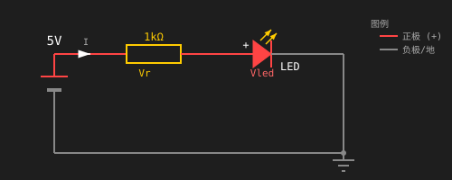
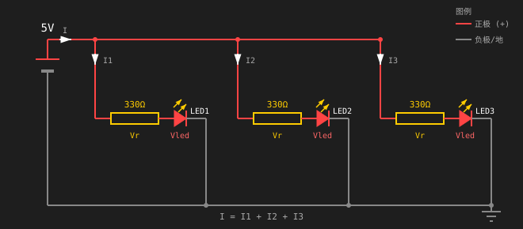
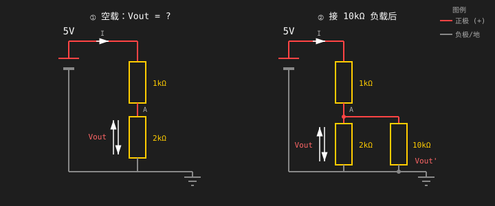
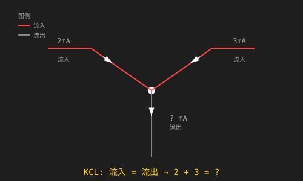
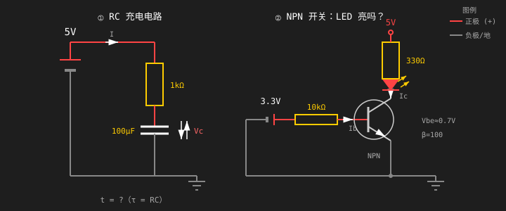

# 机器人工程师学习教程

一套从零电子基础起步，6 个月掌握 ROS2、控制论和求职级机器人技能的实践课程。

## 项目结构

| 文件夹 | 说明 |
|--------|------|
| [`教程/`](./%E6%95%99%E7%A8%8B/) | 1–6 月文章式原始学习计划 |
| [`进度/`](./%E8%BF%9B%E5%BA%A6/) | 第 1 月 30 天逐日实践指南 + 专业术语中英文对照表 |
| [`day-01/`](./day-01/) | 第 1 天学习内容（仿真截图 + 笔记） |

本仓库同时作为公开学习日志。每个实验、电路和机器人项目都会记录照片、原理图、代码，以及专门的「出了什么问题 & 如何修复」部分。

---

## 6 个月学习路线

| 月份 | 学习重点 |
|------|----------|
| 1 | 电子学基础、面包板、焊接、ESP32-S3、传感器、直流电机 |
| 2 | 单片机进阶、电机驱动、舵机/步进电机控制、IMU、超声波测距 |
| 3 | 机械设计、CAD、3D 打印、激光切割、底盘制作 |
| 4 | ROS2 仿真、Gazebo、Nav2、企业级开发实践 |
| 5 | 控制理论、PID 调参、卡尔曼滤波、数学基础 |
| 6 | LeRobot、机器人强化学习、专精方向、作品集与求职 |

---

## 第 1 月概览

- **第 1 周** — 电路理论与仿真（Falstad、Tinkercad、All About Circuits）
- **第 2 周** — ESP32-S3 GPIO、PWM、ADC、串口通信
- **第 3 周** — 焊接、HC-SR04 超声波、MPU-6050 IMU、直流电机 + TB6612 驱动
- **第 4 周** — Python 脚本、Git/GitHub 工作流、Wi-Fi 遥控小车综合项目

预算：**$0–$90**（仅仿真器 → 完整 ESP32 入门套件）。

### 本仓库文件结构

```
robotics-engineer-learning-tutorial/
├── README.md                    ← 你正在看这里（中文）
├── README.en.md                 ← English version
├── 教程/                        ← 原始 1–6 月学习计划
├── 进度/                        ← 第 1 月 30 天逐日指南 + 术语表
├── day-01/                      ← 第 1 天学习内容（截图 + 笔记）
├── day-02/                      ← 第 2 天学习内容（截图 + 笔记）
├── day-04/                      ← 第 4 天学习内容（截图 + 笔记）
└── day-05/                      ← 第 5 天学习内容（截图 + 笔记）
```

---

## 第 1 天 — 欧姆定律

### 目标
理解电压、电流和电阻。搭建并仿真你的第一个电路。用实际测量值验证欧姆定律。

### 仿真截图
- **Falstad 仿真 — 单电阻 (1 kΩ @ 5 V):** [`day-01/1kΩ.png`](day-01/1kΩ.png)
- **Falstad 仿真 — 单电阻 (220 Ω @ 5 V):** [`day-01/220Ω.png`](day-01/220Ω.png)
- **Falstad 仿真 — 单电阻 (10 kΩ @ 5 V):** [`day-01/10kΩ.png`](day-01/10kΩ.png)
- **Tinkercad 注册成功:** [`day-01/tinkercad.png`](day-01/tinkercad.png)

### Falstad 电路文件

- **可复用电路模板：** [`day-01/series-resistor-circuit.txt`](day-01/series-resistor-circuit.txt)
  - 从 Falstad 导出的 1 kΩ 串联电路
  - 导入方法：打开 https://www.falstad.com/circuit/ → File → Import → 粘贴文件内容
  - 修改电阻值：找到 `<r ... r="1000"/>`，将 `1000` 改为目标电阻值（单位 Ω），即可快速重现不同电阻的仿真

### 实测数据对比

| 电阻值 | 电流 (I) | 功率 (P) | 计算验证 |
|--------|----------|----------|----------|
| 1 kΩ | 5 mA | 25 mW | I = 5V/1kΩ = 5mA, P = V×I = 25mW ✅ |
| 220 Ω | 22.727 mA | 113.636 mW | I = 5V/220Ω ≈ 22.7mA, P = 25/220 ≈ 113.6mW ✅ |
| 10 kΩ | 500 µA | 2.5 mW | I = 5V/10kΩ = 0.5mA, P = 25/10000 = 2.5mW ✅ |

> 验证结论：所有实测值与欧姆定律 I = V/R 和功率公式 P = V²/R 完全吻合。

### 计算公式

**1. 欧姆定律**
```
V = I × R
```
- `V` = 电压，单位伏特 (V)
- `I` = 电流，单位安培 (A)
- `R` = 电阻，单位欧姆 (Ω)

> 来自我的 Falstad 仿真验证：
> - 5 V 接 1 kΩ → I = 5 V / 1000 Ω = **5 mA**
> - 5 V 接 220 Ω → I = 5 V / 220 Ω ≈ **22.727 mA**
> - 5 V 接 10 kΩ → I = 5 V / 10000 Ω = **0.5 mA (500 µA)**

**2. 功率消耗**
```
P = V × I = I² × R = V² / R
```
- `P` = 功率，单位瓦特 (W)
- 常见直插电阻额定功率为 1/4 W（0.25 W）

> 来自我的 Falstad 仿真验证：
> - 5 V 接 1 kΩ → P = 25 / 1000 = **25 mW**
> - 5 V 接 220 Ω → P = 25 / 220 ≈ **113.6 mW**
> - 5 V 接 10 kΩ → P = 25 / 10000 = **2.5 mW**（远低于 1/4 W 额定值）

### 快速参考

| 符号 | 含义 | 单位 |
|------|------|------|
| `V` | 电压 | 伏特 (V) |
| `I` | 电流 | 安培 (A) |
| `R` | 电阻 | 欧姆 (Ω) |
| `P` | 功率 | 瓦特 (W) |

---

## 第 2 天 — 串联与并联电路

### 目标
计算等效电阻，理解分压原理。

### 仿真截图

- **Falstad 仿真 — 串联 (1 kΩ + 2 kΩ @ 5 V):** [`day-02/1kΩ-串联-2kΩ.png`](day-02/1kΩ-串联-2kΩ.png)
- **Falstad 仿真 — 并联 (1 kΩ // 1 kΩ @ 5 V):** [`day-02/1kΩ-并联-1kΩ.png`](day-02/1kΩ-并联-1kΩ.png)
- **Tinkercad — 串联电路（万用表并联测电压 3.33V，串联测电流 1.67mA）:** [`day-02/电路-串联-tinkercad.png`](day-02/电路-串联-tinkercad.png)
- **Tinkercad — 并联电路（电压 5V，电流 10mA，等效电阻 500Ω）:** [`day-02/电路-并联-tinkercad.png`](day-02/电路-并联-tinkercad.png)

### Falstad 电路文件

- **串联电路模板：** [`day-02/电路-1kΩ-串联-2kΩ.txt`](day-02/电路-1kΩ-串联-2kΩ.txt)
  - 1 kΩ + 2 kΩ 串联，接 5V 电源
- **并联电路模板：** [`day-02/电路-1kΩ-并联-1kΩ.txt`](day-02/电路-1kΩ-并联-1kΩ.txt)
  - 两个 1 kΩ 并联，接 5V 电源
  - 导入方法同 Day 1

### 实测数据

**1. 串联电路 (1 kΩ + 2 kΩ)**

| 参数 | 实测值 | 计算值 | 验证 |
|------|--------|--------|------|
| 总电阻 | 3 kΩ | 1k + 2k = 3k Ω | ✅ |
| 总电流 | 1.667 mA | 5V / 3kΩ ≈ 1.667mA | ✅ |
| 中间点电压 (Vout) | 3.333 V | 5 × 2k / (1k+2k) = 3.33V | ✅ |
| 1kΩ 功率 | — | I² × R = (1.667m)² × 1k ≈ 2.78mW | — |
| 2kΩ 功率 | — | I² × R = (1.667m)² × 2k ≈ 5.56mW | — |

> 分压公式验证：Vout = Vin × R2 / (R1 + R2) = 5 × 2000 / 3000 = **3.333 V**

**2. 并联电路 (1 kΩ // 1 kΩ)**

| 参数 | 实测值 | 计算值 | 验证 |
|------|--------|--------|------|
| 等效电阻 | 500 Ω | (1k × 1k) / (1k + 1k) = 500Ω | ✅ |
| 总电流 | 10 mA | 5V / 500Ω = 10mA | ✅ |
| 各支路电流 | 5 mA | 5V / 1kΩ = 5mA | ✅ |

> 并联公式验证：1/Req = 1/R1 + 1/R2 → Req = 500 Ω，总电流 10mA = 5V/500Ω ✅

### 公式总结

**分压公式**
```
Vout = Vin × R2 / (R1 + R2)
```
- 适用于串联电路，R2 是下端电阻（靠近 GND）

**串联等效电阻**
```
R_eq = R1 + R2 + ...
```

**并联等效电阻**
```
1 / R_eq = 1/R1 + 1/R2
或
R_eq = (R1 × R2) / (R1 + R2)
```

---

## 第 3 天 — 基尔霍夫定律（KCL/KVL）与功率计算

### 目标
理解 KCL（基尔霍夫电流定律）和 KVL（基尔霍夫电压定律），计算每个元件的功耗，并理解电阻额定功率的意义。

### 仿真截图

- **Tinkercad 仿真 — KVL（串联分压 1 kΩ + 2 kΩ @ 5 V）:** [`day-03/电路A-KVL.png`](day-03/电路A-KVL.png)
- **Tinkercad 仿真 — KCL（并联分流 1 kΩ // 1 kΩ @ 5 V）:** [`day-03/电路B-KCL.png`](day-03/电路B-KCL.png)

### 实测数据

**1. KVL 验证 — 串联电路 (1 kΩ + 2 kΩ)**

| 参数 | 实测值 | 计算值 | 验证 |
|------|--------|--------|------|
| 总电阻 | 3 kΩ | 1k + 2k = 3k Ω | ✅ |
| 总电流 | 1.667 mA | 5V / 3kΩ ≈ 1.667mA | ✅ |
| 1kΩ 电压 (V1) | 1.667 V | I × R = 1.667m × 1k ≈ 1.667V | ✅ |
| 2kΩ 电压 (V2) | 3.333 V | I × R = 1.667m × 2k ≈ 3.333V | ✅ |
| V1 + V2 | 5.000 V | 1.667 + 3.333 = 5V | ✅ |
| 1kΩ 功率 | 2.78 mW | I² × R = (1.667m)² × 1k ≈ 2.78mW | — |
| 2kΩ 功率 | 5.56 mW | I² × R = (1.667m)² × 2k ≈ 5.56mW | — |

> KVL 验证：沿回路一周，电压降之和 = 1.667V + 3.333V = 5V = 电源电压 ✅

**2. KCL 验证 — 并联电路 (1 kΩ // 1 kΩ)**

| 参数 | 实测值 | 计算值 | 验证 |
|------|--------|--------|------|
| 等效电阻 | 500 Ω | (1k × 1k) / (1k + 1k) = 500Ω | ✅ |
| 总电流 | 10 mA | 5V / 500Ω = 10mA | ✅ |
| 支路 1 电流 | 5 mA | 5V / 1kΩ = 5mA | ✅ |
| 支路 2 电流 | 5 mA | 5V / 1kΩ = 5mA | ✅ |
| I_total = I1 + I2 | 10 mA | 5mA + 5mA = 10mA | ✅ |
| 各支路功率 | 25 mW | V² / R = 25 / 1k = 25mW | — |

> KCL 验证：流入节点总电流 = 流出各支路电流之和 = 10mA ✅

**3. 功率对比（理解额定功率）**

| 电阻值 | 接 5V 时的功率 | 1/4W 额定值 | 是否安全 |
|--------|----------------|-------------|----------|
| 1 kΩ | 25 mW | 250 mW | ✅ 安全（仅 10%） |
| 100 Ω | 250 mW | 250 mW | ⚠️ 已达上限（100%） |

> 思考：100Ω 电阻在 5V 下功耗 250mW，正好等于 1/4W 额定值。实际使用中应留有余量，通常选择额定功率 ≥ 实际功耗 2 倍的电阻。

### 公式总结

**KVL（基尔霍夫电压定律）**
```
∑V = 0 （沿闭合回路，电压升 = 电压降）
V_source = V1 + V2 + ...
```

**KCL（基尔霍夫电流定律）**
```
∑I = 0 （对任意节点，流入电流 = 流出电流）
I_total = I1 + I2 + ...
```

**功率公式**
```
P = V × I = I² × R = V² / R
```

---

## 第 4 天 — RC 电路与电容充放电

### 目标
理解 RC 时间常数，观察电容充电/放电的指数曲线，掌握时间常数 τ = R × C 的计算方法。

### 工具选择
- **Falstad**：内置示波器可实时观察电容电压随时间变化的指数曲线

### 仿真截图

- **Falstad 仿真 — RC 充电电路 (1 kΩ + 10 μF @ 5 V，示波器显示指数充电曲线):** [`day-04/电容电压变化.png`](day-04/电容电压变化.png)

### Falstad 电路文件

- **RC 充电电路模板：** [`day-04/电路-电容电压变化.txt`](day-04/电路-电容电压变化.txt)
  - R = 1 kΩ，C = 10 μF，电源 = 5 V
  - 导入方法：打开 https://www.falstad.com/circuit/ → File → Import → 粘贴文件内容
  - 示波器已配置：通道 0 = 电容电压，通道 3 = 电源

### 实测数据（仿真验证）

| 参数 | 数值 | 单位 |
|------|------|------|
| 电阻 (R) | 1,000 | Ω |
| 电容 (C) | 10 | μF |
| 电源电压 (Vcc) | 5 | V |
| 时间常数 τ | 10 | ms |
| 5τ (约 99% 充满) | 50 | ms |

> τ = R × C = 1,000 Ω × 10 μF = 1,000 × 10×10⁻⁶ = 0.01 s = **10 ms**
>
> 经过 5τ = 50 ms 后，电容电压达到约 99% 的电源电压（Vc ≈ 5V × (1 - e⁻⁵) ≈ 4.97 V）

### 仿真观察

- **初始状态 (t = 0)：** 电容电压 = 0 V（未充电）
- **τ = 10 ms 时：** 电容电压 ≈ 5V × (1 - e⁻¹) ≈ **3.16 V** (63.2%)
- **2τ = 20 ms 时：** 电容电压 ≈ **4.32 V** (86.5%)
- **3τ = 30 ms 时：** 电容电压 ≈ **4.75 V** (95%)
- **4τ = 40 ms 时：** 电容电压 ≈ **4.91 V** (98.2%)
- **5τ = 50 ms 时：** 电容电压 ≈ **4.97 V** (99.3%)

### 公式总结

**RC 充电公式**
```
Vc(t) = Vcc × (1 - e^(-t/τ))
```
- `Vc(t)` = t 时刻电容电压 (V)
- `Vcc` = 电源电压 (V)
- `t` = 时间 (s)
- `τ` = 时间常数 = R × C (s)

**RC 放电公式**
```
Vc(t) = V0 × e^(-t/τ)
```
- `V0` = 初始电容电压 (V)
- 放电时电容通过电阻释放储存的能量

**时间常数规则**
```
τ = R × C
5τ ≈ 99% 充满/放完
```

### 关键观察

1. **指数上升曲线：** 电容电压不是线性上升，而是指数增长，开始时快，后来慢
2. **τ 的物理意义：** 电容电压从 0 上升到 63.2% 所需的时间
3. **电阻越大充电越慢：** R 增大 → τ 增大 → 曲线更平缓
4. **电容越大充电越慢：** C 增大 → τ 增大 → 充电时间延长

### R、C 组合对比实验

| 实验 | 电阻 R | 电容 C | τ = R×C | 充满时间 (5τ) | 仿真观察 |
|------|--------|--------|---------|---------------|----------|
| ① 基准 | 1 kΩ | 10 μF | 10 ms | 50 ms | 中等速度 |
| ② 小电阻 | 100 Ω | 10 μF | 1 ms | 5 ms | 约 5 ms 充满 |
| ③ 大电阻 | 10 kΩ | 10 μF | 100 ms | 500 ms | 约 0.5 s 充满 |
| ④ 大电容 | 1 kΩ | 100 μF | 100 ms | 500 ms | 约 0.5 s 充满（与③相同 τ） |
| ⑤ 小电容 | 1 kΩ | 1 μF | 1 ms | 5 ms | 约 5 ms 充满 |

> **关键发现：**
> - τ 与 R 成正比：R 增大 10 倍 → τ 增大 10 倍
> - τ 与 C 成正比：C 增大 10 倍 → τ 增大 10 倍
> - 不同 R、C 组合只要 τ 相同，充电曲线形状完全相同（只是时间轴缩放）
> - **经验法则：约 5 τ 后电容基本充满（99%）**

---

## 第 5 天 — 二极管与晶体管开关

### 目标
理解二极管正向压降特性，学会计算限流电阻，并理解晶体管作为电子开关的基本原理。

### 工具选择
- **Tinkercad**：可在电路图中放置可见万用表，一次截图同时显示所有电压、电流和电阻值

### 仿真截图

- **Tinkercad 仿真 — 二极管/LED 限流电路:** [`day-05/二极管.png`](day-05/二极管.png)
- **Tinkercad 仿真 — NPN 晶体管开关:** [`day-05/晶体管.png`](day-05/晶体管.png)

### 实测数据（Tinkercad 仿真验证）

**1. 普通二极管（1N4007）**

| 参数 | 计算值 | 实测值 | 验证 |
|------|--------|--------|------|
| 电源电压 | 5 V | 5 V | ✅ |
| 二极管压降 | ~0.7 V | 0.57 V | ✅（Tinkercad 模型偏低，实际电路以实测为准） |
| 回路电流 | (5-0.7)/1000 ≈ 4.3 mA | 4.43 mA | ✅ |
| 电阻功率 | I²×R ≈ 19.6 mW | — | — |

> 限流电阻公式：R = (Vin - Vd) / Id = (5 - 0.57) / 0.00443 ≈ **1,000 Ω**

**2. LED（发光二极管）**

| 参数 | 计算值 | 实测值 | 验证 |
|------|--------|--------|------|
| 电源电压 | 5 V | 5 V | ✅ |
| LED 压降 | 红 LED ≈ 1.8-2.2 V | 1.89 V | ✅ |
| 回路电流 | (5-1.89)/1000 ≈ 3.1 mA | 3.11 mA | ✅ |
| 电阻功率 | I²×R ≈ 9.7 mW | — | — |

> 限流电阻公式：R = (Vin - Vled) / Iled = (5 - 1.89) / 0.00311 ≈ **1,000 Ω**

**3. 二极管 vs LED 对比**

| 特性 | 普通二极管 | LED |
|------|-----------|-----|
| 正向压降 | 0.57 V | 1.89 V |
| 是否发光 | 否 | 是（红光） |
| 主要用途 | 整流、保护 | 指示灯、显示 |
| 回路电流 | 4.43 mA | 3.11 mA |

**4. NPN 晶体管开关（2N3904）**

| 参数 | 计算值 | 实测值 | 验证 |
|------|--------|--------|------|
| 基极电流 Ib | (3.3-0.7)/1000 ≈ 2.6 mA | 2.59 mA | ✅ |
| 集电极电流 Ic | ~3-5 mA | 3.1 mA | ✅ |
| LED 电压 | ~1.8-2.2 V | 1.89 V | ✅ |
| C-E 压降 Vce | ~0.1-0.3 V（饱和） | 6.91 mV | ✅ |
| 电流放大倍数 β | Ic/Ib ≈ 1.2 | 3.1/2.59 ≈ 1.2 | ✅（开关模式，非放大） |

> **关键发现：**
> - 晶体管 C-E 压降仅 **6.91 mV**，说明完全饱和导通，相当于理想开关
> - 集电极电流（3.1mA）< 基极电流（2.59mA），因为这里晶体管作为**开关**使用，不是放大模式
> - 开关模式下，β 值没有意义，晶体管要么完全导通（C-E 压降极小），要么完全截止

### 公式总结

**限流电阻计算**
```
R = (Vin - Vd) / I
```
- `Vin` = 电源电压 (V)
- `Vd` = 二极管/LED 正向压降 (V)
- `I` = 期望电流 (A)

**功率计算**
```
P = I² × R
```

### 关键观察

1. **二极管正向压降固定**：无论电流微小变化，压降基本稳定（普通管约 0.6-0.7V，LED 约 1.8-3.3V）
2. **限流电阻保护二极管**：没有电阻，二极管会因电流过大烧毁
3. **LED 需要更大限流电阻**：因为 LED 压降更高，相同电流下电阻功耗更低
4. **Tinkercad 模型差异**：普通二极管实测 0.57V，低于理论值 0.7V，但作为学习完全可接受
5. **晶体管开关特性**：导通时 C-E 压降极小（6.91mV），相当于理想闭合开关
6. **基极电流控制开关**：基极有 2.59mA 电流时，晶体管导通，LED 亮；基极无电流时，LED 灭
7. **小电流控制大电流**：基极用小电流（2.59mA）控制集电极回路（3.1mA），实现电平转换和开关功能
8. **为什么 3.3V GPIO 不能直接驱动 12V 电机**：
   - ESP32-S3 GPIO 最大输出电流约 **20-40 mA**，电压 **3.3V**
   - 12V 电机典型工作电流 **500 mA-2A**
   - GPIO 无法提供足够电流，且电压不匹配
   - **解决方案**：GPIO → 晶体管基极（小电流控制），12V 电源 → 集电极（电机负载），发射极 → GND
   - 晶体管作为"开关"，用小电流控制大电流，实现电平转换和功率放大

---

## 第 6 天 — 面包板与万用表基础

### 目标
学会用面包板搭建真实电路，掌握面包板内部连接规则，用 USB 剪线方式为面包板供电，并点亮第一颗 LED。

### 实验器材

| 元器件 | 规格 | 用量 |
|--------|------|------|
| LED | 白色 | 1 |
| 电阻 | 1 kΩ | 1 |
| 面包板 | 830 孔 | 1 |
| 跳线 | 无焊 | 2 |
| USB 充电线 | 废旧 A-to-C/Micro，剪断取电 | 1 |
| 充电头 | 5V USB-A 输出 | 1 |
| 按钮 | 瞬动型 | 1 |

### 面包板接线照片

- **面包板整体接线：** [`day-06/点亮LED-充电头USB剪线供电.png`](day-06/点亮LED-充电头USB剪线供电.png)

### 供电拓扑：USB 剪线取电

```
[插墙充电头 5V] ── USB-A 方头
                        │
                  [废旧 USB 线剪断]
                        │
                红线 ──→ +5V ──→ 面包板 + 轨
                黑线 ──→ GND ──→ 面包板 − 轨
                        │
              + 轨 → 1kΩ → LED → 按钮 → − 轨
```

**操作步骤**：
1. 找一根废旧 USB 充电线（A-to-C 或 A-to-Micro）
2. 剪掉**插手机那一端**，保留 USB-A 方头
3. 剥出外皮，找到**红线(+5V)** 和**黑线(GND)**，白绿数据线不用
4. 先接面包板：红线插 + 轨，黑线插 − 轨
5. 再接 LED 电路：+ 轨 → 1kΩ → LED 长脚 → LED 短脚 → 按钮 → − 轨
6. **最后**才把 USB-A 方头插进充电头

### 实测记录（待万用表到货补充）

| 测量点 | 预期值 | 实测值 | 备注 |
|--------|--------|--------|------|
| 电源输出电压 | ≈5.0V | — | USB 标准 5V |
| + 轨对 − 轨电压 | ≈5.0V | — | |
| LED 两端电压 | ≈1.8V | — | 白光 LED 典型压降（正向导通后基本固定） |
| 回路电流 | ≈3.2mA | — | I = (5V - 1.8V) / 1kΩ = 3.2V / 1kΩ |
| 电阻两端电压 | ≈3.2V | — | V = I × R = 3.2mA × 1kΩ（与 LED 压降之和 = 5V） |
| 电阻功耗 | ≈10mW | — | P = I²R = 0.01mW |

**欧姆定律验证**：
```
Vtotal = Vresistor + Vled = 3.2V + 1.8V = 5.0V ✓
```

### 公式总结

**限流电阻计算**
```
R = (Vin - Vled) / Iled
```
- `Vin` = 电源电压 (V)
- `Vled` = LED 正向压降 (V)
- `Iled` = 期望 LED 电流 (A)

**欧姆定律**
```
I = V / R
```

**功率计算**
```
P = I² × R
```

### 关键观察

1. **面包板电源轨纵向连通**：所有插入 + 轨的元件都互相连通，插入 − 轨的也互相连通
2. **LED 长脚为阳极（+），短脚为阴极（−）**，反接时不亮但不损坏
3. **限流电阻必须串联**：直接 5V 接 LED 会因电流过大烧毁
4. **5V 供电 + 1kΩ 电阻时电流约 3.2mA**，LED 安全且亮度足够
5. **充电宝 Type-C 口可能不向无协议设备供电**，插墙充电头更可靠
6. **MB102 电源模块故障特征**：绿灯不亮 = 无输出，换线换电源无效 = 模块本身问题

### 遇到的问题

**1. MB102 电源模块绿灯不亮**

- 换过多根 USB 线 + 多个电源（充电宝、充电头）
- 用手机测试同一根线能正常充电 → 线和电源正常
- 结论：模块本身故障（USB 座虚焊或内部断路），待万用表终审后找商家补发

**2. 按钮实现"按一下保持亮，再按灭"**

- 现状：瞬动按钮只能按住亮、松开灭
- 后续方案：换自锁型轻触按键，或用 ESP32 代码检测按键翻转

---

## 第 7 天 — 第一周复习与答疑

### 目标
巩固前 6 天知识，通过手算和 Tinkercad 仿真检验对电路基础的理解，并整理问题清单。

### 任务一：手算电路题

> 以下 5 道题覆盖串并联、分压、KCL、RC、晶体管，均基于前 6 天所学知识。
> 计算时假设：白光 LED 正向压降 ≈1.8V，NPN 硅管 Vbe ≈0.7V，β = 100。

**题目 1 — 串联电路**
5V 电源，串联 1kΩ 电阻 + 白光 LED（Vf≈1.8V），求：
- 回路电流
- 电阻两端电压



**解：**

> 1. 设回路电流为 I（未知量）
> 2. 回路里：Vin = Vr + Vled → 5V = I × 1kΩ + 1.8V
> 3. 解方程：I = (5V - 1.8V) / 1kΩ = 3.2V / 1kΩ = **3.2mA**
> 4. 电阻电压：Vr = I × R = 3.2mA × 1kΩ = **3.2V**

**题目 2 — 并联电路**
5V 电源，3 个 LED 并联，每个串联 330Ω 限流电阻，求总电流（LED 压降按 1.8V 计）



**解：**

> 1. 并联电路各支路电压等于电源电压：V_branch = 5V
> 2. 每条支路应用 KVL：Vr + Vled = 5V → Vr = 5V - 1.8V = 3.2V
> 3. 每条支路电流：I_branch = Vr / R = 3.2V / 330Ω ≈ 9.7mA
> 4. 总电流（KCL）：I_total = I1 + I2 + I3 = 9.7mA × 3 = **29mA**

**题目 3 — 分压电路**
5V 电源，1kΩ + 2kΩ 串联分压，求：
- 2kΩ 电阻两端电压
- 若在 2kΩ 两端接一个 10kΩ 负载电阻，负载两端实际电压是多少？



**解：**

**第一问：空载分压**

1. 串联电流相等：
   ```
   I = 5V / (1kΩ + 2kΩ) = 5V / 3kΩ ≈ 1.67mA
   ```
2. 2kΩ 电阻电压：
   ```
   V2 = I × 2kΩ = 1.67mA × 2kΩ ≈ 3.33V
   ```
   或直接用分压公式：V2 = 5V × 2kΩ / 3kΩ = 3.33V

**第二问：带 10kΩ 负载（两种解法）**

**方法一：等效电阻法**

1. 并联等效电阻公式：
   ```
   Req = (R2 × Rload) / (R2 + Rload) = (2kΩ × 10kΩ) / (2kΩ + 10kΩ) ≈ 1.667kΩ
   ```
2. 总电流：
   ```
   I = 5V / (1kΩ + 1.667kΩ) ≈ 1.875mA
   ```
3. 负载电压（即等效电阻电压）：
   ```
   V_load = I × Req = 1.875mA × 1.667kΩ ≈ 3.125V
   ```

**方法二：节点电压法（KCL + KVL）**

1. 设并联部分电压为 V2，1kΩ 电阻电压为 V1
2. KCL：流入 = 流出
   ```
   V1 / 1kΩ = V2 / 2kΩ + V2 / 10kΩ
   ```
3. KVL：
   ```
   V1 + V2 = 5V
   ```
4. 代入解得：
   ```
   V2 ≈ 3.125V
   ```

**题目 4 — KCL（基尔霍夫电流定律）**
一个节点，3 个支路电流分别为 2mA（流入）、3mA（流入），求第三支路（流出）的电流。



**解：**

```
流入 = 流出
2mA + 3mA = 5mA
```

第三支路电流为 **5mA**。

**题目 5 — RC 电路 + 晶体管**
5V 电源，1kΩ 电阻 + 100µF 电容串联，求充电至 63.2% 所需时间（时间常数 τ = RC）。
NPN 晶体管基极通过 10kΩ 电阻接 3.3V，发射极接地，集电极接 LED+330Ω 到 5V，求 LED 是否亮（假设 β=100，Vbe≈0.7V）。



**解：**

**第一问：RC 充电时间**

1. 基尔霍夫电压定律（KVL）：
   ```
   Vin = I × R + Vc
   ```
2. 电容电流与电压关系：
   ```
   I = C × dVc/dt
   ```
3. 代入 KVL，整理为微分方程：
   ```
   Vin = RC × dVc/dt + Vc
   ```
4. 解微分方程（边界条件 t=0 时 Vc=0）：
   ```
   Vc(t) = Vin × (1 - e^(-t/RC))
   ```
5. 时间常数：
   ```
   τ = R × C = 1kΩ × 100µF = 0.1s
   ```
6. 充电至 63.2%：
   ```
   令 Vc/Vin = 63.2% = 0.632
   0.632 = 1 - e^(-t/τ)
   e^(-t/τ) = 0.368
   -t/τ = ln(0.368) = -1
   t = τ = **0.1s**
   ```

**第二问：晶体管开关**

1. 计算基极电流：基极通过 10kΩ 电阻接 3.3V，Vbe = 0.7V
   ```
   Ib = (3.3V - Vbe) / Rb = (3.3V - 0.7V) / 10kΩ = 2.6V / 10kΩ = 0.26mA
   ```

2. 晶体管电流放大：Ic = β × Ib
   ```
   Ic = 100 × 0.26mA = 26mA
   ```
   这是晶体管理论上能提供的最大集电极电流

3. 计算 LED 支路实际电流（负载限制）：
   - 集电极回路 KVL：5V = Vf + Vce(sat) + Ic × Rc
   - LED 压降 Vf ≈ 1.8V，晶体管饱和压降 Vce(sat) ≈ 0.2V
   - 电阻两端实际电压：Vr = 5V - 1.8V - 0.2V = 3.0V
   - LED 支路最大电流：
   ```
   ILED_max = Vr / Rc = 3.0V / 330Ω ≈ 9.09mA
   ```

4. 判断晶体管状态：比较 Ic（理论）与 ILED_max（负载限制）
   ```
   Ic = 26mA > ILED_max = 9.09mA
   ```
   集电极电流需求（9.09mA）小于晶体管能提供的电流（26mA）

5. 饱和验证：基极电流是否足以使晶体管饱和
   - 饱和所需最小基极电流：
   ```
   Ib_min = ILED_max / β = 9.09mA / 100 = 0.0909mA
   ```
   - 实际基极电流：Ib = 0.26mA
   - 判断：Ib = 0.26mA > Ib_min = 0.0909mA ✓

6. 晶体管集电极电压瞬态分析（含微分方程）：
   - 集电极回路：5V → LED → 330Ω → 晶体管集电极 → 发射极 → 地
   - 设集电极对地电压为 Vc(t)，晶体管饱和时 Vce(sat) ≈ 0.2V
   - 对集电极回路应用 KVL：
   ```
   5V = Vf + I_c(t) × 330Ω + Vc(t)
   ```
   - 整理为微分方程（假设集电极有寄生电容 Cp）：
   ```
   I_c(t) = Cp × dVc/dt
   ```
   ```
   5V - Vf - 330Ω × Cp × dVc/dt - Vc(t) = 0
   ```
   - 整理为标准形式：
   ```
   dVc/dt + (1/(330Ω × Cp)) × Vc(t) = (5V - Vf)/(330Ω × Cp)
   ```
   - 边界条件：t = 0 时，Vc(0) = 5V（晶体管截止，集电极相当于开路）
   - 解微分方程得：
   ```
   Vc(t) = Vce(sat) + (5V - Vce(sat)) × e^(-t/τ_c)
   ```
     其中时间常数 τ_c = 330Ω × Cp

7. 结论：晶体管工作在饱和区，LED 有足够的电流通过，**LED 会亮**
   - 稳态时 Vc ≈ Vce(sat) ≈ 0.2V
   - 瞬态过程按指数衰减至稳态值，时间常数取决于集电极寄生电容

---

### 任务二：Tinkercad 自动路灯电路

**电路描述**：光敏电阻（LDR）+ NPN 晶体管控制 LED。环境光暗时 LED 亮，环境光亮时 LED 灭。

**Tinkercad 电路接线**：

```
5V ──[10kΩ]── B ──[LDR]── GND

5V ── LED ──[330Ω]── C
E ─────────────────── GND
```

**接线说明**：上电阻 10kΩ 接 5V，节点 B 经 LDR 接地。LDR 在下方（接 GND）：亮环境 LDR 阻值小 → B 点电压低于 0.7V → 晶体管截止 → LED 灭；暗环境 LDR 阻值大 → B 点抬升过 0.7V → 晶体管饱和导通 → LED 亮。

**Tinkercad 仿真截图**：
- **黑暗亮灯（LDR 亮度最低）:** [`day-07/Tinkercad电路-黑暗亮灯.png`](day-07/Tinkercad电路-黑暗亮灯.png)
- **白天灯灭（LDR 亮度最高）:** [`day-07/Tinkercad电路-白天灯灭.png`](day-07/Tinkercad电路-白天灯灭.png)

**实测数据（Tinkercad 仿真验证）**

| 状态 | Vc | Vb | V光敏(LDR) | Vled | LED |
|------|-----|------|-----------|------|-----|
| 黑暗（灯亮） | 41.7mV | 695mV | 695mV | 1.97V | ✓ 亮 |
| 白天（灯灭） | 3.68V | 230mV | 230mV | 1.32V | ✗ 灭 |

> 黑暗时：Vb = 695mV > 0.7V → 晶体管饱和 → Vc = 41.7mV ≈ 0 → LED 亮
> 白天时：Vb = 230mV < 0.7V → 晶体管截止 → Vc 浮空 → LED 灭
> 注意：白天 Vc = 3.68V 为万用表浮空测量值，不代表真实工作状态

### 公式总结

**串联限流**
```
I = (Vin - Vf) / R
```

**分压（空载）**
```
Vout = Vin × R2 / (R1 + R2)
```

**分压（带负载）**
```
Vout = Vin × Rload / (R1 + Rload)   // R2 被负载并联替代
```

**RC 时间常数**
```
τ = R × C
t_63.2% = τ
```

**晶体管开关条件**
```
Ib = (Vbase_source - Vbe) / Rb
Ic = β × Ib
LED 亮条件：Ic > LED_阈值电流（约 1-2mA）
```

### 关键观察

1. **LDR 位置决定电路方向**：10kΩ 在上（接 5V）、LDR 在下（接 GND）才能实现"暗亮灭"；反过来则行为相反
2. **基极电压是开关阈值**：Vb ≈ 0.7V 是晶体管导通的临界点，测量 Vb 就能判断电路状态
3. **饱和时 Vc ≈ 0V**：晶体管深度饱和时集电极电压极低（40mV 左右），LED 得到最大电流
4. **截止时 Vc 浮空**：万用表测截止时的 Vc 会得到不确定值（如 3.68V），不代表真实电位
5. **LDR 两端电压 ≈ Vb**：因为 LDR 下端接地，上端接基极，所以 V_LDR = Vb - GND = Vb
6. **分压决定开关状态**：10kΩ 与 LDR 组成分压器，基极电压随 LDR 阻值变化——暗环境 LDR 阻值大，B 点抬升导通；亮环境 LDR 阻值小，B 点拉低截止。仿真里 LDR 阻值不会真正无穷大，因此截止时基极不会完全悬空

### 问题清单

（列出本周学习中不懂的问题，周末集中解决）

---

## 学习日志规范

每天的学习内容放在对应日期文件夹中，包括：

1. **我做了什么**（照片、GIF、原理图）
2. **代码**（注释清晰、编译/运行无误）
3. **测试结果**（测量值、示波器截图、串口日志）
4. **出了什么问题 & 如何修复** — 最重要的部分
5. **参考资料**（数据手册、教程链接、帮助过你的论坛帖子）

---

## 硬件清单

完整 BOM（物料清单）和预算分级详见：
- [`教程/第1月-电子学与工作台.md`](./%E6%95%99%E7%A8%8B/%E7%AC%AC1%E6%9C%88-%E7%94%B5%E5%AD%90%E5%AD%A6%E4%B8%8E%E5%B7%A5%E4%BD%9C%E5%8F%B0.md)
- [`进度/第1月-30天逐日指南.md`](./%E8%BF%9B%E5%BA%A6/%E7%AC%AC1%E6%9C%88-30%E5%A4%A9%E9%80%90%E6%97%A5%E6%8C%87%E5%8D%97.md)

---

## 推荐资源

- Falstad 电路仿真器：https://www.falstad.com/circuit/
- Tinkercad Circuits：https://www.tinkercad.com/circuits
- All About Circuits 教材：https://www.allaboutcircuits.com/textbook/
- ESP32-S3 官方文档：https://docs.espressif.com/projects/esp-idf/en/latest/esp32s3/

---

## 开源协议

本学习日志为个人学习用途。第三方资源版权归原作者所有。
