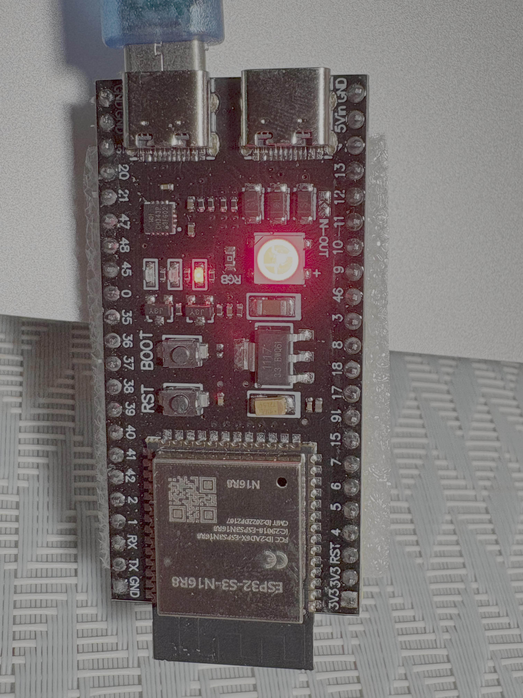
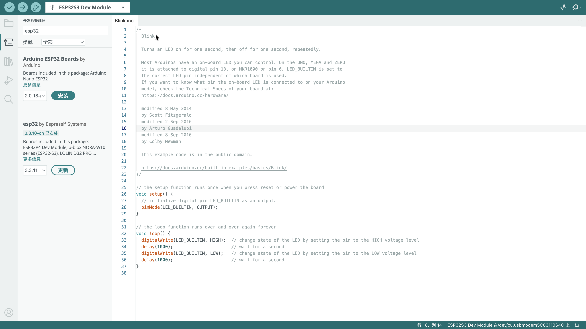
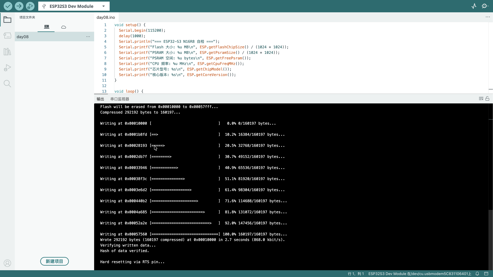
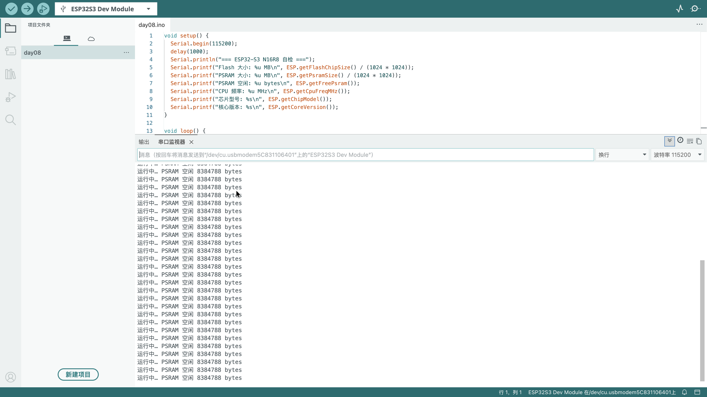

# Day 8：ESP32-S3 开发板初识与开发环境搭建

> 日期：2026-09-08（上传实测 2026-09-11）
> 状态：✅ 开发板认识完成，✅ Arduino IDE + esp32 开发包安装完成，✅ 自检程序已烧录并跑通，✅ 引脚功能笔记已整理

---

## 一、开发板认识

手头这块板子是 **ESP32-S3-WROOM-1 N16R8** 核心模组的 44 pin USB-C 开发板：



| 项目 | 参数 |
| --- | --- |
| 主控模组 | ESP32-S3-WROOM-1 **N16R8** |
| Flash | 16 MB |
| PSRAM | 8 MB（**Octal / OPI** 接口） |
| 内核 | Xtensa LX7 双核，最高 240 MHz |
| 无线 | Wi-Fi 2.4 GHz + Bluetooth 5 (LE) |
| 引脚 | 44 pin，Type-C 接口 |

### 两个 Type-C 口别插错

板上有 **两个 USB-C 接口**，功能完全不同：

| 接口 | 丝印 | 桥接芯片 | 连到 ESP32-S3 的引脚 | 用途 |
| --- | --- | --- | --- | --- |
| U2 | UART | CH343P | GPIO43 (U0TXD) / GPIO44 (U0RXD) | **串口下载 + 串口监视器**（本次使用这个） |
| U1 | USB | 无（原生） | GPIO19 (D-) / GPIO20 (D+) | USB-OTG / USB-JTAG 调试 |

> 关键点：本次上传和串口输出都走 **U2（CH343P → UART0）**。如果用 U1，需要在 Arduino IDE 里把 `USB CDC On Boot` 打开，否则串口监视器一片空白。

---

## 二、引脚功能笔记

### 引脚总览

| 类别 | 引脚 | 说明 |
| --- | --- | --- |
| 数字 GPIO | **GPIO 0–21、35–42、45–48** | 共 **33 个**可编程 IO |
| 串口 UART0 | **GPIO43 (TXD) / GPIO44 (RXD)** | 接 CH343P，用于烧录与串口打印 |
| USB-OTG | **GPIO19 (D-) / GPIO20 (D+)** | 原生 USB，也可做 USB-JTAG 调试 |
| JTAG 调试 | **GPIO39–42** | 默认 JTAG 复用脚 |
| 电源引脚 | **3V3 / 5V / GND** | 5V 可输入 4.5–5.5V；3V3 为板载 LDO 输出（约 1A，不建议大电流拉载） |
| 板载 RGB LED | **GPIO48** | WS2812B，单总线可编程彩灯（需额外库驱动） |
| 启动 / 复位 | **GPIO0 (BOOT) / EN (复位)** | 按住 BOOT 上电可进下载模式 |

### 模拟 / 触摸 / 外设分配

| 功能 | 引脚范围 | 注意事项 |
| --- | --- | --- |
| ADC1 | GPIO 1–10 | 模拟输入，**输入电压不得超过 3.3V** |
| ADC2 | GPIO 11–20 | ⚠️ **Wi-Fi 工作时 ADC2 不可用** |
| 触摸 Touch | GPIO 1–14 | 电容触摸通道 |

> 注：板载 WS2812B 彩灯的控制脚 GPIO48 已从原理图确认，但**尚未实际点亮验证**。核对本地开发环境：esp32 3.3.10-cn 内置库（`ESP32`、`BLE`、`WiFi`、`Wire` 等）中不含 WS2812/NeoPixel 驱动库，`~/Documents/Arduino/libraries` 也为空，因此要用板载彩灯需先额外安装库（如 Adafruit NeoPixel）。Day 9 的点灯实验改用**外接 LED**，可绕开这一依赖。

---

## 三、开发环境搭建

Arduino IDE 2.x + Espressif 官方 esp32 开发包，安装结果如下：



板卡管理器中显示 **esp32 by Espressif Systems 3.3.10-cn 已安装**。

### 开发板选择与参数（fqbn 记录）

工具 → 开发板选择 **ESP32S3 Dev Module**，具体配置：

| 配置项 | 取值 | 说明 |
| --- | --- | --- |
| 开发板 | ESP32S3 Dev Module | `esp32:esp32:esp32s3` |
| Flash Size | **16MB** | 匹配 N16 |
| PSRAM | **OPI PSRAM** | 匹配 R8（八线 PSRAM 必须选 OPI） |
| Flash Mode | QIO |  |
| CPU Frequency | 240 MHz |  |
| Upload Speed | 921600 |  |
| **USB CDC On Boot** | **Disabled**（默认） | ⚠️ 关键项，走 U2 串口时保持关闭 |
| 其他 | 默认值 | MSCOnBoot / DFUOnBoot 等均保持默认 |
| 端口 | `/dev/cu.usbmodem5C831106401` | CH343P 虚拟串口 |

---

## 四、自检程序（day08.ino）

### 代码

```cpp
void setup() {
  Serial.begin(115200);
  delay(1000);
  Serial.println("=== ESP32-S3 N16R8 自检 ===");
  Serial.printf("Flash 大小: %u MB\n", ESP.getFlashChipSize() / (1024 * 1024));
  Serial.printf("PSRAM 大小: %u MB\n", ESP.getPsramSize() / (1024 * 1024));
  Serial.printf("PSRAM 空闲: %u bytes\n", ESP.getFreePsram());
  Serial.printf("CPU 频率: %u MHz\n", ESP.getCpuFreqMHz());
  Serial.printf("芯片型号: %s\n", ESP.getChipModel());
  Serial.printf("核心版本: %s\n", ESP.getCoreVersion());
}

void loop() {
  delay(2000);
  Serial.printf("运行中… PSRAM 空闲 %u bytes\n", ESP.getFreePsram());
}
```

### 上传记录



```
Compressed 292192 bytes to 160197...
Wrote 292192 bytes (160197 compressed) at 0x00010000 in 2.7 seconds (868.0 kbit/s)
Hash of data verified.
Hard resetting via RTS pin...
```

### 串口自检结果



```
=== ESP32-S3 N16R8 自检 ===
Flash 大小: 16 MB
PSRAM 大小: 8 MB
PSRAM 空闲: 8384788 bytes
CPU 频率: 240 MHz
芯片型号: ESP32-S3
核心版本: 3.3.10
运行中… PSRAM 空闲 8384788 bytes
```

| 检查项 | 期望值 | 实测值 | 结论 |
| --- | --- | --- | --- |
| Flash | 16 MB | 16 MB | ✅ |
| PSRAM | 8 MB | 8 MB | ✅ |
| PSRAM 空闲 | 接近 8 MB | 8384788 bytes（≈8.0 MB） | ✅ |
| CPU 频率 | 240 MHz | 240 MHz | ✅ |
| 芯片型号 | ESP32-S3 | ESP32-S3 | ✅ |
| 开发包版本 | — | 3.3.10 | ✅ |

> **踩坑记录**：第一次只看到反复刷的「运行中… PSRAM 空闲 8384788 bytes」，看不到 `setup()` 里的自检信息。原因是 `setup()` 只在**上电/复位那一次**打印，而当时串口监视器还没打开，错过了输出。解决办法：**先打开串口监视器，再按 RST/EN 键复位**，就能看到完整的自检信息了。

---

## 五、Day 8 小结

1. 认清了 N16R8 开发板的两个 Type-C 口分工（CH343P 串口 vs 原生 USB），这是后面所有实验能否看到串口输出的前提。
2. 理清了 33 个可编程 GPIO 的分布，以及 ADC2 与 Wi-Fi 冲突、ADC 不可超过 3.3V 这类容易翻车的地方。
3. 搭好了 Arduino IDE + esp32 3.3.10-cn 环境，配置项（16MB Flash / OPI PSRAM / CDC 关闭）已固化为可复用模板。
4. 自检程序跑通，硬件参数全部符合标称。

**下一步（Day 9）**：第一个点灯程序 Blink —— 外接 LED 接 **GPIO2 → 220Ω 限流电阻 → LED → GND**，分别测试 500ms / 100ms / 2000ms 的闪烁间隔。

---

## 参考资料

- [ESP32-S3 官方产品页](https://www.espressif.com/zh-hans/products/socs/esp32-s3)
- [Arduino-ESP32 官方文档](https://docs.espressif.com/projects/arduino-esp32/en/latest/)
- [ESP32-S3-DevKitC-1 引脚图](https://docs.espressif.com/projects/esp-idf/en/latest/esp32s3/hw-reference/esp32s3/user-guide-devkitc-1.html)
