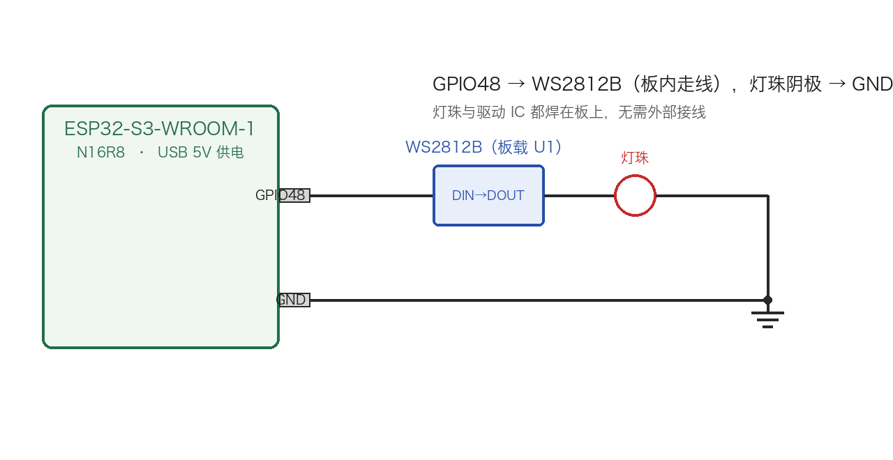
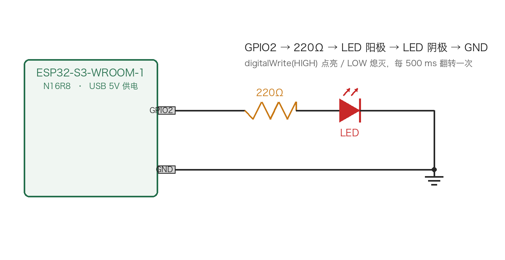
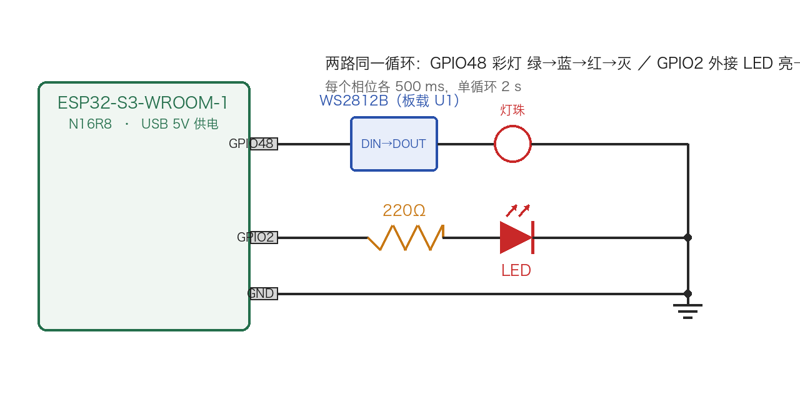
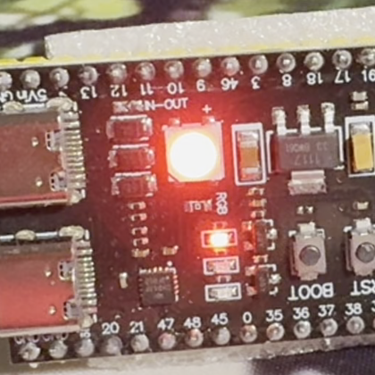
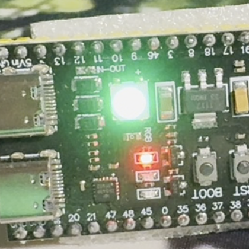
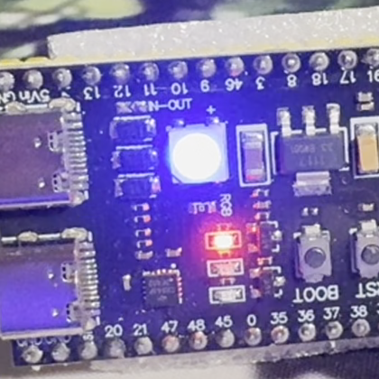

# Day 9：第一个程序 Blink —— 板载 WS2812B 彩灯 + 外接 LED

> 日期：2026-09-08（视频实测 2026-09-11）
> 状态：✅ Blink 概念跑通，✅ 板载 WS2812B 彩灯驱动成功（绿 → 蓝 → 红循环），✅ 外接 LED（GPIO2 → 220Ω → LED）闪烁跑通，✅ 彩灯 + 外接 LED 综合版跑通

---

## 一、目标

烧录第一个固件，理解 GPIO 输出 + `delay` 控制节奏。本板没有"普通 LED 可直连"的引脚，取而代之的是一颗**板载可编程彩灯**，所以第一步先驱动它；随后再补一颗外接普通 LED，把最经典的 `digitalWrite` Blink 也走一遍；最后把两路合并进同一个循环。三份代码构成 Day 9 的三个实验。

---

## 二、硬件：板载灯珠不是普通 LED

| 项目 | 参数 |
| --- | --- |
| 型号 | XL-5050RGBC-WS2812B（位号 U1） |
| 类型 | 单总线可编程 RGB 灯珠（内置驱动 IC + 恒流源） |
| 控制脚 | **GPIO48**（网络名 RGB_CTRL） |
| 协议 | 800 kHz 单线归零码，每颗灯珠 24 bit（G8 R8 B8） |
| 驱动库 | Adafruit NeoPixel（第三方，需单独安装） |

> **为什么不能 `digitalWrite`**：WS2812B 内部集成了驱动 IC，靠 800 kHz 的窄脉冲编码数据，不是"高电平亮、低电平灭"的普通 LED。普通 `digitalWrite` 只会让它乱闪或不动，必须用专用库按时序发数据。

### 依赖安装

Arduino IDE → 工具 → 管理库 → 搜索 **Adafruit NeoPixel** → 安装。

esp32 3.3.10-cn 内置库（`ESP32`、`BLE`、`WiFi`、`Wire` 等）与 `~/Documents/Arduino/libraries` 中都没有 WS2812 驱动，这一步无法跳过。

---

## 三、三个实验与代码

Day 9 写了三份代码，对应三组由浅入深的实验：

| 实验 | 代码 | 内容 | 控制脚 |
| --- | --- | --- | --- |
| 实验一 | [`rgb_cycle.ino`](rgb_cycle.ino) | 板载 WS2812B 彩灯循环 | GPIO48 |
| 实验二 | [`external_led_blink.ino`](external_led_blink.ino) | 外接普通 LED 闪烁 | GPIO2 |
| 实验三 | [`combined_blink.ino`](combined_blink.ino) | 彩灯 + 外接 LED 合并到同一循环 | GPIO48 + GPIO2 |

### 实验一：板载 WS2812B 彩灯循环

**电路**：`GPIO48 → 板载 WS2812B（板内走线）→ 灯珠 → GND`，灯珠和驱动 IC 全部焊在板上，无需任何外部接线。



完整代码：[`rgb_cycle.ino`](rgb_cycle.ino)

```cpp
#include <Adafruit_NeoPixel.h>

#define RGB_PIN   48    // 板载 WS2812B 控制脚（net RGB_CTRL）
#define RGB_COUNT 1     // 板上只有一颗灯珠

// NEO_GRB + NEO_KHZ800 是 WS2812B 的标准时序组合
Adafruit_NeoPixel rgb(RGB_COUNT, RGB_PIN, NEO_GRB + NEO_KHZ800);

void setup() {
  rgb.begin();
  rgb.setBrightness(50);   // 0-255，先调低亮度，避免直视刺眼
  rgb.show();              // 上电先熄灭，清掉复位期间锁存的随机颜色
}

void loop() {
  rgb.setPixelColor(0, rgb.Color(0, 255, 0));   // 绿
  rgb.show();
  delay(500);

  rgb.setPixelColor(0, rgb.Color(0, 0, 255));   // 蓝
  rgb.show();
  delay(500);

  rgb.setPixelColor(0, rgb.Color(255, 0, 0));   // 红
  rgb.show();
  delay(500);
}
```

两个必须成对出现的调用：

- `setPixelColor()` — 只把颜色写进**内存缓冲区**
- `show()` — 才真正把缓冲区按 800 kHz 时序**推给灯珠**

只写 `setPixelColor` 不 `show`，灯珠不会有任何反应。

### 实验二：外接普通 LED 闪烁

板载灯珠走的是 800 kHz 单总线协议，必须用库驱动；为了验证 GPIO 最原始的"直接输出"用法，再接一颗普通 LED，用经典 `digitalWrite` 驱动。

**接线**：`GPIO2 → 220Ω 限流电阻 → LED 长脚（阳极）→ LED 短脚（阴极）→ GND`

| 元件 | 说明 |
| --- | --- |
| 限流电阻 | 220Ω（库存清单中的 220Ω ×10） |
| LED | 普通直插 LED，长脚阳极、短脚阴极 |
| 电源 | 板子 USB 5V，GPIO2 输出 3.3V 逻辑电平 |



完整代码：[`external_led_blink.ino`](external_led_blink.ino)

```cpp
const int EXT_LED_PIN = 2;   // 外接 LED 控制脚

void setup() {
  pinMode(EXT_LED_PIN, OUTPUT);
  digitalWrite(EXT_LED_PIN, LOW);   // 上电先灭
  Serial.begin(115200);
  Serial.println("ESP32-S3 外接 LED Blink Start");
}

void loop() {
  digitalWrite(EXT_LED_PIN, HIGH);  // 3.3V → 电流经电阻流过 LED → 亮
  Serial.println("LED ON");
  delay(500);

  digitalWrite(EXT_LED_PIN, LOW);   // 0V → LED 两端无压降 → 灭
  Serial.println("LED OFF");
  delay(500);
}
```

### 实验三：综合版（彩灯 + 外接 LED）

把实验一和实验二合进同一个 `loop()`：每一步同时改变彩灯颜色和外接 LED 的通断。

**接线**：实验一与实验二的叠加——GPIO48 仍是板内灯珠，GPIO2 仍接 `220Ω → LED → GND`，两路共用板子的 GND。



完整代码：[`combined_blink.ino`](combined_blink.ino)

四个相位各 500 ms，单循环 **2 s**：

| 相位 | GPIO48 彩灯 | GPIO2 外接 LED |
| --- | --- | --- |
| 1 | 绿 | 亮 |
| 2 | 蓝 | 灭 |
| 3 | 红 | 亮 |
| 4 | 全灭 | 灭 |

---

## 四、运行结果（视频实录）

### 实验一：板载 WS2812B 彩灯循环

完整视频：[`板载彩灯红绿蓝循环.MOV`](板载彩灯红绿蓝循环.MOV)

从视频中抽取的三个相位（`ffmpeg` 定帧，同一裁剪区域）：

| 相位 | 截图 |
| --- | --- |
| 红 |  |
| 绿 |  |
| 蓝 |  |

#### 视频参数

| 项目 | 值 |
| --- | --- |
| 编码 | HEVC，1920×1080 |
| 帧率 | 29.97 fps（30000/1001） |
| 总帧数 | 229 |
| 时长 | 7.64 s |

#### 三色验证（逐像素主通道统计）

肉眼在暗环境看录像容易受相机自动曝光影响，所以对三张截图做了**主通道计数**：在固定灯珠区域内，统计"某一通道比另外两通道都高出 10 以上"的像素数。

| 截图 | red 主通道 | green 主通道 | blue 主通道 | 判定 |
| --- | --- | --- | --- | --- |
| 灯珠-红色.png | **134272** | 13 | 0 | 红 ✅ |
| 灯珠-绿色.png | 8446 | **71787** | 0 | 绿 ✅ |
| 灯珠-蓝色.png | 4464 | 106 | **130824** | 蓝 ✅ |

三张截图各自的主通道像素数与其余两个通道相差 1~4 个数量级，**绿、蓝、红三色全部实测确认**，循环无缺色。

#### 实测节奏

抽取的三个相位分别位于 0.20 s（红）、0.55 s（绿）、1.05 s（蓝），相邻相位间隔约 0.35~0.50 s，与代码中每色 `delay(500)` 相符，单次循环周期约 **1.5 s**。

### 实验二 / 实验三：外接 LED 实物演示

完整视频：[`外接LED.MOV`](外接LED.MOV)

| 项目 | 值 |
| --- | --- |
| 编码 | HEVC，1920×1080 |
| 帧率 | 29.97 fps（30000/1001） |
| 总帧数 | 121 |
| 时长 | 4.035 s |

**视频内容**：面包板上依次为跳线、220Ω 限流电阻与外接 LED，画面为手持拍摄。LED 按约 500 ms 亮 → 灭的节奏交替，与代码中每个状态后的 `delay(500)` 相符。

> **说明**：这段视频是运行**实验二（独立版 `external_led_blink.ino`）**时录制的，不是实验三综合固件的录像。实验三的 `loop()` 里 GPIO2 的驱动方式与实验二完全一致（同样是每 500 ms 翻转一次），所以这段片子对实验三的**外接 LED 部分**同样成立；但综合版额外的板载彩灯变相位，本视频没有记录。

**验证方式与局限**：这段片子中相机自动曝光把画面整体推到接近饱和（逐帧 max 通道普遍为 255），实验一用的"主通道计数"在这里无法区分 LED 的亮/灭。因此改用**时间相关性**：把每个像素的逐帧亮度去均值后，与"0.5 s 开 / 0.5 s 关"的方波参考（29.97 fps 下 30 帧一个周期）做相关。结果是一小部分像素与方波同步——相关系数 > 0.6 的约 214 个像素，最大约 **0.73**，无像素超过 0.8。由于手持拍摄带来的整体曝光漂移是逐像素亮度变化的主要来源，这个信号**真实但偏弱**，只足以佐证"LED 在按时序闪烁"，不足以做逐帧的亮灭定量判定。

---

## 五、出了什么问题 & 如何修复

### 1. 收到板子插上电，它自己亮了一个颜色

第一次拿到板子插上电，灯珠是亮的。后来烧完 `day08.ino` 变成**常绿**；拔线再插上又**不亮了**。

**原因**：WS2812B 内部只有一个移位寄存器 + 锁存器，**没有 NVM**，一次上电只记得最后收到的 24 bit 数据，掉电即忘。

- **插上就亮**：复位和下载期间 GPIO48 处于悬空/高阻，灯珠把这段噪声当成数据锁存了，于是显示成一个随机颜色（这颗板子常见是绿）。
- **烧完 day08 常绿**：`day08.ino` 从头到尾没驱动过 GPIO48，灯珠一直保持复位时锁存的那个颜色，看起来就是"卡住不动"。
- **拔线再插不亮**：彻底掉电后锁存内容被清空，这次上电侥幸没锁存到有效噪声 → 熄灭。

**修复**：在 `setup()` 里 `rgb.begin()` 之后立刻 `rgb.show()`，把缓冲区里的全 0（熄灭）主动推出去，清掉复位期间锁存的随机颜色，从此上电状态确定。

### 2. 看录像时"绿"这一段好像不见了

第一次逐帧分析视频时，只分辨出红和蓝两段，看不到绿，一度怀疑循环代码漏了绿色。

**原因**：相机自动曝光以最亮的灯珠为测光基准，绿色相位被压得过曝/去饱和，帧内绿灯像素的平均 RGB 接近 **(118, 162, 123)**——几乎灰白。另外画面里暖色背景本身含大量"红"像素，简单按"最红像素"或色相阈值判断会被背景带偏。

**修复**：不按全画面或色相判断，改为在**固定灯珠邻域**内用**主通道计数**（某通道 > 另两通道 + 10）。这样对去饱和不敏感，绿相位立刻显形（green 主通道 71787 vs red 8446 vs blue 0）。上表的数据就是这么来的。

### 3. 亮度先别拉满

`setBrightness(255)` 直视这颗 5050 灯珠很刺眼，本次统一用 `setBrightness(50)`。低亮度下三色依然清晰可分。

---

## 六、关键观察

1. **板载灯珠 ≠ 普通 LED**：WS2812B 是数字器件，靠 800 kHz 时序通信，必须用库驱动，不能 `digitalWrite`。
2. **`setPixelColor` + `show()` 缺一不可**：前者写内存，后者才真正发送。
3. **`NEO_GRB + NEO_KHZ800` 是 WS2812B 的固定组合**：数据顺序是 G→R→B，写错顺序会出现"要红给绿"的现象。
4. **复位期间 GPIO48 悬空会锁存随机色**：这正是"新板子插上就自己亮一个颜色"的来源，`setup()` 里主动 `show()` 熄灭即可根治。
5. **WS2812B 没有掉电记忆**：想要"记住上次颜色"必须在固件里自己做持久化（如 NVS），灯珠本身不提供。
6. **相机自动曝光会骗人**：判断灯珠颜色别只看录像观感，固定区域 + 主通道统计才靠得住。
7. **两种"点灯"要分清**：同一块板子上，WS2812B 必须走库 + 单总线时序，普通 LED 只需 `pinMode` + `digitalWrite`；写代码前先确认接的是哪一类。
8. **两路输出可以共用一个 `loop()`**：实验三把 GPIO48 与 GPIO2 放进同一个循环，`delay` 是两路共享的，所以相位天然同步。

---

## 七、Day 9 小结

1. 理解并跑通了"第一个程序"的核心：GPIO 输出 + `delay` 控制节奏。
2. 驱动了板载 WS2812B，实现绿 → 蓝 → 红循环，并用视频 + 逐像素统计确认三色齐全。
3. 搞清了新板子"插上就亮、烧完常绿、拔插就灭"的全部成因（悬空锁存 + 无 NVM）。
4. 建立了一套不受相机曝光干扰的颜色验证方法，后续点灯/呼吸灯实验可复用。
5. 补上了外接 LED（实验二）与彩灯 + LED 综合版（实验三），把"库驱动数字灯珠"和"`digitalWrite` 直驱普通 LED"两种点灯方式都跑通了一遍。

**尚未完成（Day 9 计划中的其余子任务）**：修改延时的快闪（100ms）/ 慢闪（2000ms）两档对比——留到后续补做。

**外接 LED 已补做**：原计划里的 `GPIO2 → 220Ω → LED → GND` 已实现，见上文实验二与实验三。

**下一步（Day 10）**：PWM 呼吸灯 —— 用 `ledcWrite()` 输出可变占空比，实现亮度渐变的呼吸效果。

---

## 参考资料

- [Adafruit NeoPixel 库说明](https://learn.adafruit.com/adafruit-neopixel-uberguide)
- [WS2812B 数据手册（时序与协议）](https://cdn-shop.adafruit.com/datasheets/WS2812B.pdf)
- [Arduino-ESP32 官方文档](https://docs.espressif.com/projects/arduino-esp32/en/latest/)
