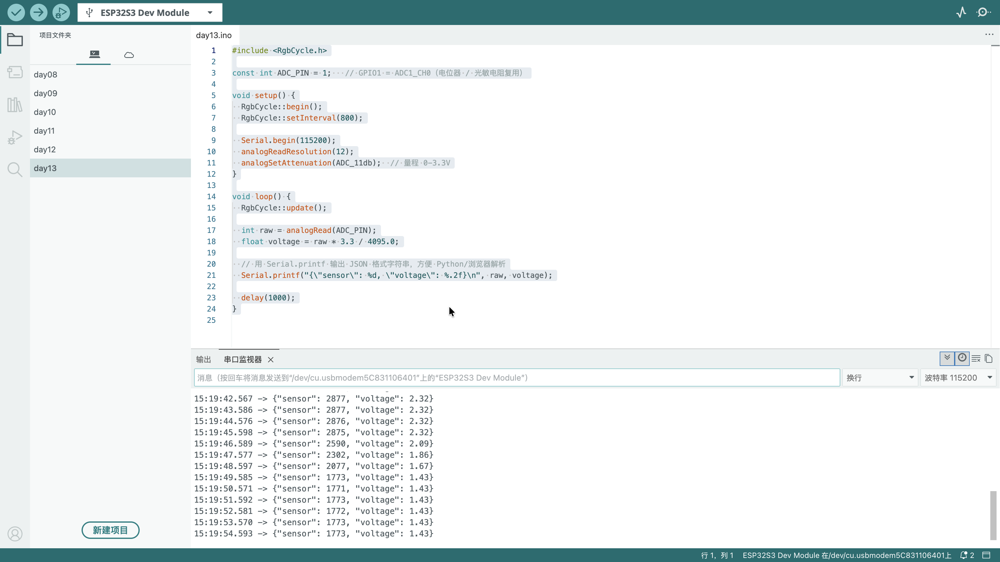

# Day 13：串口通信与调试

> 日期：2026-09-14
> 状态：🚧 学习中
>
> 硬件：复用 Day 12 电位器电路（GPIO1 → 电位器中间脚）
> 核心：UART 通信、Serial.printf() 格式化输出、JSON 数据打包

---

## 一、目标

前 12 天我们主要关注**硬件控制**（GPIO 输出/输入、ADC 读取）。Day 13 反过来——关注**与电脑通信**：把 ESP32 的数据通过串口发给电脑，方便调试和记录。

核心知识点：
- **UART 通信**：TX（发送）、RX（接收）、波特率
- **Serial.printf()**：格式化输出，类似 C 语言的 `printf`
- **JSON 格式**：把多个变量打包成结构化字符串，方便程序解析
- **Arduino Serial Monitor**：接收并查看串口数据
- **调试技巧**：用串口输出中间值，排查硬件/逻辑问题

---

## 二、UART 通信基础

UART（Universal Asynchronous Receiver/Transmitter）是最基础的串行通信协议。

### 硬件连线

| 信号 | 方向 | 说明 |
| --- | --- | --- |
| **TX** (Transmit) | ESP32 → 电脑 | ESP32 发送数据 |
| **RX** (Receive) | 电脑 → ESP32 | ESP32 接收数据 |
| **GND** | 共地 | 必须连接，否则通信失败 |

ESP32-S3 的 UART：
- USB 转串口芯片（如 CP2102/CH340）已内置在开发板上
- USB 线连接开发板和电脑，串口数据自动通过 USB 传输
- 不需要额外接线，`Serial.begin(115200)` 即可使用

### 波特率（Baud Rate）

串口通信的速度单位，表示每秒传输的比特数。

| 波特率 | 速度 | 适用场景 |
| --- | --- | --- |
| 9600 | 慢 | 调试、长距离 |
| 115200 | 快 | **ESP32 默认，推荐** |
| 921600 | 极快 | 大数据量传输 |

**关键：** 串口监视器和代码中的波特率必须**一致**，否则看到乱码。

---

## 三、Serial 常用函数

| 函数 | 作用 | 示例 |
| --- | --- | --- |
| `Serial.begin(115200)` | 初始化串口，设置波特率 | 放在 `setup()` |
| `Serial.print("hello")` | 打印字符串，不换行 | 输出 `hellohellohello` |
| `Serial.println("hello")` | 打印字符串并换行 | 输出 `hello`（每行独立） |
| `Serial.printf("%d", 123)` | 格式化输出 | 输出 `123` |
| `Serial.printf("Raw: %d, V: %.2fV", raw, voltage)` | 多个变量格式化 | 输出 `Raw: 2048, V: 1.65V` |

---

## 四、`printf` 格式化占位符

| 占位符 | 类型 | 示例 | 输出 |
| --- | --- | --- | --- |
| `%d` | 整数 | `printf("%d", 123)` | `123` |
| `%f` | 浮点数 | `printf("%f", 3.14)` | `3.140000` |
| `%.2f` | 浮点数（保留 2 位小数） | `printf("%.2f", 3.14159)` | `3.14` |
| `%s` | 字符串 | `printf("%s", "hello")` | `hello` |
| `%4d` | 整数（右对齐，4 位宽） | `printf("%4d", 42)` | `__42` |
| `\n` | 换行符 | `printf("line1\nline2")` | `line1`<br>`line2` |

---

## 五、JSON 格式输出

JSON（JavaScript Object Notation）是一种轻量级的数据格式，用键值对组织数据。

**为什么用 JSON？**
- 结构化，方便程序解析
- 易于阅读和调试
- 跨语言（Python、JavaScript、C++ 都能解析）

**格式示例：**

```json
{"sensor": 2048, "voltage": 1.65}
{"sensor": 4095, "voltage": 3.30}
{"sensor": 0, "voltage": 0.00}
```

每行是一个完整的 JSON 对象，用换行符分隔。这种格式叫 **JSON Lines**（或 NDJSON），非常适合流式数据输出。

---

## 六、实验 1：JSON 串口输出

> 日期：2026-09-14
> 状态：🚧 学习中
>
> 硬件：与 Day 12 实验 1 相同（GPIO1 → 电位器中间脚，两侧接 3V3 和 GND）

### 电路

| 器件 | 接线 | 说明 |
| --- | --- | --- |
| 电位器 | 3V3 → 左侧脚，GND → 右侧脚，GPIO1 → 中间脚 | 复用 Day 12 |
| 板载彩灯 | GPIO48 | 保持 Day 9 接法，`RgbCycle::update()` 照常运行 |

### 代码

完整代码：[`实验1-JSON串口输出.ino`](./实验1-JSON串口输出/实验1-JSON串口输出.ino)

```cpp
#include <RgbCycle.h>

const int ADC_PIN = 1;   // GPIO1 = ADC1_CH0

void setup() {
  RgbCycle::begin();
  RgbCycle::setInterval(800);

  Serial.begin(115200);
  analogReadResolution(12);
  analogSetAttenuation(ADC_11db);  // 量程 0-3.3V
}

void loop() {
  RgbCycle::update();

  int raw = analogRead(ADC_PIN);
  float voltage = raw * 3.3 / 4095.0;

  // 用 Serial.printf 输出 JSON 格式字符串，方便 Python/浏览器解析
  Serial.printf("{\"sensor\": %d, \"voltage\": %.2f}\n", raw, voltage);

  delay(1000);
}
```

### 代码详解

```cpp
Serial.printf("{\"sensor\": %d, \"voltage\": %.2f}\n", raw, voltage);
```

| 部分 | 含义 |
| --- | --- |
| `"{\"sensor\": %d, \"voltage\": %.2f}\n"` | JSON 格式字符串。注意：JSON 中的双引号需要用 `\"` 转义 |
| `%d` | 占位符，替换为 `raw`（整数） |
| `%.2f` | 占位符，替换为 `voltage`（保留 2 位小数的浮点数） |
| `\n` | 换行符，每条 JSON 记录独占一行 |
| `raw, voltage` | 传入 `printf` 的实际参数 |

**转义说明：** C 语言字符串中，双引号 `"` 是字符串的边界符。要在字符串内部表示一个双引号字符，需要用反斜杠转义：`\"`。所以 JSON 的 `{"key": value}` 在 C 字符串中写作 `"{\"key\": value}"`。

### 运行方法

1. 上传代码到 ESP32
2. 打开 Arduino IDE → 工具 → **串口监视器**
3. 确认波特率设置为 **115200**
4. 旋转电位器，观察串口输出

### 预期输出

```
{"sensor": 1024, "voltage": 0.82}
{"sensor": 2048, "voltage": 1.65}
{"sensor": 4095, "voltage": 3.30}
{"sensor": 0, "voltage": 0.00}
```

每条记录占一行，可以直接复制粘贴到 JSON 解析器中验证。

### 串口监视器显示结果



---

## 七、用 Python 解析串口数据

串口输出的 JSON 数据可以用 Python 脚本读取并可视化：

```python
import serial
import json

ser = serial.Serial('/dev/ttyUSB0', 115200)  # Linux/Mac
# ser = serial.Serial('COM3', 115200)       # Windows

while True:
    line = ser.readline().decode('utf-8').strip()
    if line:
        data = json.loads(line)
        print(f"Sensor: {data['sensor']}, Voltage: {data['voltage']}V")
```

---

## 八、出了什么问题 & 如何修复

- **串口输出乱码**：波特率不匹配。修复：确认 `Serial.begin(115200)` 与串口监视器设置一致。
- **JSON 解析失败**：字符串中的双引号未转义。修复：用 `\"` 而不是 `"` 表示 JSON 内部的双引号。
- **串口监视器无输出**：USB 线只供电不传数据。修复：换一根支持数据传输的 USB 线（充电线不行）。
- **输出行与行之间没有分隔**：缺少 `\n`。修复：在 `Serial.printf()` 末尾加上 `\n`。
- **JSON 格式报错**：值后面缺少逗号，或键没有用双引号包围。修复：对照 JSON 语法检查。

---

## 九、下一步

- Day 14：第二周项目 - 数字电压表（综合运用 ADC + Serial）
- 进阶：用 Python + Matplotlib 实时绘制串口数据曲线
