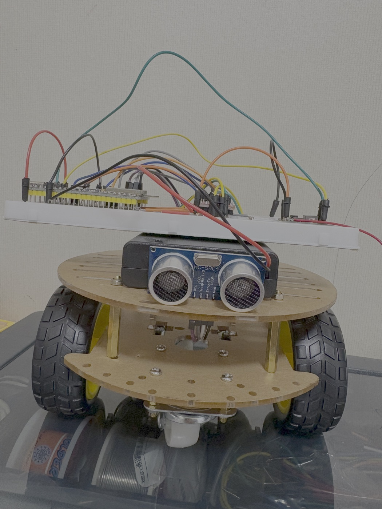
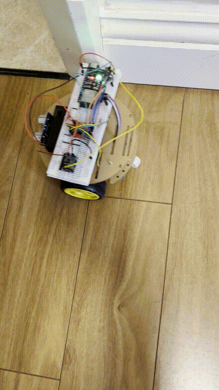
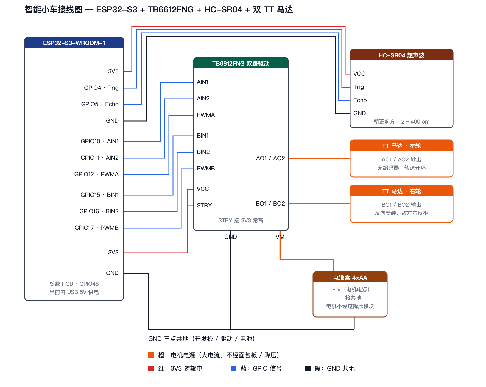

# 智能小车 · 超声波避障（Day 24 项目 README）

## 简介

一辆两轮差速小车，靠前方一个 HC-SR04 自己躲障碍：直行时每 100 ms 测一次前方距离，近于 15 cm 就后退 → 转向 → 强制前进，然后恢复判断。挡路的障碍一直不挪开，它就一直绕，不会卡死。



整车照：[`智能小车实物图.jpg`](./智能小车实物图.jpg)（1050×1400，346 KB）



地面实拍：[`智能小车落地跑.gif`](./智能小车落地跑.gif)（3 秒，440×782，6 fps，2.04 MB）——车放在瓷砖地上自己跑，靠近纸箱后后退 → 转向 → 强制前进
悬空验证（早期，轮子不着地）：[`超声波避障演示.gif`](./超声波避障演示.gif)（4 秒，440×248，8 fps，1.50 MB）

整车零电阻、零电容、零二极管——两个 TT 马达、一块 TB6612FNG 双 H 桥、一个超声波模块、一个 4×AA 电池盒，全部直接连 ESP32-S3。

> 这份 README 是 Day 24 的作业：按「名称 / 简介 / 硬件清单 / 电路图 / 代码说明 / 测试结果 / 踩坑与解决 / 下一步」的模板，给 Day 21 那辆车补一份能独立看的说明。逐日过程笔记在 [`day-21/README.md`](../day-21/README.md)。

---

## 硬件清单

| 器件 | 规格 | 数量 | 作用 |
|---|---|---|---|
| ESP32-S3-WROOM-1 开发板 | N16R8 | 1 | 主控。LEDC 出 PWM，板载 RGB 在 GPIO48 |
| DZQJ 2WD 亚克力双层底盘 | 含 TT 马达 1:48 ×2、车轮 ×2、万向轮 ×2 | 1 | 车体 |
| TB6612FNG 双路 H 桥模块 | — | 1 | 驱动两路电机，带 STBY 使能脚 |
| HC-SR04 超声波模块 | 2 ~ 400 cm | 1 | 前方测距 |
| 电池盒 | 4 节 5 号 = 6 V | 1 | **只供电机**，走 TB6612 的 `VM` |
| 杜邦线 | 公对公 / 公对母 | 若干 | — |

开发板本身由 USB 5 V 供电（Day 24 的降压模块还没到，见「下一步」）。

**没有用到的元件**（套件里有但这次刻意不上车）：MPU-6050——两轮 + 万向轮底盘不需要姿态就能跑；SG90 舵机——Day 27 做云台才上车。少一组线就少一处故障点。

---

## 电路图

[`智能小车接线图.png`](./智能小车接线图.png)（1770×1410）｜源文件 [`智能小车接线图.svg`](./智能小车接线图.svg)



矢量源文件同样内容：[`智能小车接线图.svg`](./智能小车接线图.svg)（7.7 KB，纯文本，可改引脚名后可重新渲染）

| 颜色 | 含义 |
|---|---|
| 蓝 | GPIO 信号 |
| 红 | 3V3 逻辑电 |
| 橙 | 电机电源 VM（粗线，大电流） |
| 黑 | 共地（粗线） |

### 引脚分配

| 功能 | GPIO |
|---|---|
| HC-SR04 Trig / Echo | 4 / 5 |
| 左轮 AIN1 / AIN2 / PWMA | 10 / 11 / 12 |
| 右轮 BIN1 / BIN2 / PWMB | 15 / 16 / 17 |
| 板载 RGB | 48 |

避开了 strapping 引脚（0 / 3 / 45 / 46）、SPI Flash / PSRAM 占用的 26~37、USB 的 19 / 20。

### 接线上三条不能错的

1. **四点共地**——电池负极、ESP32 GND、TB6612 GND、HC-SR04 GND 连一起。漏接的表现是"电机不动且测距恒为 0"。
2. **`VM` 和 `VCC` 是两条独立的路**——`VM` 吃电池 6 V（电机，几百 mA），`VCC` 吃 ESP32 3V3（逻辑，几 mA）。电机电流不经过开发板。把它们并到同一个电源上，电机一转就把 3V3 拖垮。
3. **`STBY` 接 3V3 常高**——这个脚拉低，TB6612 整体休眠，两个电机都不转。

---

## 代码说明

三个草图，各管一件事：

| 草图 | 作用 |
|---|---|
| [`实验1-双电机差速.ino`](../day-21/实验1-双电机差速/实验1-双电机差速.ino) | 运动函数层：前进 / 后退 / 转向 / 弧线 / 刹车 / 滑行 |
| [`实验2-超声波避障.ino`](../day-21/实验2-超声波避障/实验2-超声波避障.ino) | **主程序**：感知-决策-执行闭环 |
| [`实验3-串口单步调试.ino`](../day-21/实验3-串口单步调试/实验3-串口单步调试.ino) | 排查工具：串口输命令，一次只做一个动作 |

### 主程序怎么组织

```cpp
const int AIN1 = 10, AIN2 = 11, PWMA = 12;   // 左轮
const int BIN1 = 15, BIN2 = 16, PWMB = 17;   // 右轮
const int TRIG_PIN = 4, ECHO_PIN = 5;
const int DUTY_CRUISE = 115, DUTY_TURN = 120;
const int PWM_FREQ = 20000, PWM_RES = 8;
const unsigned long TIMEOUT_US = 6000;        // ≈103cm
const float NEAR_CM = 15.0, FAR_CM = 25.0;    // 10cm 迟滞死区
enum State { S_CRUISE, S_BACK, S_TURN, S_COMMIT };
```

四状态机，箭头上是转移条件：

```
CRUISE ──cm < 15──▶ BACK ──500ms──▶ TURN ──400ms──▶ COMMIT ──300ms──▶ CRUISE
   ▲                                                                     │
   └────────────────────── cm > 25 ──────────────────────────────────────┘
```

| 状态 | 动作 | 灯 |
|---|---|---|
| `CRUISE` | 直行 + 每 100 ms 测距 | 绿 |
| `BACK` | 后退 500 ms | 橙 |
| `TURN` | 原地转向 400 ms（左右交替） | 红 |
| `COMMIT` | **强制前进 300 ms，不测距** | 黄 |

四个要解释的设计点：

**① 阈值必须带迟滞。** 单一阈值在临界点会振荡：退到 16 cm 判通畅往前开，进到 14 cm 判挡路往后退，来回抽搐。用 15 / 25 两个阈值切出 10 cm 死区，`15 ≤ cm ≤ 25` 一律保持现状。

**② `COMMIT` 这段是指南没有的。** 转完立刻回到 `CRUISE` 测距，可能刚转了 40° 又看见同一堵墙，于是再退再转——车贴着墙原地抽搐。强制前进 300 ms 让它先离开障碍区再恢复判断。

**③ `pulseIn()` 的阻塞被压到 1/5。** 它阻塞等回波，默认超时 30 ms 会让 `loop()` 卡住。避障只关心 15 cm 以内，超时压到 6 ms（≈103 cm）：超时的结论是"前方很远"，跟远距一致，但最坏卡顿从 30 ms 降到 6 ms。

**④ 左右交替转向。** `turnLeftNext` 每完成一次转向翻一次边。固定朝一边转的话，遇到走廊或夹角会一路朝同方向越转越深，最后贴着墙出不来；交替相当于在原地附近来回试探。

### duty 为什么是 115 而不是 255

TT 马达额定 3 V，电池盒给的是 6 V。靠占空比把**平均电压**压回 3 V 以内：`115 / 255 × 6 ≈ 2.7 V`。判据是平均电压，不是占空比数字——换 3 V 供电时同一个占空比对应的 duty 要改成 230 左右。

选 6 V 不是为跑更快，是为**更低内阻**：两路电机同时启动的峰值电流，2 节 5 号根本供不出来（见「踩坑」第 1 条）。

### 串口输出为什么写中文

避障是一串连续动作，光看 `{"cm":12.3}` 看不出"现在是第几步、为什么转、往哪边转"。所以现场日志写整句，并且**在状态切换那一刻打印原因**：

```
第1轮｜前方 12.3cm < 15cm，挡住了 → 后退 500ms
第1轮｜原地左转 400ms（左轮后退 / 右轮前进，左右交替，下一轮换另一边）
```

通畅时按 500 ms 节流，状态切换时立刻打印。日志要解释**为什么**，不只是**是什么**。

---

## 测试结果

编译（Arduino CLI，`--fqbn esp32:esp32:esp32s3`）：

```
实验1-双电机差速：   Sketch uses 324683 bytes (24%) / Global variables 22252 bytes (6%)
实验2-超声波避障：   Sketch uses 324803 bytes (24%) / Global variables 22196 bytes (6%)
实验3-串口单步调试： Sketch uses 327547 bytes (24%) / Global variables 22172 bytes (6%)
```

实验 3 单轮命令 `lf lb lz lc rf rb rz rc` 八条全过——六个 GPIO、TB6612 两路、两个电机、全部接线都正常。

八轮连续避障的串口片段（手在车前方反复挡）：

```
前方 25.9cm，通畅 → 直行前进
前方通畅：超出量程（>100cm），继续直行
第1轮｜前方 6.1cm < 15cm，挡住了 → 后退 500ms
第1轮｜原地左转 400ms（左轮后退 / 右轮前进，左右交替，下一轮换另一边）
第1轮｜转向已转开，强制前进 300ms 再重新测距（避免刚转开又看到障碍）
前方 16.2cm，通畅 → 直行前进
第2轮｜前方 14.8cm < 15cm，挡住了 → 后退 500ms
第2轮｜原地右转 400ms（左轮前进 / 右轮后退，左右交替，下一轮换另一边）
```

| 检查项 | 结果 |
|---|---|
| 6 V 供电双轮驱动 | ✅ 前进 / 后退 / 转向 / 弧线全部正常 |
| HC-SR04 与双电机同板共存 | ✅ 无干扰，测距读数稳定 |
| 15 / 25 cm 迟滞 | ✅ 死区生效，未出现临界点抽搐 |
| 左右交替转向 | ✅ 严格交替（1 左 2 右 3 左 4 右） |
| 连续避障（障碍不移开） | ✅ 按轮次持续绕行，不卡死 |
| COMMIT 强制前进 300 ms | ✅ 转开后能真正离开障碍区 |

超时（`>100 cm`）和低于 2 cm 的异常读数**都当前方通畅**，区别只在日志文字——HC-SR04 偶尔抽异常值时，车不会莫名其妙停下后退。

---

## 踩坑与解决

### 问题 1：只有左轮转，一阵子左一阵子右

**现象：** 3 V 供电时，两个电机只有一个转；表现还随机——先转起来的那个电流降下来，才轮到另一个。刹车时右轮还在转。

**排查：** 单轮命令 `lf lb lz lc rf rb rz rc` 八条全过，而两轮命令 `1`-`8` 全不转。两组只差**轮子数**和**占空比**，于是排除 GPIO / 接线 / 代码，锁定电源。

**解决：** 3 V（2 节 5 号）内阻太大，供不出两轮同时启动的峰值电流。换 4 节 6 V 电池盒，并把 duty 压到 115 把平均电压拉回马达额定的 2.7 V。

> 症状相似时找**只差一个变量**的对照组。这次的对照组就是"单轮 vs 双轮"。先入为主认定是杜邦线接触不良的话，会一直在 6 根线上打转。

### 问题 2：`ledcRead()` 恒返回 0

**现象：** 想回读当前占空比确认 PWM 生没生效，读到的一直是 0，制造了"PWM 没输出"的假象。

**解决：** 别回读。`ledcWrite()` 写进去的值自己记在变量里。回读 API 在 Core 3.x 上不可靠。

### 问题 3：车贴着障碍前后抽搐

**现象：** 退到 16 cm 判通畅前进，进到 14 cm 判挡路后退，在 15 cm 附近反复抖。

**解决：** 15 / 25 双阈值切出 10 cm 迟滞死区（代码说明 ①）。

### 问题 4：转完还是看到同一堵墙

**现象：** 转了 40° 回到 `CRUISE` 立刻测距，墙还在视野里，再退再转，原地打转。

**解决：** 加 `COMMIT` 状态强制前进 300 ms、期间不测距，先离开障碍区（代码说明 ②）。

### 问题 5：串口打出来全是"后退 0 秒""左转 0 秒"

**现象：** 时长用 `%.0f` 配 `500/1000.0` 格式化成秒。

**解决：** 小于 1 秒的量格式化成秒会丢信息（`%.0f` 把 0.5 四舍五入成 0）。直接打毫秒整数。

### 问题 6：车总是往同一边越转越深

**现象：** 走廊或夹角里，固定朝一个方向转，转不出去。

**解决：** `turnLeftNext` 每轮翻边，左右交替（代码说明 ④）。代价是它不"记住"哪边是出路——真解法要加第二个传感器或做建图。

### 问题 7：两个轮子转速不一样，直行跑偏

**现象：** TT 马达有个体差异，同样 duty 下车会偏向一侧。

**当前状态：** 未解决。补偿系数 `TRIM_RIGHT` 要实测量出来，而现在车插着 USB 才能读串口，插着线就没法自由跑、量不准。等 Day 25 打通 Wi-Fi，用无线通道下发 trim、读回轨迹一次搞定。

---

## 下一步

| 事项 | 状态 |
|---|---|
| Day 25：ESP32-S3 打通 Wi-Fi | 下一步 |
| MP1584EN 降压模块到货 → 车脱离 USB 独立供电 | ⏳ 运输中（2026-09-22 下单）。到货先万用表量输出确认 5 V 再接 ESP32「5V」脚；电机仍走电池 6 V 不经过降压；电池负极与开发板 GND 共地 |
| 标定 `TRIM_RIGHT` 补偿左右轮差速 | 📌 等 Wi-Fi 通道就绪（问题 7） |

---

### 选做 / 进阶

⏭️ 进阶：编码器闭环——现在两个马达是开环，电池掉压就变慢
⏭️ 进阶：加第二个超声波（左右各一），替代"左右交替试探"这种盲试策略
⏭️ 进阶：连续 N 轮脱不了困就判定死胡同，加一个"停止并报警"状态

> GIF 与电路图是怎么做出来的（ffmpeg 参数、为什么不用 Fritzing）另见 [`素材制作过程.md`](./素材制作过程.md)。
