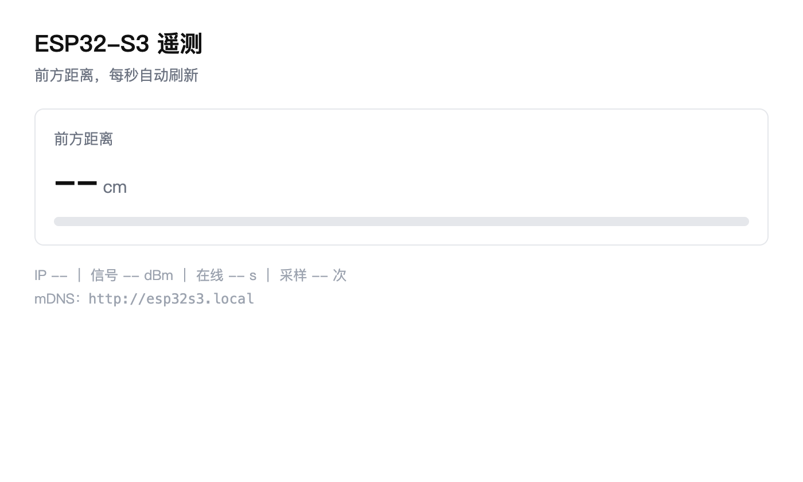

# Day 25 — ESP32-S3 Wi-Fi 初体验

> 硬件：ESP32-S3-WROOM-1（沿用 Day 21 的车：HC-SR04 在 GPIO4/5，一个元件都没加）
> 核心：从"能联网"到"别人能来问我"——连上 Wi-Fi、主动发 HTTP 请求、自己起一个 Web Server
> 代码：[`实验1-WiFi连接/`](./实验1-WiFi连接/) ｜ [`实验2-HTTP客户端/`](./实验2-HTTP客户端/) ｜ [`实验3-WebServer/`](./实验3-WebServer/)

---

## 零、指南的四件事与今天实际做的

| 指南要求 | 实际做法 |
|---|---|
| 1. 用 `WiFi.h` 连 2.4 GHz | ✅ 实验 1。加了超时和事件回调 |
| 2. 获取 IP 并串口打印 | ✅ 实验 1。多打了几项后面真要用到的（网关 / DNS / MAC / 信道 / RSSI） |
| 3. HTTP 客户端请求 httpbin.org/get | ✅ 实验 2。**写两遍**：先裸 `WiFiClient` 手搓报文，再 `HTTPClient` + TLS |
| 4. Web Server 访问 ESP32 IP 看传感器数据 | ✅ 实验 3。HC-SR04 一个传感器就够，HTML 每秒拉 `/data` 刷新 |

> ✅ **三个实验全部已上机**（2026-09-30）：连上家里的 2.4 GHz 路由（开放网络无密码）、IP `192.168.0.5`、信道 1、RSSI −17 dBm；httpbin 的 80 端口裸写和 443 端口 TLS 都拿到 `200`，httpbin 回给我的 `origin` 是一个公网地址而不是局域网地址——这就是 NAT 在起作用（[`实验2-Http客户端.txt`](./实验2-Http客户端.txt)）；堆内存 9 次轮询稳定在 217 KB 上下、无下滑。实验 3 的 Web Server 用 mDNS 名 `esp32s3.local` 打开，页面显示 28.0 cm、−32 dBm、在线 144 s、采样 699 次。

---

## 一、连 Wi-Fi 不只是"连上就完事"

实验 1 的三条，都是指南没写但车真跑起来之后必须的：

**① ESP32-S3 只有 2.4 GHz。** 5 GHz 的 SSID **扫不到**——不是信号弱，是硬件不支持。家里路由开了"双频合一"的话，2.4G 和 5G 共用一个名字，照样能连，但连上的一定是 2.4G 那个。

**② 等连接必须有超时。** 指南给的是 `while (WiFi.status() != WL_CONNECTED)`，这是死循环：密码写错、路由踢人、信号太弱，板子永远卡在那儿，串口一个点一直打，看不出是"还在连"还是"连不上"。给 15 秒上限：

```cpp
const unsigned long CONNECT_TIMEOUT_MS = 15000;
unsigned long start = millis();
while (WiFi.status() != WL_CONNECTED) {
  if (millis() - start > CONNECT_TIMEOUT_MS) return false;   // 给结论，不再打点
  ...
}
```

**③ 掉线要能自己恢复。** 路由器重启、密码改了、车跑到信号边缘——掉线是常态，而车脱离 USB 之后没人给它按复位。用 `WiFi.onEvent()` 挂回调，比在 `loop()` 里轮询 `status()` 更早拿到状态变化：

```cpp
case ARDUINO_EVENT_WIFI_STA_DISCONNECTED:
  Serial.printf("⚠ 掉线，原因码 %d\n", info.wifi_sta_disconnected.reason);
  WiFi.reconnect();
  break;
```

**原因码是定位"为什么连不上"的关键**：`201` = 没找到这个 SSID（名字写错，或者就是 5 GHz 那一个），`202` = 认证失败（密码错）。只打一句"掉线"等于没打。

板载 RGB 的颜色语言从 Day 25 开始固定：**蓝闪 = 正在连，绿 = 已连上，红 = 失败/掉线**。车以后没有串口，灯是唯一的状态输出。

连上之后要打的不止 IP：

```
IP / 子网掩码 / 网关 / DNS / MAC / 信道 / 加密方式 / RSSI
```

信道值得看一眼：2.4G 有 11 个信道但**互不重叠的只有 1 / 6 / 11**，落在别的信道上就是跟邻居互相干扰，表现为 RSSI 不低却老是丢包。RSSI 是负数 dBm，越接近 0 越好，代码里给了口语化判据：≥ -55 极好，≥ -67 好，≥ -75 可用，再低就是"边缘，随时会掉"。

---

## 二、HTTP 客户端：先裸写一遍，再上库

实验 2 把同一个请求做了两遍，这是故意的。

### 方案 A：裸 `WiFiClient`，80 端口

```cpp
client.printf("GET %s HTTP/1.1\r\n", PATH);
client.printf("Host: %s\r\n", HOST);        // 少了这行就是 400
client.print("User-Agent: ESP32-S3/1.0\r\n");
client.print("Connection: close\r\n");      // 让服务端发完就断，省得我们猜长度
client.print("\r\n");                       // 空行 = 请求头结束
```

HTTP 请求就是**几行文本 + 一个空行**，写一遍就再也不用背了。两个细节：行尾是 `\r\n` 不是 `\n`（写 `\n` 有些服务器也认，但那是对方的容错）；`Host` 头在 HTTP/1.1 里是**必须的**——同一台服务器上挂几百个站点，靠它区分。

这条不是记下来的，是试出来的。同一份字节序列，只差 `Host` 那一行：

```
=== 带 Host ===      HTTP/1.1 200 OK          （457 字节，返回 JSON）
=== 去掉 Host ===    HTTP/1.1 400 Bad Request （272 字节，awselb 直接拒）
```

收响应别用 `while (client.connected())` 死等——服务端不主动断开就一直卡着。用"最后一次收到字节的时间"做超时：

```cpp
unsigned long lastByteMs = millis();
while (client.connected() || client.available()) {
  if (client.available()) { ...; lastByteMs = millis(); }
  else if (millis() - lastByteMs > READ_TIMEOUT_MS) break;   // 5 秒没新字节就认为收完了
  else delay(10);
}
```

### 方案 B：`HTTPClient` + `WiFiClientSecure`，443 端口

真要长期用得上 HTTPS——TLS 握手不是几行字符串，裸写写不出来。差别不只是"多个 S"：

```cpp
WiFiClientSecure secureClient;
secureClient.setInsecure();          // 跳过证书校验：图省事，但在不可信网络里等于把门敞开
HTTPClient http;
http.begin(secureClient, String("https://") + HOST + PATH);
http.setTimeout(8000);               // 不设就是默认 5 秒，弱网下经常不够
```

`HTTPClient` 帮处理重定向、chunked 编码、`Content-Length`，这些裸写都得自己做。`http.end()` **必须调**，否则连接池里的 socket 不释放，几次之后就没得用了。

从返回的 JSON 里抠 `origin`（路由器给这辆车分配的公网 IP）没引入 ArduinoJson——JSON 就一层，`indexOf` + 切片足够，省下一个库。

---

## 三、Web Server：页面和数据分开

实验 3 是今天最有价值的一个。前两个只是"能联网"，这个是"**别人能来问我**"。车以后脱离 USB，浏览器就是它唯一的显示器：不用装任何软件，手机连同一个 Wi-Fi 就能看到车在测什么。

**车上没有模拟量，所以 `/data` 里没有电压字段。** 指南只说"看传感器数据"，车上的传感器只有 HC-SR04，它一个就够。一开始额外接了个电位器充当第二个传感器——但那是个拧出来的死数字，不携带任何信息，也不可能一边跑车一边拧它，删了。

> 📌 Day 27-28 的"电池电压监测"要用 ADC，届时必须接 **ADC1（GPIO1–10）**：ESP32-S3 的 ADC2（GPIO11–20）和 Wi-Fi 共用一套硬件，开了 Wi-Fi 之后 `analogRead(ADC2)` 会失败。这条 Day 8 / 12 / 22 都记过，今天的实验里没有 ADC，所以没验成。量程也到时候再算：ADC 最宽的 `ADC_11db` 也只有约 3.3 V，电池 6 V 直接进会削顶，必须分压；默认 0 dB 更窄，只能量到约 1.1 V。

三个要点：

**① `loop()` 里不能有 `delay()`。** WebServer 靠 `server.handleClient()` 推进，一次 `delay(500)` 就是半秒不响应，页面会转圈。测距用 `millis()` 做非阻塞节流。

**② 别用 `String` 拼整个 HTML。** ESP32 的堆只有几百 KB，字符串反复拼接会打洞，跑几小时就 malloc 失败。静态页面放成 `PROGMEM` 的 `const char[]`——烧在 flash 里，不占堆：

```cpp
static const char PAGE[] PROGMEM = R"rawliteral( ... )rawliteral";
server.send(200, "text/html; charset=utf-8", String(FPSTR(PAGE)));
```

**③ 页面和数据分开。** `/` 给 HTML，`/data` 给 JSON，浏览器每秒拉一次 `/data` 只更新数字，不重载整页。JSON 用 `snprintf` 打进栈上的 `char buf[256]`，长度已知，用完就回收：

```cpp
snprintf(buf, sizeof(buf),
         "{\"cm\":%.1f,\"rssi\":%ld,\"up\":%lu,\"n\":%lu,\"ip\":\"%s\"}", ...);
```

顺手起 mDNS：`MDNS.begin("esp32s3")` 之后可以用 `http://esp32s3.local` 访问。局域网里 IP 会变（DHCP 租约到期），名字不会变。

页面渲染出来是这样（用 mock 数据在本地 Chrome 里跑的，数字不是实测量）：



上机时浏览器直接打开 `esp32s3.local` 看到的页面（[`实验3-WebServer.png`](./实验3-WebServer.png)）：距离 28.0 cm、信号 −32 dBm、在线 144 s、采样 699 次——和串口同一时刻打出来的数一致，说明浏览器和串口读的是同一份 `lastCm`。

> 这一份 JSON 有两个消费者：浏览器和 Day 26 的 Python。Day 26 只要把 `serial.Serial()` 换成 HTTP 拉 `/data`，解析和落 CSV 的逻辑原样复用——**这也是为什么数据要走 JSON 而不是人读的整句**。

---

## 四、测试结果

编译（Arduino CLI，`--fqbn esp32:esp32:esp32s3`）：

```
实验1-WiFi连接：    Sketch uses 881725 bytes (67%)  / Global variables 44196 bytes (13%)
实验2-HTTP客户端：  Sketch uses 1018013 bytes (77%)  / Global variables 46092 bytes (14%)
实验3-WebServer：   Sketch uses 958565 bytes (73%)   / Global variables 48324 bytes (14%)
```

三个全部 ✅ 编译通过。

**第一个数字本身就是今天最大的发现**：Day 21 的避障草图是 324 KB（24%），一开 Wi-Fi 就跳到 881 KB（67%），加上 TLS 直接到 1.02 MB（77%）。Wi-Fi 协议栈吃掉了一半以上的 flash。这不是"代码写多了"，是**联网这件事本身的标价**——以后选功能得先算这笔账（OTA 要留两个 app 分区，1 MB 的草图意味着 OTA 基本没戏）。

离线能验的两件事：

| 验证项 | 方法 | 结果 |
|---|---|---|
| HTTP/1.1 的 `Host` 头 | 用 Python socket 照抄 `rawHttpGet()` 的字节序列，只差 `Host` 那一行 | 带 → `200 OK`（457 B）；不带 → `400 Bad Request`（272 B） |
| 实验 3 的页面能正常渲染 | 把 `PAGE` 抠出来，把 `fetch('/data')` 换成 mock 数据，无头 Chrome 截图 | ✅ 距离卡片、进度条、IP / RSSI / 在线时长 / 采样次数全部正常显示 |

上机能验的三件事：

| 验证项 | 证据 | 结果 |
|---|---|---|
| ESP32-S3 连上 Wi-Fi 并拿到完整网络信息 | [`实验1-WiFi连接.txt`](./实验1-WiFi连接.txt) | 开放网络连上，IP 192.168.0.5、信道 1、RSSI −17 dBm（极好）；40 s 心跳里 RSSI 在 −17…−20 dBm 之间小幅波动，连接稳定 |
| 浏览器打开板子 IP 看实时数据 | [`实验3-WebServer.png`](./实验3-WebServer.png) | `esp32s3.local` 直接打开，28.0 cm ｜ −32 dBm ｜ 在线 144 s ｜ 采样 699 次，页面与串口同一份数据 |
| Web Server 长时间运行 | [`实验3-串口打印.txt`](./实验3-串口打印.txt) | 1132 次采样持续打出，未重启、未掉线；mDNS 名与 IP 都能访问 |

`实验3-串口打印.txt` 里 1132 次采样的分布也值得看一眼：绝大多数落在 21–31 cm，周期性出现 `超出量程（>102cm）`——那不是传感器坏了，是前方出现了一个超声吸收面（墙、窗帘、软布），回声弱到 6000 µs 都没回来。这和 Day 12 记过的"散射体导致丢读数"是同一条物理规律，当时用手在传感器前晃动复现，这次是环境自己重现。

上机日志里两条值得记的：

- **信道落在 1 上，正合适**。2.4G 有 11 个信道，互不重叠的只有 1 / 6 / 11；落在别的信道上就是跟邻居互相干扰，表现是 RSSI 不低却老丢包。这次 −17 dBm，极好。
- **堆内存没有掉**。`HTTPClient` 连发 9 次 TLS，剩余堆 217092 → 216992 → 216960 → 216972 → 216988 → 216968 → 216976 → 216984 → 217040 字节，在 ±100 字节内上下晃，没有持续下滑——说明「JSON 用栈上 `char buf[256]`、不用 `String` 拼」那条真的起作用了。这也解释了实验 3 为什么把 HTML 整个塞进 `PROGMEM`。

---

## 五、踩的坑

| 现象 | 原因 | 解决 |
|---|---|---|
| `ESP.getFlashSize()` / `WiFi.firmwareVersion()` 编译不过 | 这两个 API 在当前核心版本里不存在 | 换成 `ESP.getFlashChipSize()` 和 `esp_get_idf_version()` |
| `handleData()` 里 `sampleCount` 未声明 | 全局变量声明写在了函数后面 | 声明提到 `lastMeasureMs` 旁边 |
| 5 GHz 的 SSID 扫不到 | ESP32-S3 硬件不支持 5 GHz | 连 2.4G；双频合一的网络连上的一定是 2.4G 那个 |
| 实验 3 一开始多了个电位器 | 为了有"第二个传感器"好让页面不止一个数，但拧出来的数字不携带信息，也不可能一边跑车一边拧 | 删掉。车上只有 HC-SR04，它一个就满足指南"看传感器数据"的要求 |

---

## 六、下一步

- **Day 26**：Python 实时遥测绘图。走的是 HTTP 拉 `/data`，不是读串口——车自由跑时没有串口，解析与落 CSV 的逻辑照 Day 22 的写法复用，固件一行没改
- **Day 27-28**：Wi-Fi 遥控小车综合项目

> 📌 Day 22 那条"串口这条路有窗口期"到 Day 25 就兑现了：车一旦脱离 USB 就没有串口，Day 26 的实时绘图只能改成拉 `/data`。

---

### 选做 / 进阶

⏭️ 进阶：`WiFiClientSecure::setCACert()` 烧根证书替掉 `setInsecure()`——现在这样在公共 Wi-Fi 里等于不防中间人
⏭️ 进阶：实验 3 加 `/cmd?duty=xx` 路由，用浏览器下发 `TRIM_RIGHT`（接 Day 24 问题 7 的左右轮差速补偿）
⏭️ 进阶：把 `/data` 的刷新间隔从 1 秒压到 100 ms，用串口看堆内存有没有掉——`String` 打洞就是这么看出来的
