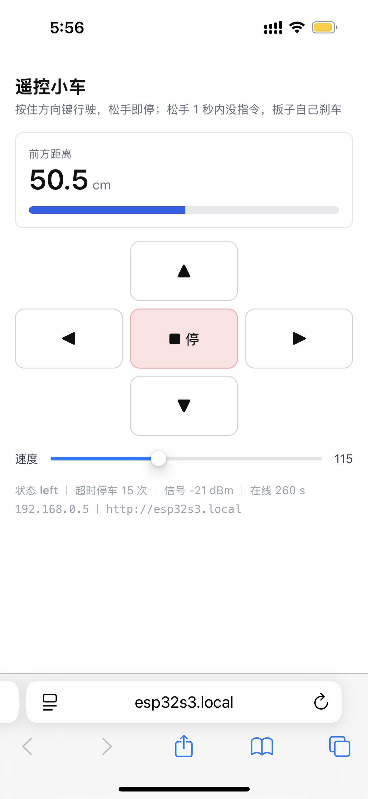

# Day 27 — Wi-Fi 遥控小车：让板子第一次改变物理状态

> 硬件：无新增（Day 24 定型的车：TB6612 + 双 TT 马达 + HC-SR04 + 6 V 电池盒，一个元件都没加）
> 核心：Day 25 的 Web Server 上加一条 `/cmd` 路由，手机浏览器开车
> 代码：[`实验1-WiFi遥控/实验1-WiFi遥控.ino`](./实验1-WiFi遥控/实验1-WiFi遥控.ino)
> 页面：固件里那段 `PROGMEM` 的 HTML，手机连同一个 Wi-Fi 打开 `http://esp32s3.local` 就是控制面板

---

## 零、指南的四件事与今天实际做的

指南 Day 27-28 是综合项目，四项任务逐条对：

| 指南要求 | 实际做法 |
|---|---|
| 1. Web Server + HTML 控制面板（前进/后退/左转/右转按钮）+ AJAX 控电机 | ✅ `/` 给面板，`/cmd` 收指令。按钮绑定**没用指南的 `onmousedown/onmouseup`**，改 Pointer Events + 指针捕获，原因见第二节 |
| 2. 手机连同一 Wi-Fi，浏览器访问 ESP32 IP | ✅ 面板就是照手机写的：`viewport` 锁缩放、按钮高 64 px、`touch-action:none` |
| 3. 实时显示前方距离 | ✅ `/data` 本来就有，面板 500 ms 拉一次 |
| 3. 显示 IMU 姿态数据 | ⏭️ **不接**。车上没有 IMU，作为进阶内容 |
| 3. 速度调节滑块 | ✅ 60~200，`change` 时发一条指令 |
| 4. 连接超时自动停车 | ✅ `CMD_TIMEOUT_MS = 1000`，Wi-Fi 掉线也算超时 |

> 状态：固件编译通过、面板 JS 在电脑上实测通过、**手机上机跑通**（按住持续走、松手立刻停、左右转正常）

> 📷 手机上的控制面板：[`实验1-手机遥控.png`](./实验1-手机遥控.png)

---

## 一、从"读"到"写"，冒出的问题是新的

Day 25 和 Day 26 的 HTTP 全是读。读通道和写通道的安全性差一个量级：`/data` 挂了你顶多少看一个数，`/cmd` 挂了**车还在跑**。于是有三个读的时候根本不存在的问题：

**① 上电默认态必须是停车。** 板子一上电，Wi-Fi 还没连上，手机也连不进来，这会儿没有任何指令可收。如果默认是前进，插电那一瞬车就窜出去。所以 `setup()` 里先 `brakeAll()`，再去连 Wi-Fi 那几秒。

**② 指令通道会断，断了车不能继续跑。** 浏览器会崩、会被系统挂起、手机会走出 Wi-Fi 范围、AP 会重启——这些情况下没有任何 `stop` 会发出来。板子必须自己有个看门狗（第三节）。

**③ 一次请求只改一个参数，当前状态留在板子侧。** 指南的 `/control?dir=fwd` 把方向塞进一个字符串；实际拆成 `dir` 和 `speed` 两个参数，板子各自存 `cmdDir` 和 `cmdDuty`。理由是心跳每 250 ms 就要发一次，把速度也塞进去意味着每次心跳重复发一遍当前速度，而速度在绝大多数心跳里根本没变。拆开之后心跳只发 `dir`，滑块只发 `speed`，谁也不打扰谁。

从"读"到"写"，代码量其实只多一个路由；多出来的全是在回答"怎么让它停下来"。

## 二、松手停为什么靠不住

指南给的 HTML 是这样绑的：

```html
<button onmousedown="send('fwd')" onmouseup="send('stop')">▲</button>
```

三处会失效，而且全部只在手机上出现：

**① `onmouseup` 不是为触摸准备的。** 它是浏览器给触摸设备模拟出来的，时机不可靠。该用的是 Pointer Events——同一套 `pointerdown` / `pointerup` 统一覆盖鼠标、触摸、笔。手指离开屏幕，`pointerup` 一定来，`mouseup` 不一定。

**② 手指滑出按钮再松手，`pointerup` 到不了按钮上。** 事件发到手指当前所在的元素，按钮什么也收不到，`stop` 永远不发，车就一直开。要 `setPointerCapture(e.pointerId)`：按住的那一刻把后续所有指针事件都收到这个按钮自己身上，之后手指划到屏幕任何角落，松手都由按钮处理。

**③ 页面被系统挂起时没有任何松手事件。** 锁屏、切后台、来电都会让 `pointerup` 不再送来。这一条板子的看门狗最终会兜住，但立即停比等着看门狗反应更稳——`visibilitychange` 和 `window.blur` 各补一次。

外加一条 CSS 上的坑：按钮必须写 `touch-action:none`。没有它，按住按钮会触发页面滚动和双击缩放，手势被浏览器吃掉，`pointerup` 同样丢。

三条的共同点是：**"用户松手了"这件事，浏览器不保证告訴你**。所以停止这件事必须有两条独立的路径——浏览器主动发 `stop`，板子超时自己停。

## 三、心跳和看门狗是同一件事

看门狗想生效，有个前提：**正常驾驶的时候也得有指令在流**。

如果只在按下的那一刻发一条 `dir=fwd`，用户按住三秒，板子第一秒就判超时停车——看门狗从"兜底"变成了"打断正常驾驶的隐患"，而且现象极其难查（表现为"车开不到一秒就自己停"）。所以按住期间每 250 ms 补发一次同样的 `dir`，松手才发 `stop`：

```js
b.addEventListener('pointerdown', e => { ...; startHold(id); });   // 首条 + 起心跳
b.addEventListener('pointerup',     endHold);                      // 发 stop + 停心跳
beat = setInterval(() => send('dir=' + holding), 250);             // 心跳
```

这样一来"超时"的含义变干净了：**超过 1 秒没有心跳，一定是控制端出事了**，不可能是用户还在开。心跳不是额外开销，是让看门狗可用的前提。

250 ms 这个数是被两件事夹住的：要明显小于板子的 `CMD_TIMEOUT_MS = 1000`，留出至少三次丢失的余量；又不能太密，1 秒 4 个请求和 1 秒 40 个请求对车没有区别，只是白占 WiFi。`CMD_TIMEOUT_MS` 取 1 秒的理由类似：500 ms 太紧，一次请求加网络抖动就可能误停；3 秒太松，够车以巡航速度冲出两米。

板子这一侧：

```cpp
bool ctrlAlive = (WiFi.status() == WL_CONNECTED) &&
                 (millis() - lastCmdMs <= CMD_TIMEOUT_MS);
if (cmdMoving && !ctrlAlive) {
  cmdDir = CMD_STOP;
  applyMotion();
  ...
}
```

两个触发条件——收不到新指令、Wi-Fi 掉了——都是"控制端不在了"。只在车**确实在动时**才动作，否则静止的车会每秒刷一行日志。

还有个容易被漏的细节：**看门狗只认被接受的指令**。`/cmd?dir=bogus` 回 400，不刷新 `lastCmdMs`。一个只会发垃圾参数的客户端不该被当成还活着，否则它能靠刷无效请求一直把车续着跑。

闪红提示也一样不能用 `delay()`——Day 25 刚立过「`delay()` 在 `loop()` 里是禁品」，闪 720 ms 就是 720 ms 不调 `handleClient()`，正好让看门狗自己多饿 720 ms。所以只记一个 `flashUntil` 截止时刻，闪烁放到 `loop()` 末尾非阻塞地做。

## 四、测试结果

分三层：固件编译、面板 JS、上机。

**固件编译**：`arduino-cli compile --fqbn esp32:esp32:esp32s3` 干净通过，971856 字节（74%），无警告。比 Day 25 实验 3 的 958565 字节（73%）多 12991 字节——几乎全是控制面板那段 HTML，逻辑代码只占零头。

**控制面板的 JS（电脑上实测）**：把固件里 `R"rawliteral(...)rawliteral"` 那段 HTML 抽出来，起一个 mock 的 `/cmd` / `/data`，用合成 PointerEvent 完整走了一遍：

| 场景 | 期望 | 实测 |
|---|---|---|
| 按住 fwd 700 ms | 1 条 `dir=fwd` + 250 ms 一条心跳 | `dir=fwd` ×2 ✅ |
| 松手 | 立刻 `dir=stop`，心跳停 | ✅ 再等 800 ms 无新请求 |
| 拖动速度滑块后松手 | 恰好一条 `speed=N`（不跟着拖动一路刷） | `speed=160` 一条 ✅ |
| 页面隐藏 | 立刻 `dir=stop`，心跳停 | ✅ 再等 600 ms 无新请求 |
| 距离 / 状态 / IP | 从 `/data` 填进页面 | 42.5 cm ｜ stop ｜ 192.168.0.5 ✅ |

**上机实测（手机连同一个 Wi-Fi）**：



手机浏览器打开 `http://esp32s3.local`，面板照设计的样子出来了。逐项读这张截图：

| 截图里的 | 说明什么 |
|---|---|
| 前方距离 50.5 cm | `/data` 的实时值进了页面，**没接串口也在显示**——Day 25 那条读通道今天是靠着面板被看见的 |
| 状态 back | 板子这一刻正在执行后退，`dir` 参数确实改写了电机状态 |
| 速度 115 | 滑块默认值 `DUTY_CRUISE` |
| 超时停车 0 次 | 看门狗没误触发（0 次 = 没有一次被 400 之外的请求续错命） |
| 信号 −32 dBm、在线 3869 s | 板子上电约 64 分钟；截图这一瞬车在动、Wi-Fi 还在 |

但"能跑"和"会停"是两件事，截图只证明前者，停那半得靠手机上的实际操作：**按住前进/后退/左转都持续行驶，松手立刻停**。这条把本来的两条边界各自收窄了一半：

**松手停验证通过。** 第二节讲的三处失效（`onmouseup` 不可靠、手指滑出按钮、页面被挂起）和 `touch-action:none`，在手机上分别验证：按住持续走，说明事件一直来；松手就停，说明事件确实在松手那一刻到达。指针绑对了，而且**是真的对**，不是电脑上 mock 那种"只验绑定关系"。

**按住期间车没有自己停，反过来证明了心跳。** 这是最容易被忽略的一条：看门狗 `CMD_TIMEOUT_MS = 1000` 一直在跑，如果心跳没发出去，按住一秒车就会停——第一节说的"看门狗从兜底变成打断驾驶的隐患"这种现象没有出现，说明 250 ms 心跳确实在流。同时面板上「超时停车 0 次」也印证了看门狗**一次都没误触发**。心跳和看门狗这对矛盾，今天算同时验到了正面。

- **"在线"不等于"Wi-Fi 没断过"。** `up` 字段是 `millis()/1000`，从上电起算，掉线重连不清零。所以 3869 s 证明的是板子连续 64 分钟没死没重启；不过车实际在跑且 Wi-Fi 在线，Day 24 那个"电机一开 3V3 被拉垮"的担心目前看是虚的。要彻底证伪得另加一个掉线计数器。

## 五、待上机验的最大未知

电机和 Wi-Fi 同时上这件事，Day 24 只跑过电机（没 Wi-Fi）、Day 25 只跑过 Wi-Fi（没电机），今天是第一次同时上。TT 马达启动瞬间的峰值电流和电刷噪声会通过 Day 24 那套五点共地传导——整车是零电阻、零电容、零二极管直接连的，有可能把 3V3 拉垮，表现为 **Wi-Fi 瞬间断连**：一动不动车好着，一动车就掉线，重启又能连上。

截图里车在动且 Wi-Fi 在线，加上按住持续行驶时链路没断，这条目前看是虚的。真出现的话方向是给电机电源加去耦电容，不是调代码。

---

## 六、下一步

- **Day 28**：把遥控和自动避障合成一个固件；今天已跑通的转为回归检查

> 📌 Day 28 的车是自由的（没有 USB 线），串口全程拿不到。所以验收标准都得是**不依赖串口的**：灯色、`/data` 里的 `tmo` 字段、以及录手机屏幕。

---

### 选做 / 进阶

⏭️ 进阶：把 `/data` 的轮询并进心跳。现在心跳每 250 ms 一次、拉数据每 500 ms 一次，是两条独立的连接，合成一个请求能省一半建连开销（Day 26 记过 `get()` 的建连成本）

⏭️ 进阶：转向时给两侧不同 duty。现在原地转向两侧都是 `DUTY_TURN`，但 Day 24 记过两个马达转速不一致（`TRIM_RIGHT` 那就是为它留的），等 duty 会让原地转画弧而不是原地转

⏭️ 进阶：给 `/data` 加掉线计数。现在 `up` 是 `millis()/1000`，从上电起算，掉线重连不清零，于是"一直好着"和"断了又连回来"在面板上长得一样。加一个 `reconn` 计数器，才能让"在线 3869 s"这句话有分量

⏭️ 进阶：给 `/cmd` 加访问控制。现在同一局域网内任何人都能让车动——家里无所谓，拿到公开场合就是谁都能开
